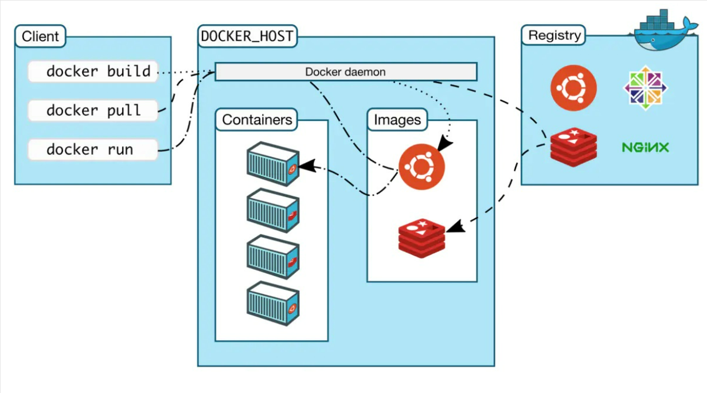
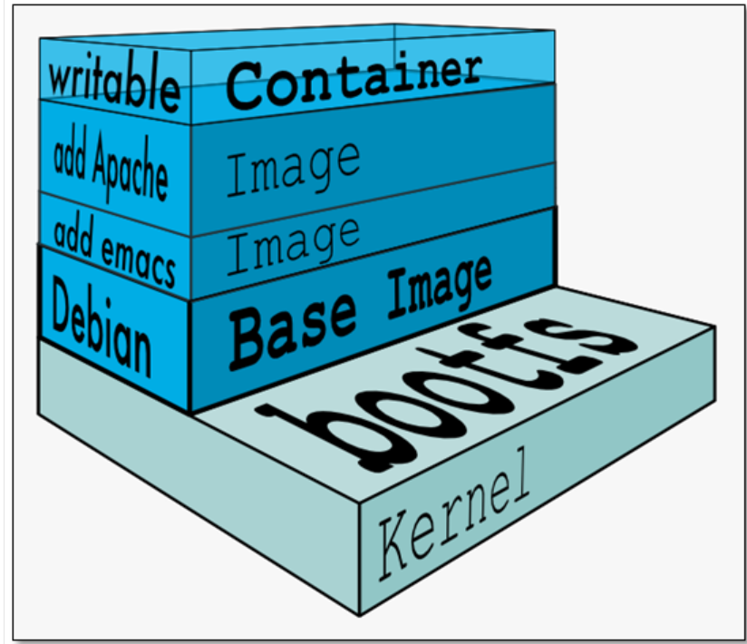

# docker

> [手册\_Docker中文网 (github.net.cn)](https://docker.github.net.cn/manuals/)
>
> [docker中文社区,docker帮助,docker手册,docker教程,docker安装手册 - docker中文社区](https://www.docker.org.cn/index.html)

## 基础使用

### 架构

可以看到，Docker的主要架构如下：

* 客户端，用于发起各种命令
* 服务端，运行着一个守护进程，暴露出一组`restful-api`，用于相应客户端请求，从而完成docker的核心功能，比如运行容器等
* 注册中心，用于保存用户构建的镜像，并且可以分享出去

#### Client

用于向服务端的守护进程发送请求，并可以等待响应结果。

#### Engine

一个物理/云服务器，用于执行`Docker`守护进程和容器。

#### Image & container

一个`Image`就是一个文件系统，包含了可以运行在`os kernel`之上的程序以及所需要的数据。

而一个容器是每个应用程序组件的独立进程(比如一个web程序，其前端进程，后端进程，数据库进程都在自己的隔离环境运行)。

一个运行进程的容器，所使用的文件系统就是`多层Image`所构建出来的文件系统。

Docker中，`Image`是分层的。如果需要运行多个容器，而它们的部分镜像依赖是重叠的，则只需要在磁盘存储一份就可以。

那如果一个容器运行时，对镜像修改了怎么办？这就是加层的好处，保证对所有镜像的都是`read-only`。

### 使用

#### 操作镜像

通过镜像名称操作

* `docker search`搜索镜像
* `docker  pull`拉取镜像
* `docker images`查看服务器端已经拉取的镜像
* `docker rmi`删除服务器端某个镜像

#### 操作容器

通过容器的名称来操作

* `docker run` 根据镜像运行容器
* `docker ps`查看运容器进程，默认是正在运行的，通过`-a`参数来控制
* `docker start/stop/restart` 启停容器
* `docker stats` 查看容器状态
* `docker logs` 查看容器启动日志
* `docker rm`删除容器
*
