# Git 规范总结

> 一直都是简单的使用git, 并且idea已经有较好的可视化工具。需要系统总结使用方式。

## Local

### level0

#### commit

**定义**

Git 仓库中的提交记录保存的是你的目录下所有文件的快照，就像是把整个目录复制，然后再粘贴一样，但比复制粘贴优雅许多！

Git 希望提交记录尽可能地轻量，因此在你每次进行提交时，它并不会盲目地复制整个目录。条件允许的情况下，它会将当前版本与仓库中的上一个版本进行对比，并把所有的差异打包到一起作为一个提交记录。

Git 还保存了提交的历史记录。这也是为什么大多数提交记录的上面都有 parent 节点的原因 —— 我们会在图示中用箭头来表示这种关系。对于项目组的成员来说，维护提交历史对大家都有好处。


**使用**

比如现在的版本控制链上已经有几个节点了，你可以将当前的`main`追加到`parent`节点之后，作为新的版本。

```plaintext
git commit
```


#### branch & checkout

**定义**

分支只是简单的指向某个提交记录而已，并且建立再多的分支也不会造成存储的开销，所以可以按照逻辑将工作分解为不同的分支，

使用分支的含义，简单来说就是`我想基于当前的某个提交，以及它的所有parent提交进行新的工作`。

创建分支，使用`branch`。而切换分支，使用`checkout`。

**使用**

可以在基于某个`commit`，比如当前`main`所指向的`commit`创建分支。

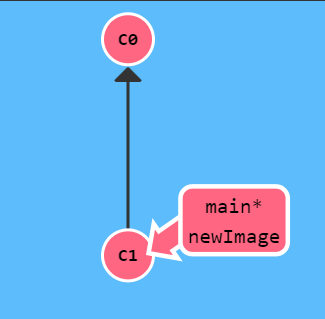

> 这里直接commit的话还是会将main向后推，因为星号还在main上。
>
> 所以需要切换分支到newImage之后，再进行commit.

```plaintext
git checkout newImage;git commit
//或者两者合并
```

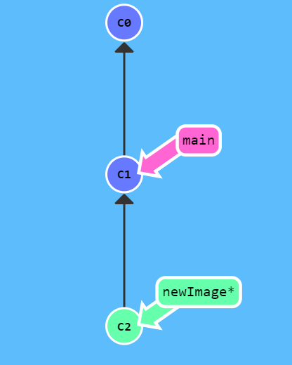

其中，创建新分支和切换到新分支可以一步完成:

```plaintext
git checkout -b newImage
```


#### merge

**定义**

分支有了，并且可以基于分支进行开发，那如何将分支合并回原来的分支呢？就需要使用`merge`。

在 Git 中合并两个分支时会产生一个特殊的提交记录，它有两个 parent 节点。翻译成自然语言相当于：我要把这两个 parent 节点本身及它们所有的祖先都包含进来。

现在情况如下:

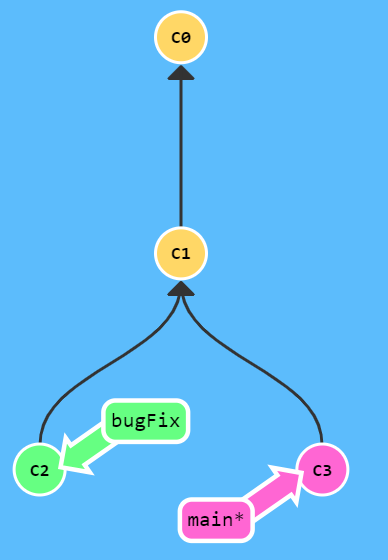

可以看到，基于`c1 commit`，出现了两个分支:也就是`c2,c3`，两者都做了进一步的开发，以及提交，也就是有了新的版本。

将分支垂直，则其中`main`所在的可以看做主分支竖直往下，而bugfix是叉出来的分支。

**使用**

```plaintext
git merge bugFix
```


也就是当前的最新版本，即`c4`，是同时依赖于上述的主分支，以及要合并的分支的。

> 同时依赖，也就是说从当前节点出发，可以回溯到所有的历史版本，这就是符合了merge的语义。可以看到，所有位置都被 mix in 主分支的颜色。

但是现在，bugfix分支并不是最新的，它不能访问所有的节点，怎么办？

```plaintext
git checkout bugfix;git merge main

```

这样之后，由于要符合`merge后的当前节点需要包含两个parent的节点的所有路径；而main又已经包含了parent`，则如下:

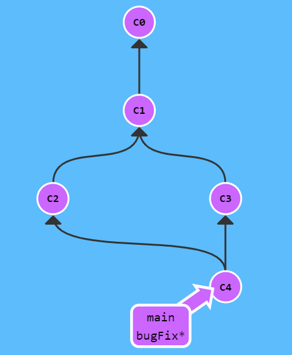

则当前的所有的分支都是最新的。


#### rebase

**定义**

merge和rebase是合并分支的两种方式，后者可以创建更加线性的`commit`历史记录。

具体而言，`rebase`就是取出一系列的提交记录，复制它们，然后在另一个地方逐个放下去。

其实从`rebase`这个单词就可以看出含义了，具体就是为当前分支所指向的最新版本，重新选择基底，而不是原来的基底。从而变得线性。

> 就是将并行开发的两个分支，修改为串行开发的结构。


**使用**

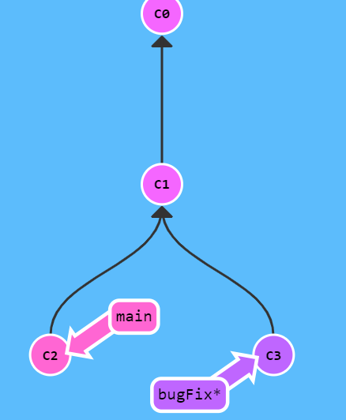

当前在`bugFix`分支上。如果要将当前的分支合并到主分支。

首先，执行

```plaintext
git rebase main
```

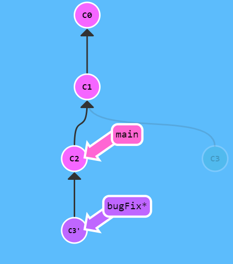

可以看到，，当前的`bugFix`已经变为最新，并且可以回溯到所有的历史版本(进行染色了)。

只有一个问题，就是说`main`没有更新。很显然，我们只需要让`main`以最新版本为基底就可以。

```plaintext
git checkout main;git rebase bugFix
```

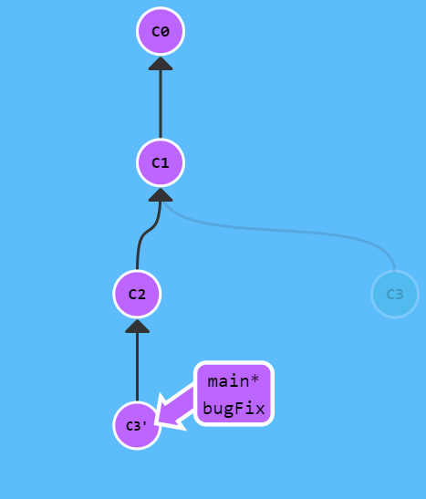


### level1

#### HEAD

> 注意需要大写，否则有些情况可能会出错。

HEAD 总是指向当前分支上最近一次提交记录。大多数修改提交树的 Git 命令都是从改变 HEAD 的指向开始的。

也就是我们总是从head出发的。

但是默认`head`并不是指向最近的`commit`的，而是指向当前分支名称(可以视作指针的指针)。如果要直接指向某个提交记录(通常是哈希名称)，需要如下：

```plaintext
git checkout c1
```

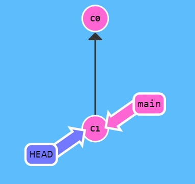


#### 相对引用

**定义**

OK，已知可以直接将head切换到对应哈希值的`commit`上。但是哈希值太长怎么办？

* 使用tab键
* 使用相对引用

> 这里可以看到，其实就是在操作文件系统

**使用**

* `^` 是上一级
* `~num`是向上`num`级

```plaintext
git checkout main^
```

上述命令，就是将head移动到main分支的上一个版本(其实就是*的移动)

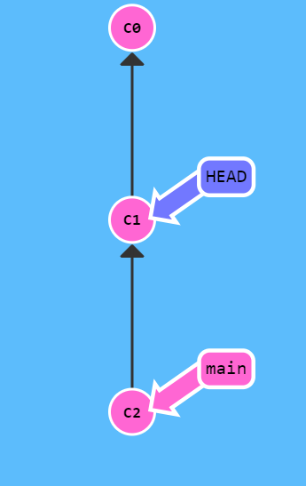

> 并且可以将head作为引用的参照(就和cd ../../一个道理)。

如果要一次向上三步，则就是

```plaintext
git checkout head~3
```


**其他**

还有一个强制修改分支位置。

```plaintext
git branch -f main head~3
```

强制将main分支指向head向上的第三级`parent commit`。

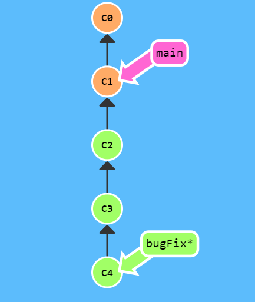


#### reset & revert

撤销/回退变更，有两种方式:

* reset：用于本地撤销
* revert：用于远程撤销

**定义**

```plaintext
git reset HEAD^
```

就是将当前分支的版本控制回退到上一个版本。

```plaintext
git revert HEAD
```

它是为了撤销，并将其分享给别人。

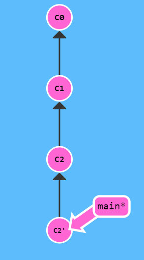

可以看到，从c2位置执行这行命令，则会多出来一个修改版本，它是用来将状态修改会`c1`的，也就是说，它是`c2`的反操作，将状态回退到c1。


## Remote

将代码进行远程版本控制，有两个作用

* 进行代码备份，即使本地的数据丢失，也可以从远端仓库拿回丢失的代码
* 远程代码社交化，也就是可以进行多人协作管理

### Level0

#### clone & checkout

**定义**

`clone`就是将远端的代码在本地存储一份。

这个含义就是在本地创建一个远程分支(在此处的名称是`o/main`)。远程分支反映了远程仓库的状态，是团队合作共享结果的重要节点。

> 切换到远程分支之后，会自动进入分离HEAD状态。

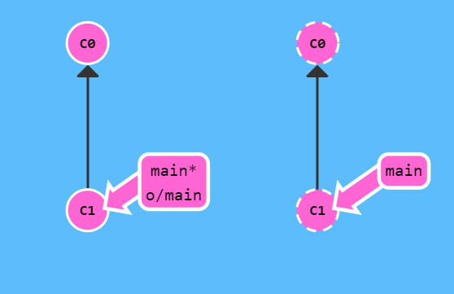


**命名**

远端分支的命名，是`remove-name/branch-name`。

其中，远端分支名称，默认是`origin`。

**使用**

```plaintext
git checkout o/main;git commit
```

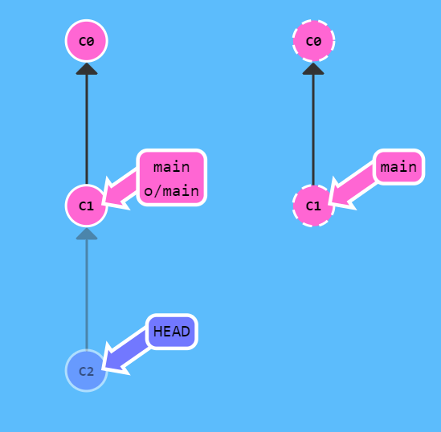

可以看到，进行上述命令后，由于是分离HEAD模式，只有本地的HEAD移动了，记录了变更。


#### fetch

**定义**

和远端仓库的交互，可以被归纳为两部分:

* 推送
* 拉取

而`fetch`就是为了完成拉取的环节。

> 它只是将本地的远程分支更新，并不会动本地的主分支。

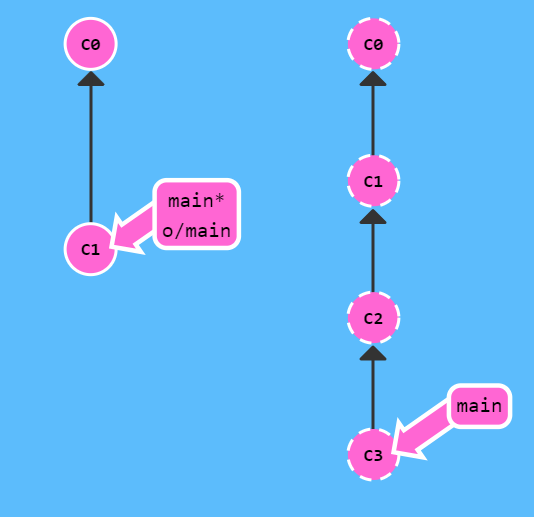


```plaintext
git fetch xxx协议
```

执行完`git fetch`之后，如下:

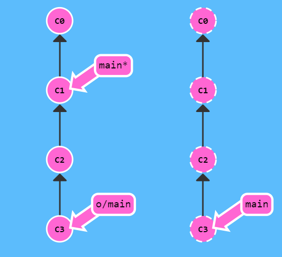

语义就是将远端仓库的变更，下载到本地，并应用到本地对应着远端的`o/main`分支。

其实就是: 将本地仓库中的远程分支更新成了远程仓库相应分支最新的状态(通信时候的最新状态)。

> git fetch并不会改变本地仓库的状态，不会更新`main`分支，最根本的，它就没有修改之前的磁盘文件。只是单纯的将`commit`下载下来。

#### pull

**定义**

实际上，常见的工作流程是:

1. 拉取远端数据到本地(此时会只会更新远程分支，并没有合并主分支)
2. 将远程分支和主分支合并

Git将这两者封装为一个原子操作:`Pull`

站在当前的`main*`上，则

```plaintext
git fetch & git merge o/main
```

等价于

```plaintext
git pull
```


**使用**

常见的使用方式如下:

1. 将远端代码`clone`下来
2. 远端代码有变更（其他人修改）
3. 本地代码也有变更(本地commit)
4. `git pull` 将远程分支更新为最新，然后和本地main分支合并

#### push

**定义**

负责将本地变更上传到远端。

**使用**

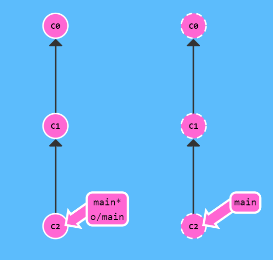

如果本地是c1 -> c2，而远程仓库是c1，则执行如下:

```plaintext
git push
```

结果为上图所示，远端分支更新，同时更新本地远程分支和此时的远端分支一致。


#### rebase  & push

这里就是一个常见的场景，常见的活跃项目的开源贡献，通常你可能刚clone完毕，就有人将远程仓库修改了，这时候你的本地代码，和远端代码就会有交叉`diff`，则不能使用push。

**rebase & push**

```plaintext
git fetch;git rebase o/main;git push
```

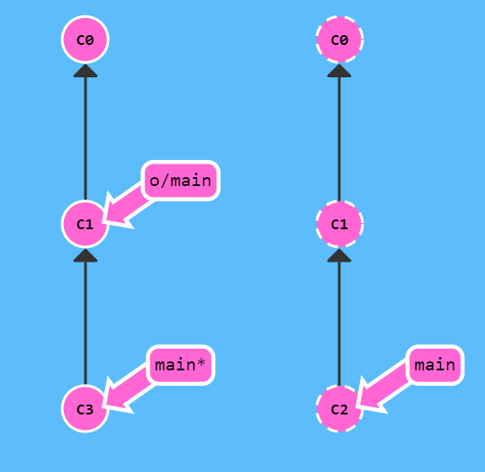

未修改前如上图，有交叉diff。

修改完毕如下图:

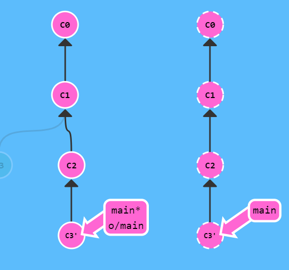


而git同样提供了原子操作:

1. git fetch;git rebase o/main ;git push
2. git pull --rebase ; git push

两者完全等价


#### push feature

**场景**

就是常规情况，共享仓库的`main`分支被锁住了，只能让管理员通过`Pull Request`的方式进行合并。也就是说，你不能直接push来更新`Main`分支了。

**解决办法**

创建一个分支`feature`,推送到远程服务器，然后将本地的`main`分支和远程服务器保持一致。

```plaintext
git checkout  -b feature c2
git push origin feature
git checkout main;git reset o/main
git checkout feature
```


## 常见工作流程

### 开源贡献

> [代码提交指南 - Apache Doris](https://doris.apache.org/zh-CN/community/how-to-contribute/pull-request)
