# 操作系统

## 虚拟化

### why

> [进入内核态究竟是什么意思？ - 知乎 (zhihu.com)](https://www.zhihu.com/question/306127044)

**计算机状态的维护**

计算机的基本结构：`运算器，控制器，存储器，输入，输出`

而其中有状态的部分就是控制器和存储器，而控制器的状态，又来自于寄存器。

所以整个计算机系统的状态全部由`存储器 + 寄存器`来维护。

从`安全性`考虑来说：如果任意程序都可以完全控制`主存和寄存器`，则它能改变系统的任何部分，包括`入侵OS内核`。

从`可用性`考虑来说，多任务情况更加复杂，比如内存地址冲突，外设读取冲突，存在作恶任务等等情况。

所以需要从能够改变状态的`CPU`，以及维护状态的`存储器`入手解决这个问题。

**CPU状态**

CPU被设计为两个状态，分别是内核态(特权模式)和用户态(用户模式)。切换到内核态的CPU可以执行任意指令，而切换到用户态的CPU只能执行部分指令。

**内存访问限制**

CPU引入`MMU`，也就是内存管理单元组件，来实现内存访问限制。`CPU`在用户模式下，所有地址访问均经过`MMU`。而在`特权模式`下所有地址访问均绕过`MMU`。

具体来说，采用虚拟地址空间技术来实现内存访问限制，其通过页表实现了从虚拟地址到物理地址的转换(以页(4KB)为最小粒度)。

如果有进程切换，而页表会作为上下文的一部分进行存储，并且可以在重新加载的时候提前由`OS`进行修改，这样就可以实现了内存的访问限制。

### 并发

#### LWP

> [轻量级进程 - 维基百科，自由的百科全书 (wikipedia.org)](https://zh.wikipedia.org/wiki/%E8%BD%BB%E9%87%8F%E7%BA%A7%E8%BF%9B%E7%A8%8B)
>
> [何时使用clone()和fork而不是pthreads？ linux - Dev59](https://dev59.com/lmgu5IYBdhLWcg3wASWO)

这里只针对`Linux`。

Linux操作系统中的调度只能通过进程来实现。

通常，用户编程的时候，如果要创建进程，会使用`系统调用fork`。要创建线程，则使用`用户库函数pthread_create`。而在当前的`Linux`实现中，两者最终都是通过`sys_clone`系统调用来创建的。

`sys_clone`根据传入的参数不同，也就是资源隔离范围不用，可以创建任意粒度的轻量级线程。最常见的就是`进程`以及`线程粒度的轻量级进程`，当然我们可以创建其他不同粒度的调度实体来实现自己想要的调度功能，比如只从`父进程`继承`fd`资源的轻量级进程。

在创建用户线程，也就是调用`pthread_create`库函数的时候，一个用户线程就对应着`一个线程粒度的LWP`。

而用户态的多线程并发，可以认为对应着内核态的`线程粒度LWP`并发调度。

#### 协程

> [协程 - 维基百科，自由的百科全书 (wikipedia.org)](https://zh.wikipedia.org/wiki/%E5%8D%8F%E7%A8%8B)

协程就是一种用户级线程，但是它对内核是完全透明的。而不是和传统的用户线程一样，绑定一个`LWP`。

协程对应的任务调度理论是`用户态协作式任务调度`，而线程对应的任务调度理论则是`内核态抢占式任务调度`。

也就是说，协程针对的是`单个core`上的调度问题，也就是`并发问题`。而线程针对的则是`OS`对于`多core`的调度问题，也就是`并行问题`。

### 内存

> 这里不说分段的了，因为目前基本都使用分页管理技术。

#### 分页存储

**页**

将一个进程逻辑地址空间不再是分割为几个不同长度的逻辑段(堆，栈，代码区)，而是统一大小分页。同时将物理内存同样通过页帧来管理。

假设一个进程逻辑地址空间大小一共`64 Byte`，而一个页有`16 Byte`，则可以分为4个页大小。通常32位可以有`4GB`的地址空间。

将上述逻辑地址空间放入物理内存，如下图所示:

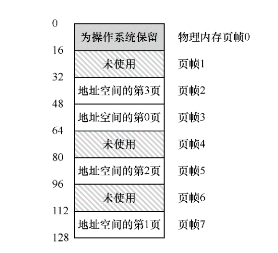

**页表**

为了记录本进程的每个逻辑页的物理存放位置，操作系统通过为每个进程维护一个`page table`，也就是页表来实现。页表可以为每个逻辑页存储对应的地址转换关系。

那么如果`CPU`在用户态下访问内存，则会通过`MMU`，访问页表并将虚拟地址转换为物理地址，过程如下：

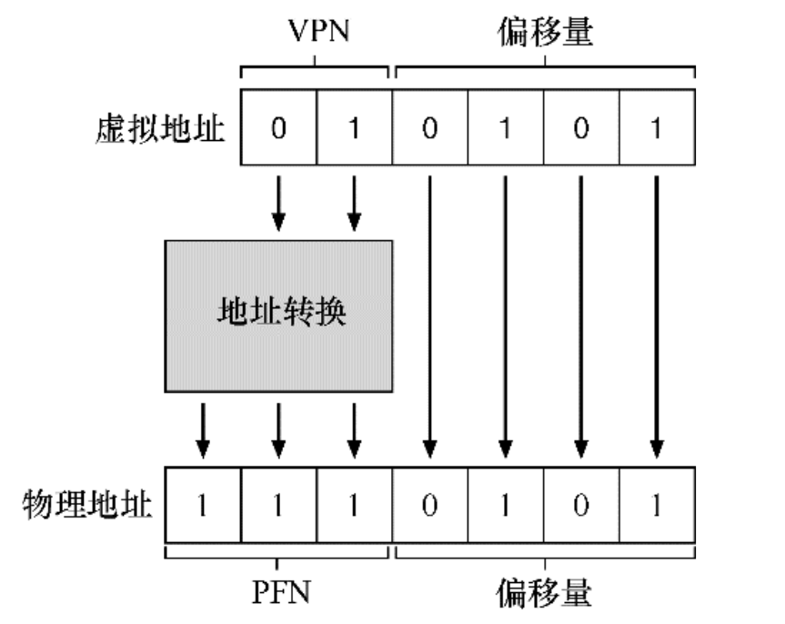

也就是说，由于虚拟地址映射以页为单位，所以找到对应的物理页，偏移量不用变就可以。其中的`VPN`是虚拟页号，而`PFN`是物理页号。

由于地址空间的大小原因，页表可以变得特别大，所以存储在内存中而不是`MMU`中，如下图所示：

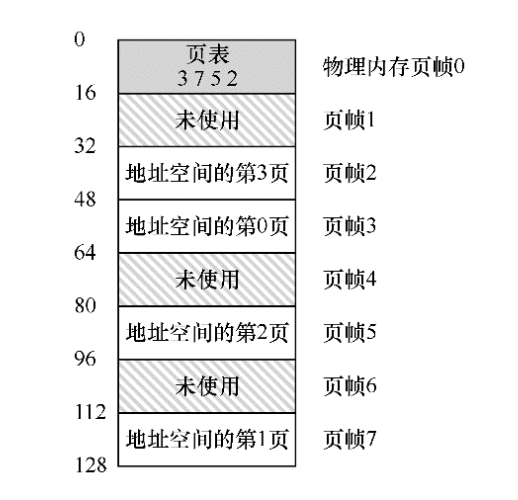

**页表项**

在`x86`中，一个标准的页表项是4字节。

假设页表是线性的，则`Array[VPN] = PTE`，也就是对应的页表项(PTE)。一个标准的`PTE`如下所示，存储着是否允许对该物理页读写，是否为脏页等信息。

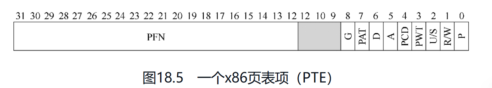

#### TLB

**无TLB，CPU访问页表**

已知切换到用户态的`CPU`，会将所有访问内存地址的指令全部过一遍`MMU`，则`MMU`该如何和页表交互呢？

具体而言，`MMU`中由一个`页表基址寄存器`，存储着页表的起始位置。

对于一个虚拟地址，首先需要访问页表:

```plaintext
VPN     = (VirtualAddress & VPN_MASK) >> SHIFT 
PTEAddr = PageTableBaseRegister + (VPN * sizeof(PTE))
```

然后通过`offset`以及`PTE`中所得到的`PFN`，如果可以访问该页的位置，则直接通过真实地址访问即可。

`CPU`每次访存，都被放大成了两倍。

**有TLB**

`TLB`,地址转换旁路缓冲存储器，是频繁发生的虚拟到物理地址的转换的`cache`.

实际上存储的是`VPN-PFN`键值对。

具体控制流如下：

```plaintext
1    VPN = (VirtualAddress & VPN_MASK) >> SHIFT
2    (Success, TlbEntry) = TLB_Lookup(VPN)
3    if (Success == True)    // TLB Hit
4        if (CanAccess(TlbEntry.ProtectBits) == True)
5            Offset   = VirtualAddress & OFFSET_MASK
6            PhysAddr = (TlbEntry.PFN << SHIFT) | Offset
7            AccessMemory(PhysAddr)
8        else
9            RaiseException(PROTECTION_FAULT)
10   else    // TLB Miss
11       PTEAddr = PTBR + (VPN * sizeof(PTE))
12       PTE = AccessMemory(PTEAddr)
13       if (PTE.Valid == False)
14           RaiseException(SEGMENTATION_FAULT)
15       else if (CanAccess(PTE.ProtectBits) == False)
16           RaiseException(PROTECTION_FAULT)
17       else
18           TLB_Insert(VPN, PTE.PFN, PTE.ProtectBits)
19           RetryInstruction()
```

可以看到，越是热点的区域使用`TLB`收益就越高，也就是遵循局部性原理。假设一共有`n`次访存，则`有TLB情况下只需要n+1`次，而无`TLB`就是`2n`次访存开销。

**对于TLB未命中**

有软件和硬件两种管理形式。

硬件形式:TLB未命中，触发异常中断，`CPU`切换到内核态，执行对应的异常处理程序。而这段异常处理程序就是查找对应的页表，并用特权指令写到`TLB`，然后切回内核态程序处，然后硬件会重试并命中（注意是这里是重试，而不是正常情况下的向下执行）。

**进程切换的TLB处理**

对于进程切换，常见的思路就是简单的`flush_tlb`，将当前的状态清除，而不影响其他进程。

#### 多级页表

**目的**

地址空间的占用情况往往是稀疏的，多级页表是为了解决线性页表占据空间太大的问题，将稀疏的分布变得紧凑。

**基本思想**

将页表本身同样通过页进行存储，然后对这些划分后的粗粒度页(`4KB`)而不是细粒度的页表项(`4Byte`)通过页目录进行管理，如果有的页中的页表项全部为`invalid`,则不继续存储，并标志`invalid`。

通过一个有中间层功能的顶级页表(`页目录`)，为真正有用的页表提供索引，这也就是多级页表的最终目的：使得页表中的每个页都是有用的(页目录除外)。

当然，这时候如果`TLB`未命中，如果是两级页表，则需要从内存加载两次(页目录 + PTE)。

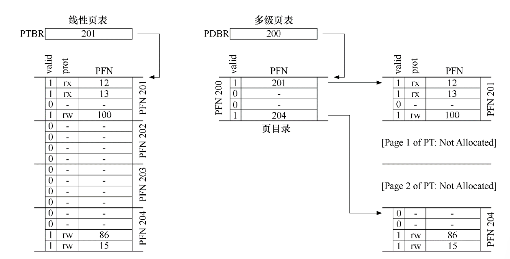


## 并发化

### 互斥

#### 互斥锁API

通常使用锁来对临界区的访问变为串行化。

一个互斥锁(mutex)，通常有`lock & unlock`api提供给用户。可以使用它来对不同的区域进行加锁，从而达到精细的控制。

```c
1    pthread_mutex_t lock = PTHREAD_MUTEX_INITIALIZER;
2
3    Pthread_mutex_lock(&lock);    // wrapper for pthread_mutex_lock()
4    balance = balance + 1;
5    Pthread_mutex_unlock(&lock);
```

#### 锁的评价标准

从三点进行评价:

* 正确性
* 公平性
* 性能

通常正确性是一个锁的必要条件，而公平性可以根据需要进行实现，性能的话则是越高越好。

#### 锁的实现

对于单核或多核，实现方式也有不同。

**关闭中断**

首先是单核程序，由于是单核，则`OS`获得控制权从而调度程序的方式只有通过中断。通常系统会提供时钟中断来让`OS`获得定时的必要的操控权利。

如果在临界区关闭中断，则执行临界区代码的时候必然不会有其他程序的进入，则完成的对临界区的串行访问。

多核方式则需要使用硬件指令。

**testAndSet 、compareAndSwap**

关闭中断的方式无法在多核上起作用，因为程序还可以被调度到其他核上。

最简单的方式是使用一个`flag`变量来控制多线程对临界区的访问如下，我们通过`test then set`的方式检查这个变量(注意这里不是`and`，也就意味着不是原子的)。

```c
1    typedef struct  lock_t { int flag; } lock_t;
2
3    void init(lock_t *mutex) {
4        // 0 -> lock is available, 1 -> held
5        mutex->flag = 0;
6    }
7
8    void lock(lock_t *mutex) {
9        while (mutex->flag == 1) // TEST the flag
10           ; // spin-wait (do nothing)
11       mutex->flag = 1;         // now SET it!
12   }
13
14   void unlock(lock_t *mutex) {
15       mutex->flag = 0;
16   }
```

这个程序显然是有问题的，如果一个程序刚通过`test`，在`set`的之前被中断了，这时候另一个程序可以轻松同样通过`test`。从而，两个线程都进入了临界区，这是不正确的。

但是，现在硬件已经提供了`test and set`的指令意味着上述的操作可以原子性完成，则可以通过上述方式实现一个互斥锁:

```c
1    typedef struct  lock_t {
2        int flag;
3    } lock_t;
4
5    void init(lock_t *lock) {
6        // 0 indicates that lock is available, 1 that it is held
7        lock->flag = 0;
8    }
9 
10   void lock(lock_t *lock) {
11       while (TestAndSet(&lock->flag, 1) == 1)
12           ; // spin-wait (do nothing)
13   }
14 
15   void unlock(lock_t *lock) {
16       lock->flag = 0;
17   }
```

通过`test-and-set`操作单变量 + while实现的锁称为自旋锁。要使用自旋锁，操作系统必须能通过时钟中断的方式实现抢占式调度的方式(即不断中断一个线程，运行其他线程)。虽然如此，但是其仍然会浪费`一个时间片`。

评价这个自旋锁:

* 是正确的
* 没有公平性保证
* 单核性能极低，多核通常性能不错

如何解决自旋过多的问题?

答案是再次寻找硬件/操作系统的支持，让其提供用户线程的调度原语。

当前的操作系统，线程的状态有三种:

* 就绪
* 运行
* 阻塞

在JDK中，让进程/线程/LWP从 运行转换到阻塞的调用如下:

> [java线程的五大状态，阻塞状态详解 - Life\_Goes\_On - 博客园 (cnblogs.com)](https://www.cnblogs.com/lifegoeson/p/13516019.html)

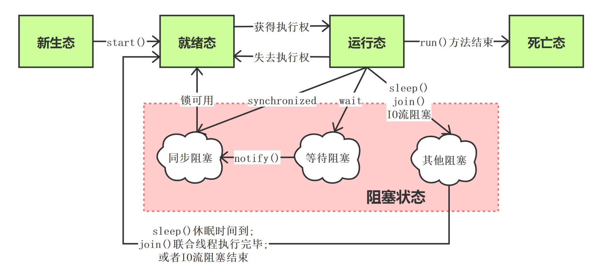

而操作系统，可以通过如下方式让线程进入阻塞态，而不是占用`CPU`时间片。

* `park & unpark`：让线程在获取不到锁的时候直接`park`，让其休眠进入阻塞态,随后可进入就绪态
* `两阶段锁`:第一阶段自旋，获取不到则让其休眠进入阻塞态，随后可进入就绪态

### 同步

通常使用`条件变量`的方式，进行线程/进程间同步。

#### 线程同步场景

```c
1    void *child(void *arg) {
2        printf("child\n");
3        // XXX how to indicate we are done?
4        return NULL;
5    }
6
7    int main(int argc, char *argv[]) {
8        printf("parent: begin\n");
9        pthread_t c;
10       Pthread_create(&c, NULL, child, NULL); // create child
11       // XXX how to wait for child?
12       printf("parent: end\n");
13       return 0;
14   }
```

上述就是一个线程同步的场景，比如常见的`join`调用。

#### 条件变量

条件变量是一个显式队列，里面是等待该条件变量对象的线程。

其提供`wait/signal`来让线程入队出队，并且**会同时让出锁对象**

> 通过`Thread.sleep`方式进入阻塞态的线程并不会让出锁对象

其使用方式是被互斥锁保住，并配合用户程序的某个条件(比如x == 3)

> 注意，这里的条件(用户线程感兴趣的值)和`condtion`对象不同，后者内部维护的是队列

#### 信号量

信号量的使用详见下面的消费者-生产者问题。

虽然信号量的功能齐全，但是很多时候并不推荐使用信号量，因为其操作复杂并且很容易失误。

其使用方式如下-比如通过信号量初始值为1，实现互斥锁:

```java
    val sem = new Semaphore(1)
    var count = 0
    val service: ExecutorService = Executors.newCachedThreadPool()
    for(i <- 0 to 1000){
      service.execute(new Runnable {
        override def run(): Unit = {
          sem.acquire()
          count += 1
          sem.release()
        }
      })
    }
    service.shutdown()
    while(!service.isTerminated){
      Thread.sleep(1000)
    }
    println(count)
```

基本原理就是维护一组资源，一个线程获得一个资源，就将其减1。一个线程让出资源，就将其加1。

信号量为负几，就代表还有几个线程正在等待资源(位于阻塞态)。

而通过信号量初始值为0，可以实现join。

#### Scala实现join

```java
  @Test
  def test02(): Unit = {
    val lock = new ReentrantLock()
    val condition = lock.newCondition()
    var done = 0

    new Thread(() => {
      lock.lock()
      Thread.sleep(1000)
      done = 1
      println("child")
      condition.signal()
      lock.unlock()
    }).start()
  
    //下述方式等同于thread.join
    lock.lock()
    while(done == 0){
      condition.await()
    }
    lock.unlock()
    println("main")
  }
}
```

可以看到，条件变量通常是和锁在一起的，而在JDK中直接从lock中获取condition。

### 消费者-生产者问题

#### 描述

生产者-消费者问题，也称为有界缓冲区问题。

假设有两侧有多个消费者/生产者，如何完成围绕缓冲区的消费-生产模式，而不发生错误。

#### 问题实质

这个问题的实质，可以拆分为并发问题的两大方面：`互斥`和`同步`。

首先，对于共享缓冲区(通常放置在堆中)，其实就是临界区，所以多个线程访问就必然有竞态问题，通常的解决办法就是对临界区加`互斥锁`

然后，两侧的生产者-消费者线程之间，就是涉及到了线程的同步问题-如何在合适的时候调度合适的线程，通常通过`条件变量`来完成。

#### 解决办法

对于临界区的操作，加一个互斥锁。

对于线程同步问题，使用两个条件变量，维护两种等待线程的队列(生产 、消费)

> 条件变量部分使用while而不是if，使得线程被唤醒之后会再次判断，防止假唤醒的情况。使用if会直接向下走
>
> 只有一个条件变量的话并不能区分唤醒的是哪种线程，所以使用两个条件变量，维护两种等待队列。

代码如下:

```cpp
1    cond_t empty, fill;
2    mutex_t mutex;
3
4    void *producer(void *arg) {
5        int i;
6        for (i = 0; i < loops; i++) {
7            Pthread_mutex_lock(&mutex);                 // p1
8            while (count == MAX)                        // p2
9                Pthread_cond_wait(&empty, &mutex);      // p3
10           put(i);                                     // p4
11           Pthread_cond_signal(&fill);                 // p5
12           Pthread_mutex_unlock(&mutex);               // p6
13       }
14   }
15
16   void *consumer(void *arg) {
17       int i;
18       for (i = 0; i < loops; i++) {
19           Pthread_mutex_lock(&mutex);               // c1
20           while (count == 0)                            // c2
21               Pthread_cond_wait(&fill, &mutex);     // c3
22           int tmp = get();                              // c4
23           Pthread_cond_signal(&empty);              // c5
24           Pthread_mutex_unlock(&mutex);             // c6
25           printf("%d\n", tmp);
26       }
27   }


```

#### Scala实现

**方式1：双条件变量 + 互斥锁**

```java
class ProducerConsumer {
  @Test
  def test(): Unit = {
    val buf = new Buffer()
    val producerList = for(i <- 1 to 5) yield new Producer(buf)
    val consumerList = for(i <- 1 to 5) yield new Consumer(buf)
    val service = Executors.newCachedThreadPool()
    for(p <- producerList;c <- consumerList){
      service.execute(p)
      service.execute(c)
    }

    service.shutdown()
    while(!service.isTerminated){
      Thread.sleep(1000)
    }
    println("end")
  }

}
class Buffer{
  private val lock = new ReentrantLock()
  private val empty = lock.newCondition() //条件变量通常和锁绑定
  private val full = lock.newCondition()
  private val buffer = mutable.ArrayBuffer[Int]()
  private val maxSize = 10

  def put(i: Int):Unit = {
    val flag: Boolean = lock.tryLock(3, TimeUnit.SECONDS)

    while (buffer.size >= maxSize){
      full.await()
    }
    buffer += i
    empty.signalAll()

    lock.unlock()
  }

  def get():Int = {
    val flag: Boolean = lock.tryLock(3, TimeUnit.SECONDS)
    while(buffer.size <= 0){
      empty.await()
    }
    val i = buffer.remove(0)
    full.signalAll()

    lock.unlock()
    i
  }
}

class Producer(buffer: Buffer) extends Runnable{
  override def run(): Unit = {
    for (i <- 1 to 1000){
      buffer.put(i)
    }
  }
}
class Consumer(buffer: Buffer) extends Runnable{
  override def run(): Unit = {
    for (i <- 1 to 1000){
      buffer.get()
    }
  }
}
```

在这里，可以尝试将`while`修改为`if`，在我的测试中，使用`if`的情况必然会报异常，因为其不能对进来的(被唤醒的，拿到锁的)线程再次进行判断，防止它就是上一次调用的线程(`假唤醒`)。而使用`while`则彻底避免了这种情况。

其实可以使用`阻塞队列`来胜任有界缓冲区功能，甚至无界缓冲区的也可以。

有界缓冲区，则直接使用`LinkedBlockQueue`即可，两边可以开任意线程进行生产/消费。

```java
class Producer3(buffer: ArrayBlockingQueue[Int]) extends Runnable{
  override def run(): Unit = {
    for (i <- 1 to 10000){
      buffer.put(i)
    }
  }
}
```

#### 其他库函数

> 库函数的实现只适用于只有两个线程同步交换数据，或者说两边可以组成一对对的情况。也就是点对点的交互，并没有更多线程的方式。
>
> 而上面的设计则是通用的逻辑，并且是异步交换。这两者有本质不同。

**SyncChannel**

```java
class Producer2(channel: SyncChannel[Int]) extends Runnable{
  override def run(): Unit = {
    for (i <- 1 to 10000){
      channel.write(i)
    }
  }
}
```

**exchanger**

Java同样提供了一个库函数，当然在Scala内也能使用。这个库函数内部不像`SyncChannel`一样只有70行代码，相反的，它有700行。

具体使用和上述方式类似.


## 持久化

### I/O设备

#### 架构

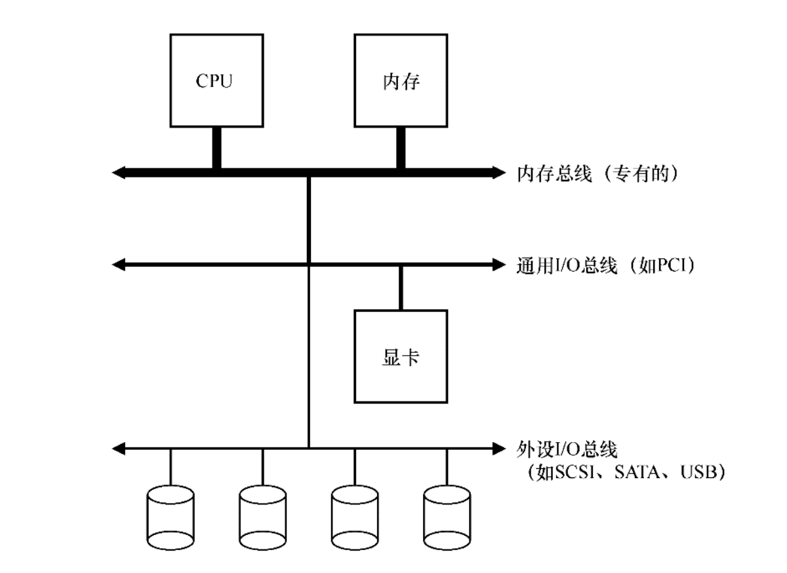

典型的系统架构如上所示，整体采用分层的方式：

* 内存最靠近CPU，并通过`内存总线`与其连接
* 然后是一些高性能设备，被`系统总线/通用IO总线`连接
* 最后是注重扩展性的外设部分，通过`外设IO总线`和`CPU`相连

#### 标准设备

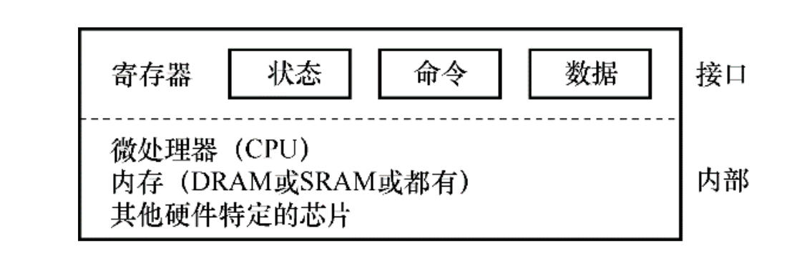

IO部分的一个抽象的标准设备如上。

硬件需要一些接口，来让系统软件通过遵循`标准协议`的方式来控制它，也就是访问改变寄存器状态，从而达到使用外部设备的目的。

而外部设备内部同样有`CPU`以及`RAM`，其同样遵循`标准协议`来操作寄存器，以及内部设备，从而让系统和外设可以通过`标准协议`进行交互。

**和寄存器交互的方式**

* 特权指令，比如`in/out`指令
* 内存映射, 外设将寄存器作为内存地址提供，则`OS`不用引入新指令，正常读写就可以。

#### 标准协议

具体的标准协议可以有多种实现，只要能够`OS`和`外设`按照协议，通过共同操作寄存器来达到交互的目的就可以。

**简单轮询**

> 非阻塞IO的实现

1. `os pulling status register`
2. `os writes data to data register by PIO`（PIO，也就是可编程的IO，即通过CPU来实现数据的移动）
3. `os writes command to command register`
4. `again polling`

缺点：需要操作系统不能挂起当前的`LWP`，并且一直使用`CPU`进行轮询。

#### 中断

> 阻塞IO的实现
>
> 在`unix-like`操作系统中，进程等用于

首先，操作系统调度的当前`LWP`，通过执行该进程的`CPU`首先向`外设`发送IO请求，然后操作系统让对应的进程挂起，从而可以调度其他进程在该`CPU`上执行。

而`外设`完毕之后，则发起`硬件中断`，引发`CPU`跳转到对应的中断处理程序。这里的处理程序则会重新将之前被挂起的进程在合适的时机恢复。

中断的意义，就在于通过切换，使得`IO和计算`重叠，最大化利用了`CPU`的资源。

**混合与合并**

* 如果`外设`是高性能设备，也就是可以快速实现进程的需求
* 如果该用户进程需要最短可控时间来得到想要的数据

则不应该只用中断。中断将进程再次交给了`OS`调度，而进程上下文切换以及响应中断的开销很大。如果直接`polling`并得到结果的开销可以接受，则可以采用`polling`。

当然，也可以两者混合，先`polling`,不能忍受了再交给`OS`进行调度。

或者针对中断的场景进行优化，批处理数据再统一中断，减少处理中断的代价,也就是`多LWP`在`core`的切换问题。

#### DMA

直接存储器访问。

操作系统指示之后，DMA就可以自己将数据从外设传输到内存，而不使用CPU。完成之后，将触发硬件中断。

#### 驱动

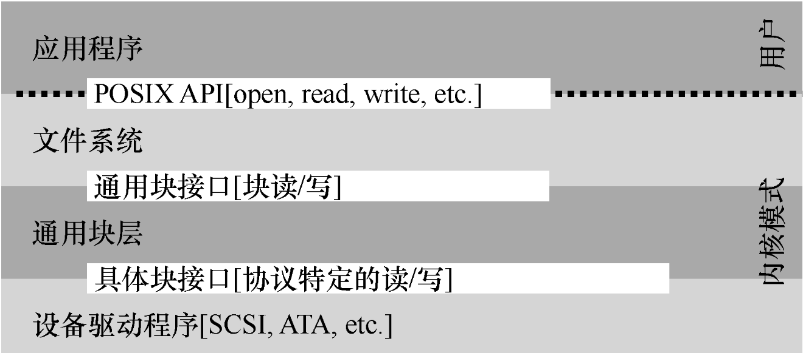

`Linux`系统的典型文件系统结构如上。

可以看到，其采用了分层的方式，对系统进行抽象，和计算机网络的思想是类似的。

用户调用的系统API，在内部首先经过文件系统API调用，最后由具体块接口路由到驱动程序部分，然后驱动程序完成对应操作之后返回调用。

驱动程序一般是在用户插入外设之后，主动下载的程序，比如多数鼠标插入的时候就提示需要下载驱动。

以网络通信为例子，当数据全部从网卡的`FIFO`缓存到达`内存skb_buffer`之后，发起硬件中断，操作系统调度`网卡驱动`，对`skb_buffer`的数据进行处理，然后向上传递。

#### 硬盘

> [硬盘 - 维基百科，自由的百科全书 (wikipedia.org)](https://zh.wikipedia.org/wiki/%E7%A1%AC%E7%9B%98)

### 文件和目录

#### 基本抽象

**文件**

文件就是一个字节数组，并且由一个`整数inode-number`(也可以称为`inode handle`)代表。

**目录**

> [inode - 维基百科，自由的百科全书 (wikipedia.org)](https://zh.wikipedia.org/wiki/Inode)

目录是一个`List[(name,inode)]`列表，存储该目录下每一个文件的用户名称，以及底层名称，也就是`inode`。

文件系统对象中只有`inode`的概念，而`文件和目录`都只是一个别名。可以通过文件系统的`inode-numer`去文件系统存储区域的元数据空间去索引`inode table`，然后找到对应的文件的真实存储位置与其他元数据信息(也就是`真正的inode`)。

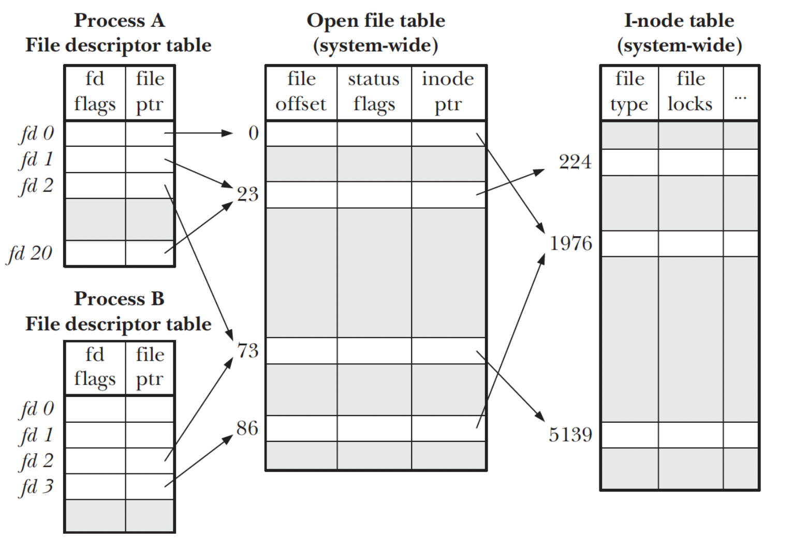

#### 接口调用

**创建文件**

```c
int fd = open("foo", O_CREAT | O_WRONLY | O_TRUNC);
```

这里的系统调用返回的结果就是一个`fd`，也就是文件描述符下标，或者将其称为句柄(void * )。

> 之所以获得的是下标而不是直接的文件对象指针,就是系统出于安全的屏蔽考虑。一切用户访问都路由到这个`fd table`，方便资源与权限管理，而不是任何程序都可以随便直接操作文件对象。

每个进程提前打开了3个文件，分别是标准输入，标准输出，标准错误。

**硬链接**

> ln file1 file2

实际上就是在目录中添加了一个`(new_name,inode`），也就是链接和被链接的两个文件的inode实际上就是一个，他们指向磁盘元数据区域的同一块元数据位置。

删除文件实际上就是去除了一个硬链接。只有到引用数为0的时候，才会删除磁盘上的数据。

**软链接**

> ln -s file1 file2

这里就是`Linux`文件系统的第三种抽象。

软连接会创建一个新的类型文件，并用`file1- > file2`作为文件内容。

从而屏蔽掉直接复用`inode`带来的两个问题：

* 不能硬链接目录
* 不能跨文件系统链接

**mount**

挂载文件系统，并将所有文件系统(`ext3/4,proc,tmpfs,AFS`)统一到同一颗树上，命名统一并且方便。

### 传统文件系统

#### 心智模型

文件系统整体模型分为两个部分：

* 文件系统的数据结构
* 访问方法，也就是暴露给用户的API

应该要思考文件系统在磁盘应怎么存储数据和元数据，在内存如何暴露怎么样的API。

#### 整体组织

> 文件系统的数据结构

**磁盘数据**

对磁盘扇区组织起来形成块，`1 block = 4 KB`。

> 对于快速文件系统，还会引入`block group`来优化文件组织，使用局部性原理降低随机写的概率，提高性能。

然后存储区域抽象为数据区域和元数据区域。

并使用很少的`block`作为`bitmap`，存储两种区域的每个位置的使用情况。

最后是`super block`，存储文件整个文件系统的元数据信息，`mount`的时候加载`super-block`到内存并初始化信息就算挂载完毕。

**inode**

这里要区分`inode`和`inode number`。也就是给操作系统进程暴露的都是`inode numer(inode handle)`，然后再磁盘维护着一个`Array[inode]`，一个`inode`存储着一个文件对象真正的元数据。

一个典型的`inode结构体`如下：

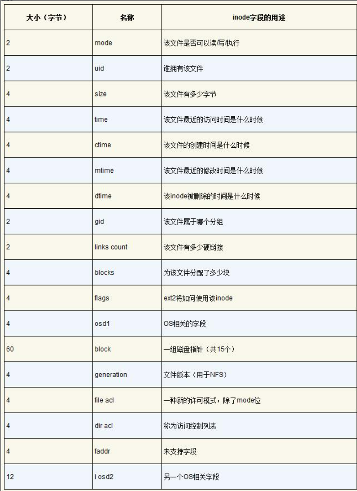

**目录**

目录就是`List[(user_name,inode-numer)]`的别名，并附加一些其他的元数据信息。

其本身同样有一个`inode`结构存储于磁盘中。而根目录的`inode-number`是暴露给全部用户的。

#### 访问过程

> 用户访问API的所发生的过程

假设现在一个磁盘存储着一个文件系统，我们要通过系统访问它，比如调用`open`系统调用访问`/foo/bar`

1. 首先，将该文件系统挂载，`super-block`加载到内存
2. 使用`open`系统调用之后，会从根目录开始访问(因为开始只知道根目录的`inode`位置)。然后开始路径匹配过程，依次将目录读取出来并遍历查找。
3. 最终可以找到`/foo/bar`对应的`inode-number`，然后从磁盘找到`inode`并从数据区读取文件。

#### 缓存

**读缓存**

OS通常会将系统内存的`10%`取出来，使用`LRU`策略等缓存进程常用的`block`。

**写缓存**

写的时候也可以缓存起来，最后按`batch`写入。当然这样提高性能的同时也降低了可靠性，因为引入了中间态。

### 日志结构文件系统

#### 概述

日志结构文件系统整体思路：针对写多读少的场景，将所有更新(包括元数据信息inode)缓存在内存段中，等到积累到足够量的时候再一次性`顺序写入`磁盘中，并且是从未被使用的部分。

也就是说，加了一层中间层(内存缓冲)，将所有写统一为`顺序写`。也就是`copy on write`。

#### 缓冲

**必要性**

如果不是足够量的缓冲，就算一个个顺序写，但是两次写之间，磁盘可能已经旋转，那就必须再转回来。这样的开销很大。

所以缓冲的目的就在于`制造一次连续大写入`,写入的是一个段，也就是很多个`block`。如下所示

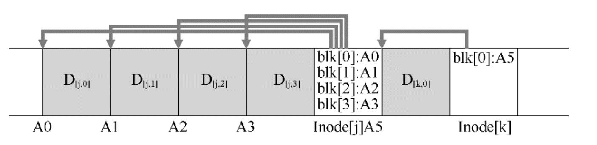

#### inode分布

传统的文件系统`inode`以`Array[inode]`形式组织，可以很方便的访问(通过`inode-number`)。

如上图所示，`inode`写入(也就是文件的元数据信息)，是和数据块一起写入的。这就说明`inode`分散在整个磁盘上了。

**inode map**

解决方案还是加入中间层：维护一个的`inode map`，每次写入都存储/更新一下`inode`的磁盘位置信息。

等到一个大批量写入的时候，将这个段的`inode map`同时顺序写入磁盘。

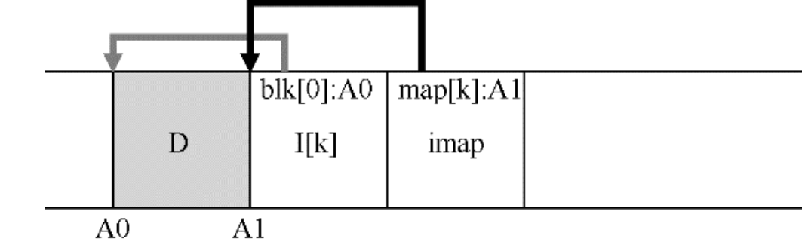

**checkpoint region**

同样又面临`inode map`分散的情况，同样加一层，但是这次是在一个`众所周知`的位置，也就是检查点区域，其维护着所有的`inode map`的引用。

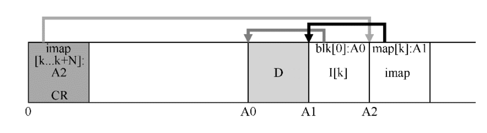

**整体访问路径**

`CR -> inode map -> inode -> file block`

通常，`OS`会将所有的`inode map`缓存在内存中。

#### 垃圾清理

对于磁盘上过期的旧数据，有多种处理方法。

* 不处理并存储，则称为版本控制文件系统(有`snapshots`，曾经在`LevelDB`的实现中看见过)
* 定时清理,是LFS的做法，而分段大批量写入在此时也更方便清理。
