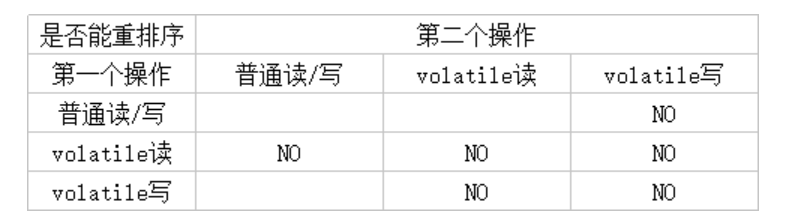
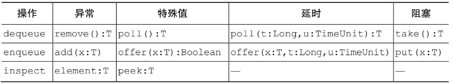
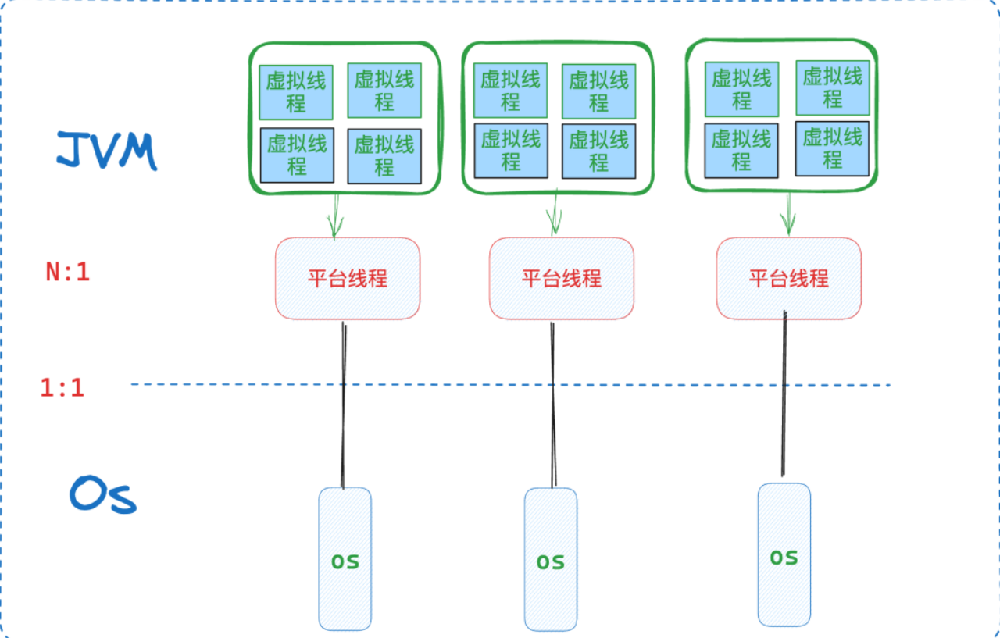
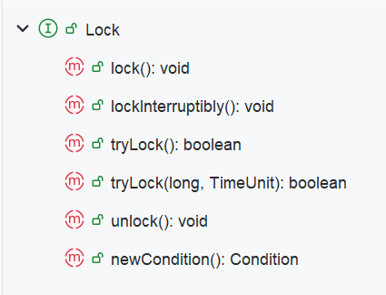

# JVM并发总结

## 内存模型核心

> [全网最硬核 Java 新内存模型解析与实验单篇版（不断更新QA中） - 知乎 (zhihu.com)](https://zhuanlan.zhihu.com/p/490465757)

上面这篇文章实在是太`hardcore`了，所以我放这里，只是针对其中内容作自己的思考。

### CPU-Stall

CPU的一切优化，都是为了去掉一段`CPU-Stall`，也就是在等待响应(内存访问，或者是硬盘访问）的时候，如何才能防止浪费掉这么多时间片呢？

#### 各操作浪费的CPU时间片

> [计算机各种操作耗时 - 知乎 (zhihu.com)](https://zhuanlan.zhihu.com/p/99837672)

可以看到，以一个单核的主频为`2500MHZ`,也就是`2.5GHz`的CPU来说，一秒钟，可以有250亿个时钟周期，也就是时间片。

> 这里引申一个问题，为什么很多刷题网站会判定超时复杂度是`10^9`，而且几乎是统一规定？其实可以这么思考:后台只把程序放在一个core上跑，那么纯单线程操作。如果限制一个CPU只能跑1s中给某个用户的每次提交，则需要的时间片，就是`单次OP耗时 * O时间复杂度`。而在不考虑特化指令情况下，常规的CPU加减乘除的指令都只会占`两位数`的时钟周期，则结果显然可得。

一些常见耗时列出如下:


| 运算操作             | cache访问                                | 其他访问                                                                          |
| -------------------- | ---------------------------------------- | --------------------------------------------------------------------------------- |
| 加减:1-10个时钟周期  | l1:1-5个时钟周期                         | 内存-随机访问:250个时钟周期；SSD随机访问:25万时钟周期；磁盘随机访问:2.5亿时钟周期 |
| 乘除:10-50个时钟周期 | l2：10-20个时钟周期; l3:50-100个时钟周期 | mutex-加锁解锁:60个时钟周期                                                       |

#### 引入cache

可以看到，就算是访问内存，Stall也会有200个时钟周期。

如果考虑引入`cache`，就会发现，在一直hit的时候，可以将`Stall`缩短一个数量级。

#### 多CPU-cache一致性

但是由于CPU早就是多核逻辑，而多核的Cache如何保持一致呢？可以通过缓存一致性协议，比如`MESI`。

但是`MESI`中有一个逻辑，是一个CPU如果要将自己的cache修改的话，首先要将其变为`invaild`，但是这个操作要等到所有的`CPU`全部同意为止。

可以发现，`Stall`又出现了。

#### StoreBuffer和invalidQueue

StoreBuffer就是为了避免上面缓存一致性协议所引入的Stall。CPU又可以放到buffer中就不用管了。但是加一层非原子操作，必然又会出现问题。

同时，由于`StoreBuffer`很小，所以如果一直有invalid需求，如果不再加一层，就又会回退到`invalid Stall`。所以，CPU又加了一层`invalid Queue`。

### 内存屏障

内存屏障，就是为了解决StoreBuffer，以及invalid Queue所带来的不一致问题。

#### 写内存屏障

等待CPU刷完所有的`StoreBuffer`的内存屏障指令。

#### 读内存屏障

等待CPU处理完所有的`invalid Queue`的指令。

#### Java中屏障

**LoadLoad**

如果想让两个不想关的read操作，不乱序执行，则可以在其间加`LoadLoad`。

```java
Load(x)
LoadLoad
Load(y）
```

**LoadStore**

一个read，和其不相关的write指令，则:

```java
Load(x)
LoadStroe
Store(y)
```

**StoreStore**

**StoreLoad**

### Volatile



#### Volatile写

对Volatile字段写，比如对value写，就是

也就是防止和其上的写重排序，防止和其后的读重排序。

> StoreLoad很重要，也就是写的内容缓存同步，然后其后的读才可以处理。

```java
StoreStore
value = x
StoreLoad
```

#### Volatile读

```java
value = x
LoadLoad
LoadStore
```


## 基础

操作系统通过将内存虚拟化，完成了保护性与性能追求的目标，任何用户进程在想操作内存的时候使用的都是虚拟地址，单个进程拥有独立的地址空间。

但是在多核心`cpu`的时代，一个进程只使用单线程的方式运行，显然无法将效率达到最高。所以需要多线程编程。而多线程同时操作的都是同一个进程空间的内存，显然竞争问题不可避免。而一个JVM进程显然也有这种问题。以下讨论JVM中常见的解决办法。

### 内置锁与重入

#### 内置锁

Java的内置锁机制可以支持原子性，即同步代码块，使用`sychronized`来标识，是一种互斥锁。任何时刻只有一个线程执行这段代码。则可以保证在这个进程空间的这段代码操作是线程安全的。

如果要同步，则需要对所有操作保护对象的路径全部进行同步，常见的操作是将可变转态全部封装到对象内部，并使用这个对象的内置锁进行同步。

#### 重入

一个线程想要获取其他线程已经获得的锁的时候，就会被阻塞挂起。但是当线程获取的是自己已经获得的锁的时候，可重入锁可以保证该线程可以获得锁。也就是说，获得锁操作的粒度从细粒度的`调用` 变为了`线程`。也就是可重入性进一步对锁的行为进行了封装，简化了开发，如下例所示：

```java
class Person{
    public synchronized void say(){
        System.out.println("person");
    }
}
class specPerson extends Person{
    public synchronized void say(){
        System.out.println("true person from:");
        super.say();
    }
}
```

如果创建一个`specPerson`实例，并调用方法，则这段代码并没有产生死锁。

### 可见性

#### sychronized

同步代码块(`sychronized`)等方式不仅能保证原子性，同时还有很重要的作用就是保证了`内存可见性`，所有的操作在解锁之前会被全部刷新会`主存`。一个进程中开了多个线程，其中每个核对应的`cache`，与`主存`并不是一致更新的，这其中涉及到了脏读，重排序，一致性等等问题。而如果不使用`cache`，性能差距将会是不同的量级。

#### voliate

但是，考虑到`sychronized`的粒度已经是线程的粒度，一个线程会因为没有抢到内置锁位被阻塞挂起，这所带来的`线程上下文切换`成本是很高的，状态的存储以及恢复在某些情况下都是不必要的。那么如果程序只需要轻量化，特定场景的可见性保证，就需要换一种方式。下面的文章是很经典的解读文章。

> [java volatile关键字解惑 - 简书 (jianshu.com)](https://www.jianshu.com/p/195ae7c77afe?from=timeline&isappinstalled=0)

JVM以及其他语言通过引入`voliate`关键字来实现上述的效果。

作用：轻量级可见性 + 防止重排序

它的具体实现就是两个指令，将当前的结果直接刷回`主存`，并且使得其他线程的`cahce 为 invalid`，则其他线程的访问时则需要从`主存`重新加载。

涉及到重排序，则对`voliate`字段的访问指令会前后加上屏障，防止重排序。

`voliate`的使用场景，需要满足两个条件：

* `变量写操作不依赖于当前值,比如对a++就不能保证`
* `该变量不被包含在具有其他变量的不变式中`

所以一般而言，`voliate`使用的情况只有如下两种：

* 状态标志变量
* `double check`

首先是`flag`使用：

`voliate 写`可以挡住前面的写，`voliate 读`可以挡住后面的读，也就是常见的模式是：

`nomal write -> voliate write`

`voliate read -> normal read`

```java
public class ServerHandler {
    private volatile isopen;
    public void run() {
        if (isopen) {
           //促销逻辑
        } else {
          //正常逻辑
        }
    }
    public void setIsopen(boolean isopen) {
        some op
        this.isopen = isopen
    }
}
```

这里的`isopen`完美符合要求。写入不需要参考之前的值，并且其单独发挥作用。当多个线程操作堆内存中的同一个该对象实例的时候，即使有`cache`，对内存中该对象的`isopen`也能立刻被其它线程看到，而不用`sychronized`。

然后是`double check`

```java
class Singleton{
    private volatile static Singleton singleton;
    public static Singleton getInstance(){
        if(singleton==null){
            synchronized (Singleton.class){
                if(singleton==null){
                    singleton=new Singleton();
                }
            }
        }
        return singleton;
    }
}
```

这个单例模式的实现中，使用了`voliate` + `sychronized`，具体分析如下：

首先，`voliate`起到剪枝的作用。如果很多线程同时到`sychronized`的位置，并且此时实例已经被创建完毕了，那么就都要走一次没必要的线程挂起 + 恢复，上下文切换的开销很大。显然，如果使用了`voliate`关键字进行判断，那么很多的线程完全没必要挂起，直接就可以及时看到变量的改变，则减少了上下文切换的开销。

如果没有使用`voliate`变量，而使用普通栈字段来作为剪枝条件，可能会出现如下情况：

`singletion = new Singletion()`的指令顺序：

* 首先，在堆中分配内存，这是所有步骤的前置要求，没有空间则无需后续操作
* 然后，关于栈中引用变量的分配，以及堆中对象的具体创建，因为重排序的出现，没有先后顺序，因为堆内存的空间已经提前被规划完毕。

而在这段代码逻辑中，重排序一旦出现，除非换写法，不然无法保证安全。

所以使用`voliate`加上屏障，防止重排序。

### 线程封闭

线程封闭是最简单的线程安全的实现方式，局部变量以及`ThreadLocal`都是线程封闭的实现。

#### 特殊情况

如果在多线程环境中，一个`voliate`字段只被单个线程进行写入操作，其他线程全部都只读该变量，那么其实也是一种特殊的线程封闭，这种线程封闭更为强大，因为它同时提供了可见性的便利，其他线程可以实时看到变化并读取。

#### 栈封闭

就是使用局部变量，不要逸出即可。

#### ThreadLocal

`ThreadLocal`的出现，就是给每个线程一个封闭的，贯穿线程的可变对象，其通常为`static`类型。

常用于数据库连接配置，以及上下文的维护。比如我在Web项目中，一个请求一个线程，而由于用户登录信息获得的JWT校验贯穿上下文，则可以使用全局`ThreadLocal`来维护即可实现隔离与性能提升。而在Spark数据库连接中也可以进行维护，防止一个`record`一个`conn`。Flink中由于算子有便捷的`open`函数，反倒使用的较少。

测试如下：

```java
    @Test
    public void testThreadLocal(){
        var threadLocal = new ThreadLocal<String>();
        CompletableFuture<Void> future1 = CompletableFuture.runAsync(() -> {
            threadLocal.set("t1");
        }).thenRun(() -> {
            System.out.println("t1-" + threadLocal.get());
        });
        threadLocal.set("t2");
        System.out.println("t2-" + threadLocal.get());
        future1.join();
    }
```

核心API如下：

```java
        //创建，使用withInitial静态方法，或者new +set方法都可以
        ThreadLocal<String> threadLocal = ThreadLocal.<String>withInitial(() -> {
            return "hello";
        });
        //获取值
        String value = threadLocal.get();
        //设置值
        threadLocal.set("hello world");
        //消除
        threadLocal.remove();
```

`remove`的使用是必要的。

## 容器与工具类

### 并发容器

#### ConcurrentHashMap

给容器的每个方法加锁，从而实现容器的可靠并发，是常规思路。但是`ConcurrentHashMap`并没有这么做，不能对它加锁，并且它使用了更细粒度的加锁机制，来达到更高程度的并发。

作为权衡，它的`size`以及`empty`方法返回的实际上只能是估计值，`ConcurrentHashMap`将主要优化放到了`get,put,containsKey,remove`上。

其格额外提供了常见的原子性的API，使用的时候没必要额外重复加锁。

常见的方法如下：

```java
    @Test
    public void testCollection(){
        var map = new ConcurrentHashMap<String,Integer>();
        //没有就添加，并返回旧值
        map.putIfAbsent("direct-1",1);
        //没有就添加，并返回计算的新值
        map.computeIfAbsent("computed-3",(k)->{
            return 3;
        });
        //如果没有就添加，否则用新旧计算之后再添加
        map.merge("computed-3", 4,(oldValue,newValue)->{
            return oldValue + newValue;
        });
        //如果存在就计算并修改，并返回计算后的新值
        Integer computedIfPresent = map.computeIfPresent("computed-3", (k, v) -> {
            return v + 1;
        });
        map.forEach((k,v)->{
            System.out.println(k+":"+v);
        });
    }
```

#### BlockingQueue

阻塞队列完美支持消费者-生产者模式。API分为两组：

可阻塞的`put-take`以及可定时的`offer-poll`



**ArrayBlockingQueue**

基于数组的有界阻塞队列，FIFO。

**LinkedBlockingQueue**

基于链表的可有界，可无界的队列，FIFO。通过容量参数控制，如果空参构造器，默认是一个容量为`Integer.MAX_VALUE`的无界队列。一般应用于消费者总比生产者效率高的情况。

## 线程池与虚拟线程

### Executor框架

任务可以放到一个线程串行执行，也可以一任务一线程，还可以提交到一个线程池等待执行。

最为核心的工厂类就是`Executors`

#### Executor

Java中任务执行的主要抽象，不是`Thread`而是`Executor`，其用于执行用户提交的任务，需要传入的是`Runnable`接口的实现类。

通常使用`Executor`来避免显式的创建线程,同时实现任务的提交与执行的解耦。实现逻辑基于消费者-生产者模式。

```java
public interface Executor {

    /**
     * Executes the given command at some time in the future.  The command
     * may execute in a new thread, in a pooled thread, or in the calling
     * thread, at the discretion of the {@code Executor} implementation.
     *
     * @param command the runnable task
     * @throws RejectedExecutionException if this task cannot be
     * accepted for execution
     * @throws NullPointerException if command is null
     */
    void execute(Runnable command);
}
```

> The Executor implementations provided in this package implement ExecutorService, which is a more extensive interface. The ThreadPoolExecutor class provides an extensible thread pool implementation. The Executors class provides convenient factory methods for these Executors.
> Memory consistency effects: Actions in a thread prior to submitting a Runnable object to an Executor happen-before its execution begins, perhaps in another thread.

`ExcutorService`是`Executor`的一个子接口，是对其的扩展。

**创建**

线程池的创建通过`Executors`工具类的静态方法可以创建,

首先，所有的线程池都采用懒加载。

* `newFixedThreadPoll`创建一个固定长度的线程池。
* `newSingleThreadExecutor`创建单个ExecutorService
* `newScheduledThreadPoll`创建定时任务
* `newCachedThreadPoll`创建一个无限长的，可动态调整的线程池

**提交任务**

通过`submit方法`,可以传入`callable/runnable`

```java
        ExecutorService executorService = Executors.newSingleThreadExecutor();
        Future<String> future = executorService.submit(() -> {
            return "hello";
        });
```

**关闭**

JVM进程，只有在所有非守护线程执行完毕才会关闭。所以线程池的关闭十分重要。通常使用`ExecutorService`并使用它的方法来关闭。

* `shutdown`平缓的关闭，会等待所有任务结束
* `showdownNow`立刻关闭
* `awaitTermnation`限时等待关闭。

#### Future

`Executor`接受的参数是`Runnable`实现类，但是这就代表着这个任务没有返回值，不能抛出异常。

而如果有上述需求，`Callable`是一个更好地选择，其有返回值或抛出异常。

首先，是JDK5的Future，其可以传入一个`Callable任务`来创建。

如果使用`Executors`，则如下：

```java
        ExecutorService executorService = Executors.newSingleThreadExecutor();
        Future<String> future = executorService.submit(() -> {
            return "hello";
        });
```

然后通过`get,isDone等方式`来在需要的时候同步阻塞获取结果。

#### CompletableFuture

从JDK8引入，实际上Netty等框架早于JDK已经实现了具有异步回调功能的Future，Scala也有很完备的Future实现。

**创建**

* `runAsync`
* `supplyAsync`

其中`runAsync`需要传入`Runnable`，也就意味着没有返回值。而`supplyAsync`，需要传入`supplier`的实现类。

`Supplier`接口从JDK8引入，是一个函数式接口，通常使用`lambda`表达式进行实现，其含义是无参数并且有返回值。

两个方法均可传入用户自己创建的线程池，用于给异步任务提供线程资源。

**获取结果**

* `get`,限定时间可选。
* `join`

两者的主要区别在于异常处理，一般严格异常处理的话选择`get`

**异步回调**

* 无参无返回值：`thenRun/thenRunAsync`
* 有参无返回值：`thenAccept/thenAcceptAsync`
* 有参有返回值：`thenApply/thenApplyAsync`

**异常处理回调**

* 任务异常执行回调：`exceptionally`
* 任务执行完执行回调,无返回值:`whenComplete`
* 任务执行完执行回调，有返回值：`handle`

**两个任务组合回调**

and关系

* `runAfterBoth`:无参，无返回值
* `thenAcceptBoth `：有参，无返回值
* `thenCombine`：有参，有返回值

OR关系

* `runAfterEither`
* `acceptEither`
* `applyToEither`

**多个任务组合回调**

* `allOf`
* `anyOf`

#### asyncTool

京东开源的框架，基于`CompletableFuture`封装，我的解析文章如下：

[asyncTool框架梳理 - lx-bigdata (melodylx666.github.io)](https://melodylx666.github.io/lx-bigdata/frameworkAnalysis/asyncToolLearn/)

### 线程池深入

#### 与ThreadLocal

都知道ThreadLocal可以实现线程封闭，而线程池会复用线程，那么会出现一个问题：脏数据的读取

代码测试如下：

```java
    public void test04() throws ExecutionException, InterruptedException {
        ExecutorService executorService = Executors.newCachedThreadPool();
        ThreadLocal<String> threadLocal = new ThreadLocal<>();
        CompletableFuture<Void> future1 = CompletableFuture.runAsync(() -> {
            System.out.println("thread1:" + threadLocal.get());
            threadLocal.set("thread1");
        },executorService);
        CompletableFuture<Void> future = future1.thenRunAsync(() -> {
            System.out.println("thread2:" + threadLocal.get());
            threadLocal.set("thread2");
        },executorService);
        future.get();
    }
```

这里使用的线程池是无界线程池，则没有出现脏读的情况，结果为：

`thread1:null `

`thread2:null`

但是如果换为`singleThreadPoll`，则结果如下：

`thread1:null `

`thread2:thread1`

解决办法就是及时`remove`或者不使用。

显然这是不可以出现的。比如之前做的那个Web项目，如果没有及时清理，则可能出现登录时获得的是其他人的信息。

#### 大小

通常情况下，如果核心数量为`n`,则`size = n + 1`

#### ThreadPoolExecutor

官方建议的是使用封装好的线程服务，`threadPoolExcutor`是用来进行定制线程池的。

其构造函数如下：

```java
    public ThreadPoolExecutor(int corePoolSize,
                              int maximumPoolSize,
                              long keepAliveTime,
                              TimeUnit unit,
                              BlockingQueue<Runnable> workQueue) {
        this(corePoolSize, maximumPoolSize, keepAliveTime, unit, workQueue,
             Executors.defaultThreadFactory(), defaultHandler);
    }
```

**线程的创建和销毁**

任务数量从0开始，最终可能远多于线程池的线程数量。

`corePoolSize`,`maxPoolSize`,`keepAliveTime`,`unit`共同决定了线程的创建以及销毁。

对于新来的任务，如果`curSize < corePoolSize`,则无论是否有其他空闲线程，都会创建新线程来执行任务。

如果`corePoolSize=maxPoolSize`，则相当于创建了一个固定大小的线程池

如果`maxPoolSize = Integer.MAX_VALUE`，则相当于创建了一个几乎无界的线程池。

**管理任务的队列**

通过用户提供的`BlockingQueue`来保存等待执行的任务。

基本的任务排队方法有3种：

* `unbounded queue`
* `bounded queue`
* `direct handsoff`

使用有界队列来管理，通常传入`ArrayBlockingQueue`，有大小参数的`LinkedBlockingQueue`，`PriorityBlockingQueue(可以不是FIFO)`作为任务队列。如果队列满了，可以使用饱和策略来应对。

而如果使用无界队列，可以使用`无大小参数的LinkedBlockingQueue`或者`SyncQueue(只是作为桥接)`。

`Executors`所提供的封装好的`newFixedThreadPool`以及`newSingleThreadPool`默认都使用无界队列管理任务。一般`newCachedThreadPool`是一个很好的选择。

`如果任务之间有依赖关系，那么不应该为任务队列设置大小限制，防止线程饥饿`。

**饱和策略**

只在使用有界队列管理任务，并且队列已经满了的情况下发挥作用。

常见的有如下几种：

* `Abort`:直接抛弃
* `Caller-Runs`：不会抛弃任务，但是将其回退给调用`execute`的主线程去调用。

`Caller-Runs`示例如下，运行发现任务确实有在`main`中执行的。

```java
    @Test
    public void test06() throws ExecutionException, InterruptedException {
        // 创建一个固定大小的线程池，核心线程数和最大线程数都为2，队列容量为2
        ThreadPoolExecutor executor = new ThreadPoolExecutor(
                2, // 核心线程数
                2, // 最大线程数
                0L, TimeUnit.MILLISECONDS, // 线程空闲时间
                new ArrayBlockingQueue<>(2), // 任务队列
                new ThreadPoolExecutor.CallerRunsPolicy() // 拒绝策略
        );

        // 提交5个任务
        for (int i = 0; i < 5; i++) {
            final int taskNumber = i;
            executor.execute(() -> {
                System.out.println("Task " + taskNumber + " is running in " + Thread.currentThread().getName());
                try {
                    // 模拟任务执行时间
                    Thread.sleep(1000);
                } catch (InterruptedException e) {
                    Thread.currentThread().interrupt();
                }
            });
        }
    }
```

**线程工厂**

任务的抽象是`runnable`，执行载体是`Thread`。而线程池每次创建线程，都是使用`ThreadFactory`来创建。这个接口如下：

```java
public interface ThreadFactory {

    /**
     * Constructs a new {@code Thread}.  Implementations may also initialize
     * priority, name, daemon status, {@code ThreadGroup}, etc.
     *
     * @param r a runnable to be executed by new thread instance
     * @return constructed thread, or {@code null} if the request to
     *         create a thread is rejected
     */
    Thread newThread(Runnable r);
}
```

则我们可以实现这个接口，并定制`Thread`类，然后实现自己的线程工厂。

### 虚拟线程

得物技术的分析：

[虚拟线程原理及性能分析 - 知乎 (zhihu.com)](https://zhuanlan.zhihu.com/p/670651709)

#### 异步编程的几种形式

下面讨论内部逻辑的不同

**有栈协程**

又称虚拟线程，JDK21与Go语言的虚拟线程，以及`goroutine`均为有栈协程。

**无栈协程**

Kotlin中的实现就是无栈的。

**回调语法糖**

TS中的实现就是如此。

普通的`Future`,在安装回调的时候需要调用`then`等方法写在其中，但是如果层级过深，则代码清晰度大大降低。比如`JDK8 CompletableFuture`

但是如果可以将其像同步变量一样接住，正常操作，由编译器分析后一个个安装在`future`部分后面，则会方便很多。`TS`就是这么实现的，`async + await`标记一个异步方法，返回值是`Future`，然后正常使用即可。

而`无栈协程`暴露给用户的同样需要是`async + await`，两者都有染色问题。

但是虚拟线程就没有这个问题，并且前面的`Future`在用户代码级别，需要依托于线程池，而虚拟线程可以在用户代码级别完全替换掉线程池。其实现的目标就是`write sync and run async`

#### 模型与API

**线程模型**

操作系统任务通过`OS thread`来实现，而`JVM`中一个`Thread`就是对应的一个`OS thread`的封装，称为平台线程。

而`虚拟线程`是对应`Virtual Thread`，是一种更轻量级的线程。其中的任务通过`Carrier Thread`也就是载体线程来执行。载体线程一般都是平台线程

关系如下：



实质上说，无论是在哪里的进程，还是线程，还是虚拟线程，本质上都是运行上下文的封装而已，只不过是范围的大小问题，在这里的协程，也就是更细粒度的运行上下文。

**API**

1.直接开始一个`runnable任务`

```java
        //1.直接创建
        Thread vt = Thread.startVirtualThread(() -> {
            System.out.println("hello");
        });
        try {
            vt.join();
        } catch (InterruptedException e) {
            e.printStackTrace();
        }
    }
```

2.手动执行

```java
    @Test
    public void vtDemo2(){
        Thread vt = Thread.ofVirtual().unstarted(() -> {
            System.out.println("hello");
        });
        vt.start();
        try {
            vt.join();
        } catch (InterruptedException e) {
            e.printStackTrace();
        }
    }
```

3.通过线程工厂创建

```java
    @Test
    public void vtDemo3(){
        var factory = Thread.ofVirtual().factory();
        var thread = factory.newThread(() -> {
            System.out.println("hello");
        });
        thread.start();
        try {
            thread.join();
        } catch (InterruptedException e) {
            e.printStackTrace();
        }
    }
```

4.通过`工具类`

这里底层思路就是和自定义线程池一致，但是JDK已经封装好了，线程池创建线程的时候直接通过线程工厂创建虚拟线程就可以了。同时还可以不止传递`runnable`，也可以传递`callable`

```java
    @Test
    public void vtDemo4(){
        var pool = Executors.newVirtualThreadPerTaskExecutor();
        var future = pool.submit(() -> {
            System.out.println("hello");
        });
        try {
            future.get();
        } catch (Exception e) {
            e.printStackTrace();
        }
    }
```

#### 底层原理

> [JDK19 - 虚拟线程详解-CSDN博客](https://blog.csdn.net/Zong_0915/article/details/132035898)

如果使用常规的线程模型，则为`1:1`模型，则大量的平台线程调度，就等用于大量的内核线程调度，会导致大量的上下文切换，状态的保存与恢复现场的成本是很高的。

而如果将任务所需要的上下文做更细粒度的封装和隔离，则出现了虚拟线程。而整个虚拟线程的核心就是上下文的抽象以及调度。

其实协程(无栈/有栈)概念比线程出现的更早，也就是协作方式的任务调度其实早于抢占方法的任务调度(线程)。其实现就是将管理权交给用户态进程管理，而不是将管理权交给`OS`。

> [ 出于什么样的原因，诞生了「协程」这一概念？ - 知乎 (zhihu.com)](https://www.zhihu.com/question/50185085/answer/3623865922)

核心字段如下：

```java
    // scheduler and continuation
    private final Executor scheduler;
    private final Continuation cont;
    private final Runnable runContinuation;
```

**Continuation**

其是Java中对协程的抽象，是有栈协程(有一个`stackChunk`成员变量,被存储到了堆中)。用户传入`task`之后，被封装为`Continuation`，然后该任务就可以被`执行，挂起，唤醒，执行`。

Demo如下：

```java
public class ContinuationDemo {
    public static void main(String[] args) {
        ContinuationScope scope = new ContinuationScope("scope");//标识一个线程上下文名称
        Continuation continuation = new Continuation(scope, () -> {
            System.out.println("Running before yield");
            Continuation.yield(scope);
            System.out.println("Running after yield");
        });

        System.out.println("First run");
        continuation.run();
        System.out.println("isDone: " + continuation.isDone());;

        System.out.println("Second run");
        continuation.run(); //再次调用run方法，则从yield处继续执行
        System.out.println("isDone: " + continuation.isDone());;
    }
}
```

其中在一个`ContinuationScope`中，可以有多个`Continuation`。

JVM中使用一个链表结构维护`Continuation链`，当执行链上的一个`Continuation`发生`yield`的时候，控制权会被交给交回给顶层的线程，由它控制是否继续`run`

而`VirtualThread`对`Continuation`进行了简单封装，底层的虚拟线程调度就是使用`Continuation`的`run & yield`

**Scheduler**

就是一个`Executor`，用于维护线程池，也就是一组平台线程，来执行一个个的虚拟线程的任务。

具体来说，当虚拟线程需要被执行的时候，会将`Continuation`对象，拷贝到平台线程的栈中，然后执行。

而需要卸载的时候，将`Continuation`对象存储到堆中。这里的`Continuation`中维护有线程运行的`stack`信息。

从而实现了更细粒度，更轻量级的线程调度，而不是开销大的平台线程上下文切换，即内核上下文切换。

**需要注意**

上下文加载到载体线程之后，如果`yield`失败，而此时正好在`sychronized`方法中，则两者被绑定，虚拟线程的阻塞在这里就等同于载体线程的阻塞。

而在一个虚拟线程的任务可以在`yield`前后被执行在不同的载体线程，因为`Continuation`有足够的上下文信息，只需要挂载即可。

#### 性能与不足

虚拟线程为`byte`级别，而平台线程为`KB`级别，基本上差一个数量级。

适用于IO密集型场景。

不足：

* 需要从`sychronized`替换为`reentrantLock`
* 使用`ThreadLocal`会有问题

## 锁与无锁

在`JDK5`之后出现了`ReentrantLock`，是一种内置锁的补充。

### Lock & ReentrantLock

#### Lock

Lock从JDK5开始提供，是一个提供了无条件，可轮询，定时，以及可中断的锁获取操作的接口。其可以控制锁的释放顺序，是一种更灵活，更细粒度的锁接口。



#### ReentrantLock

**无条件获取锁**

其实一个Lock接口的实现类，提供了和`Sychronized`一样的互斥性，以及内存可见性，并且是一个可重入锁，且通过`lock & unlock`来实现手动加锁。

```java
    @Test
    public void vtDemo5() throws InterruptedException {
        class  ID{
            private int number;
            public int getNumber() {
                return number;
            }
            public void setNumber(int number) {
                this.number = number;
            }
        }
        ID id = new ID();
        var pool = Executors.newVirtualThreadPerTaskExecutor();
        var lock = new ReentrantLock();
        for (int i = 0; i < 1000; i++) {
            pool.submit(() -> {
                lock.lock();
                try{
                    id.setNumber(id.getNumber() + 1);
                }finally {
                    lock.unlock();
                }
            });
        }
        pool.awaitTermination(5,java.util.concurrent.TimeUnit.SECONDS);
        pool.shutdown();
        System.out.println(id.getNumber());
    }
```

而虚拟线程也不能使用内置锁而只能使用`ReentrantLock`

**轮询锁与定时锁**

该锁还有定时机制，防止死锁造成的危害。通过`tryLock`方法，对常规的死锁情况，如果不能两个锁同时获取，则会放弃所有锁，回退并重试。

**公平与非公平**

可以创建默认的非公平锁，来保证性能，减少上下文切换的损耗，或者创建一个公平锁。通过`fair`布尔值来控制。

### 原子变量

#### 悲观锁与乐观锁

悲观锁就是需要强制加锁，如内置锁，`ReentrantLock`

而乐观锁不需要强制加锁，比如原子变量

#### 原理

底层通过硬件指令：`Compare ans Set`进行支持，这个是一个原子指令。由于系统状态不会回退，则最终可以保证任务完成。

原子变量类是一种很细粒度的竞争，相当于一个泛化的`voliate`变量。

**ABA问题**

也就是当线程A在进行操作x的时候，线程B已经将x从a -> b -> a，但是A却无法察觉。

解决办法：加版本号即可。

### 使用

最经常使用的就是`getAndincreasement`，有经典的使用以后再总结。
