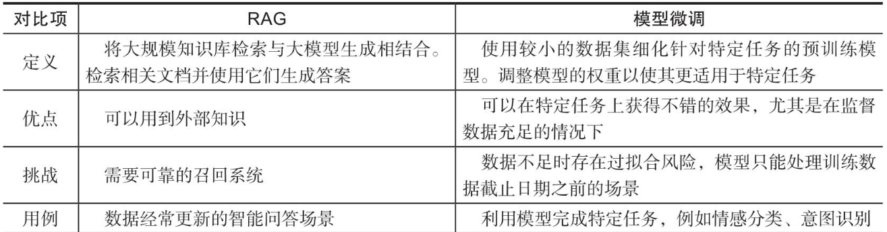
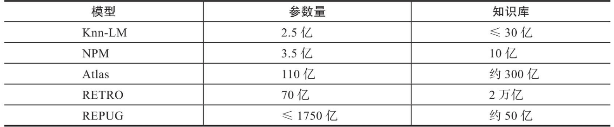

# RAG

## 概述

### What

RAG：Retrieval-Augmented Generation

> [[2005.11401] Retrieval-Augmented Generation for Knowledge-Intensive NLP Tasks (arxiv.org)](https://arxiv.org/abs/2005.11401)
>
> [RAG论文阅读笔记 - 知乎 (zhihu.com)](https://zhuanlan.zhihu.com/p/671448677)

### Why

* 时效性
* 大模型生成结果的不可控性
* 大模型的数据隐私问题
* 成本更小

与微调的对比如下：

### How

RAG总体通过超大规模的外挂知识库，中等规模的LLM，以及向量数据库组成。

整体可以分为三个部分：

* 数据准备
* 数据召回
* 答案生成

完整的工作流程是，将输入的用户问题与提示词，通过RAG对比从知识库中抽取增强片段，然后统一拼接处理，给LLM，最后返回结果。

经典的RAG的外挂知识库，与LLM参数的规模对比如下：

显然，超大规模的知识库的存储与相似性检索，是整个RAG系统的性能瓶颈。

## 流程

### prompt

RAG场景下，一般`prompt`较长。这部分暂时忽略

### 文本切块

构建向量数据库的基本流程：首先将文本切块，然后将文本向量化存储到向量数据库中，最后可以通过检索召回将相似片段取出。

则会有文本过长，或者过短的问题出现。

文本过长，则损失的语义就会更多，导致召回的准确率降低。

文本过段，语义的粒度更细，但是容易丢失上下文信息。

通常使用`langchain`模型进行开发。

切块方式有如下几种：

* 固定大小的`chunk`，并且有`overlap`
* 特殊文本格式切块
* 基于深度学习的切块

### 向量化

使用`Transfrom`嵌入模型将文本以及问题向量化，从而存储或者进行召回。

### 向量存储

**向量存储**

常见向量存储有Faiss，Milvus

**向量检索**

* 精确检索：取向量中与目标相似度最高的一个
* 倒排索引：这里的倒排索引，指的是对数据库中所有向量做一次聚类，然后计算相似度的时候根据聚类中心，缩小范围之后再精确搜索。

### 向量召回

这里向量召回本质进行的是非对称检索，而显然正常情况下进行对称检索更为容易，然而可以通过某些方式将两者进行转换，比如`HyDE`.

步骤如下：

1. 直接使用LLM生成k个假答案
2. 使用向量化模型，将k个假答案 + 用户问题向量化
3. 对向量取平均，作为融合查询向量
4. 利用该向量从向量数据库召回片段

向量的召回会受到之前的文本切块，以及用户问题描述等问题的影响，常见的优化思路如下

**向量化部分**

* 短文本拼接全局文本信息，比如长文本前三句话，标题，关键词
* 为每一个向量化的短文本维护一个父长文本，召回之后向LLM输入父文本

**用户提问部分**

可以通过`langchain`API给用户提问修改为多种提问方式，然后并行进行文本召回，结果取并集输入LLM。

### 重排序

思路就是通过多级排序，从召回的候选文本中，精选出与用户查询的最相关部分的文本。

RAG中通常将用户查询与候选文本同时输入交叉编码器，预测相关性。

## 多模态RAG

顾名思义，就是可以处理不同模态的数据，其依赖于多模态模型。

常见架构如下：

如果有文字 + 图片的PDF，则步骤如下：

1. 输入源：PDF
2. 提取：将文字与图片分离
3. 元数据：对图片进行元数据提取并同图片一起存储
4. 多模态向量存储，将两者向量进行嵌入，然后存储
5. 构建基于用户输入来查询向量存储的部分
6. 构建基于向量召回结果传递给LLM进行输入并得到相应的部分。
