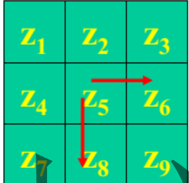

# 数字图像处理

## 第一章 导论

1. 图像分类
   1. 模拟图像：又称为光学图像，空间坐标和明暗程度是连续的，计算机无法直接处理
   2. 数字图像：空间坐标和灰度不连续，可以使用计算机处理
2. 数字图像定义
   1. 图像可以定义为二维函数$f(x,y)$,其中x,y是空间坐标，而在x,y处的幅值为该点的强度或者灰度。如果离散，则为灰度图像
   2. 图像的基本组成是像素，每个像素都有位置和幅值
3. 数字图像处理
   1. 定义：借助于数字计算机来处理数字图像
   2. 方式：图像到图像，图像到非图像
   3. 组成：图像获取设备，专用图像处理设备或者有相应配置的计算机，图形输出设备
   4. 目的
      1. 提高图像的视感质量
      2. 提取图像中包含的特征和信息
      3. 图像数据的变化，编码和压缩，便于存储于传输
   5. 意义
      1. 扩大人的视觉
      2. 代替人的视觉
      3. 打动人的视觉

## 第二章 基础知识

> 主要分为图像获取和图像数字化，主要为数字化

1. 数字化
   1. 定义：所谓图像数字化，是将模拟图像经过离散化之后，得到用数字表示的图像。
      包括了空间离散化(**采样**)和明暗表示数据的离散化(**量化**)
   2. 采样
      1. 间隔是关键，太小了则数据量太大。太大了则无法识别细节
      2. 原理是对连续图像生成扫描线，对每个线进行取样和量化
      3. 方式：有缝，无缝，重叠
   3. 数字化处理规则
      1. 对缓慢变化的图像，细量化，粗采样
      2. 细节丰富的图像， 细采样，粗量化
   4. 数字图像表示
      1. 如果原图像是f(s,t) 连续函数，则通过取样和量化，得到二维阵列 f(x,y).
      2. 方式
         1. 函数图
         2. 灰度图
         3. 矩阵
      3. 注意:**x轴向下，y轴向右**
      4. 描述术语
         1. 动态范围：最大灰度和最小灰度的**比值**
         2. 饱和度：指超过该值的灰度值将被剪切掉
         3. 对比度：最大灰度和最小灰度的**差值**
      5. 分辨率
         1. 定义：描述图像中物体的细节程度
         2. 分类
            1. 空间分辨率：采样决定，是图像可辨别的最小细节的度量
            2. 灰度分辨率：量化决定，是图像灰度级的可分辨的最小变化
         3. 空间分辨率因素
            1. 是由采样点数决定
            2. 灰度一定，则点数和分辨率成正比
      6. 图像内插
         1. 定义：使用已知数据估计未知数据的一种数值处理。属于**图像重采样**
         2. 分类：**计算题**
            1. 最临近内插法：将原图像中最近邻的灰度赋给每个新位置
            2. 双线性内插法：$v(x,y) = ax + by +cxy + d$,其中**系数由四个最邻近元素**决定
            3. 三次内插法
   5. 图像运算
      1. 实质：是对应位置像素之间的运算
      2. 要求：图像大小相同
      3. 作用
         1. 相加：做平滑噪声处理
         2. 相减：增强差别
         3. 相乘、相除：可以用于矫正阴影和模板操作
   6. 几何空间变换
      1. 组成要素
         1. 坐标的空间变换
         2. 灰度内插，就是对变换后的像素赋予灰度值
      2. 坐标变换
         1. 公式：$(x,y) = T(v,w)$
         2. 正向映射：直接对每个位置应用公式
         3. 反向映射：扫描输出位置，对每个图像使用$(v,w) = T^{-1}（x,y)$得到输入图像的位置，然后使用决定输出像素的灰度值
      3. 类型
         1. 位置变换
            1. 平移变换
            2. 镜像变换：水平或者垂直
            3. 旋转变换
         2. 形状变换
            1. 比例变换
            2. 错切变换
         3. 复合变换
   7. 图像放大
      1. 实质：对信息的估计
      2. 方式：最近邻域法和线性插值法
      3. 最近邻域法
         1. 思想：如果需要将原图像放大k倍，则将原图像中的每个像素，放入$k*k$的子块中。会出现**马赛克**效应
      4. 线性内插法
         1. 思想：当求出的分数地址和像素点不一致的时候，求出周围像素点的距离比值，由四个邻域的像素灰度值进行线性插值
         2. 对于$(x,y)$,则周围四个像素点是$([x],[y]),([x]+1,[y]),([x],[y]+1),([x]+1,[y]+1)$.这里的坐标是y向下，x向右
         3. 计算公式：如果图像四个角分别是a,b,c,d，则结果为q(p*d + (1-p)*c) + (1-q)(p*b + (1-p)*a)
         4. 其中横向为p,1-p.竖向为q,-1q
         5. 复合旋转，等于乘以两次的旋转的矩阵的乘积。单次旋转的矩阵是左上角四个位置是
            cos, sin,-sin,cos

## 第三章 灰度变换和空间滤波

> 拍雾中的照片，或者黑夜的照片，因为亮暗差别不是很大，则画面效果不好
>
> 改正方法：图像增强与图像复原

### 常见的描述术语

* 图像动态范围：图像中最大灰度和最小灰度的**比值**
* 对比度：图像中最大灰度和最小灰度的**差值**
* 空间分辨率：图像可辨别的最小细节的度量
* 灰度分辨率：灰度级中可分辨的最小变化

### 图像增强

定义：图像增强采用一系列技术改善图像的视觉效果，或者转换为需要的便于处理的形式。

分类：从增强的作用域出发，分为空间域增强和频率域增强。**空间域增强**是直接对图像各像素进行处理。而**频率域增强**是将图像经过傅里叶变换之后，**从空域转换为频域**(其中每个点表示图像中不同频率成分的幅度和相位信息)，从而可以对不同的频域进行操作或者过滤，最后再转换为空域即可。

#### 空间域增强：灰度直方图与空间滤波

分类：主要分为灰度变换和空间滤波两部分。其中**灰度变换**在图像的单个像素上操作，主要以对比度和阈值的处理为目的。而**空间滤波**涉及改善性能的操作，比如通过图像中的每个像素的邻域来锐化图像。

统一公式：$g(x,y) = T(f(x,y)))$，则其中T是对点$(x,y)$的邻域进行处理的算子。如为降低噪声而对图像序列执行每个像素求和的操作。对边界，需要进行pedding或者其他操作，这就是**空间滤波**的定义。

灰度变换：

* 线性灰度变换：输入图像的灰度范围[a,b]，输出图像的灰度范围为[c,d]。超出原范围的值全部变为边界值，中间的部分使用线性变换。
* 反线性变换：s = L - 1 - r

对数变换：通用形式为s = $c * log(1 + r)$,其中c是常数，假设$r >= 0$.**该变换可以扩展暗像素的值，同时压缩更高灰度级的值**。反对数变换的作用相反。可以查看前后的频谱。

伽马变换：$s = c  r^{z}$，其中如果 z<1，提升灰度，图像变亮。z>1，则降低灰度级，图像变暗

#### 方式一：灰度直方图均衡

定义：灰度直方图是表达图像灰度分布情况的统计图像，横坐标是灰度值，纵坐标是概率密度(可用比值计算)。如果要归一化，就是需要除以总像素数量MN。

灰度值集中偏小，则原图像变暗。灰度值集中偏大，则原图像变量。如果跨度太大，则动态范围合适

**直方图均衡**：直方图均衡化已经是将原图像通过某种变换，得到一副灰度直方图为均匀分布的新图像的方法。

对于离散值，我们用概率和求和来计算。对于一幅图像，灰度级rk的出现概率近似为$nk / MN$,也就是频率代替概率。其中MN是图像的总像素数量，nk为灰度值为rk的像素个数。而sk的计算公式为$s_{k}=T(r_{k})=(L-1)\sum_{j=0}^{k}p_{r}(r_{j})=\frac{(L-1)}{MN}\sum_{j=0}^{k}n_{j},\quad k=0,1,2,\cdots,L-1$，该式子将输入灰度级为rk的各像素映射到输出图像，灰度级为sk。这里使用的是求和逻辑。最后一个s必然是1。

作用：高概率增强，低概抑制，灰度级简单合并，不能严格均匀，并且重复做就无意义

#### 方式二：空间滤波

**基础知识**

空间滤波是指利用像素以及像素邻域组成的空间进行图像增强的方法。

原理是对图像进行模版运算。基本思路是赋予某个像素的值为本身 + 邻域的灰度值的函数。

是否pedding: 如果需要输入输出的大小一直，则需要pedding

**卷积模板**

核心：滑动窗口 + 点乘

**分类**

按照线性分，分为基于傅里叶变换的线性滤波器，以及直接邻域操作的非线性滤波器。

按照功能分，**主要分成平滑滤波和锐化滤波**。

**平滑空间滤波**

线性滤波器：均值滤波器

非线性滤波器：最大值，中值，最小值滤波器(都是统计排序(非线性)滤波器)。其中的中值滤波器用于去除噪声，最大值用于寻找最亮点，最小值用于寻找最暗点

**中值滤波器：3*3的模板，则第5大的是中值**

**锐化空间滤波器**

作用：突出图像细节，增强被模糊的细节。**积分产生的是钝化效果，而微分产生的是锐化效果**。最常用的方式是计算梯度

分类：

* 二阶微分滤波器-拉普拉斯算子
  * 公式：  $f(x+1,y) + f(x-1,y) + f(x,y+1) + f(x,y-1) - 4f(x,y)$
  * 如果模板系数为负号，则减去算子值，否则加上算子值
* 一阶微分滤波器-梯度算子
  * 
  * 如上图，则梯度近似计算：$G(x) =  z6 - z5$,而$G(y) = z8 - z5$

**不同滤波器的对比**

* 对于椒盐噪声，是指图像中的某些像素被随机设置为最大值（白色，即“盐”）或最小值（黑色，即“椒”）。通常以一定的概率p来决定哪些像素会被替换。
  **中值滤波**对类似脉冲噪声更有效果。而椒盐噪声均值不为0，使用均值滤波不能很好去除。
* 高斯噪声：也就是噪声符合正态分布的噪声。噪声通常是连续的。则使用**均值滤波**刚好可以处理

## 第四章 频域滤波

**基本概念**

正交向量：两向量乘为0

正交矩阵：是N个正交列向量矩阵，必然满足$A^{T}A = I$

使用正交矩阵对一维向量进行变换的过程称为**正交变换**。也就是$g = Af$

### 图像变换

**定义**

将图像看做线性叠加系统，图像变换是将图像从空域转换为频域等的数学变换。

好处：借助正交变换等特性使得在空域上难解的问题在频域上得到简化

**基本条件**

满足正交，完备两个条件的函数集合或者矩阵才能用于图像的分析

**傅里叶变换**

* 定义：将满足条件的周期函数使用不同频率的正弦和余弦函数的加权和来表示。非周期函数也可以展开为傅里叶级数。
* 性质：
  * 对函数$f(x)$,则其傅里叶变换是对称的，也就是$F(u,v) = F(-u,-v)$,频谱也对称的
  * 平移不影响傅里叶变换的幅值
  * 缩放同步
  * 旋转同步
  * 只需一个周期的变换就可以全部确定

### 频域处理

公式：$G(u,v) = H(u,v)F(u,v)$

基本例子

* 陷波滤波器
  * 公式:$H(u,v) = 0,当(u,v) = (M/2,N/2)的时候，其他时候等于1$
  * **整体灰度等级降低**
* 低通(平滑)滤波器
  * 低频通过，高频衰减
  * 平滑处理
* 高通(锐化)滤波器
  * 高频通过，低频减弱
  * 锐化处理

**空间域滤波和频率域滤波之间的关系**

* 空间域乘法可以通过频率域卷积得到
* 空间域和频率域的滤波器组成了傅里叶变换对
* 低通和平滑等价，高通和锐化等价

**频率域平滑滤波器**

* 理想低通滤波器
  * 原理：截断傅里叶变换所有的高频部分，处于指定距离d之外，为一个圆形
  * 半径d越小，模糊越大；半径d越大，模糊越小
  * ILPF
* 巴特沃思低通滤波器
  * 应用：可用于平滑处理，如图像由于量化不足产生的虚假轮廓，可以减弱振铃现象
  * BLPF
* 高斯低通滤波器
  * GLPF
  * **没有振铃效果**
* 应用实例

**频率域尖锐滤波器**

* 理想高通滤波器
* 巴特沃思高通滤波器
* 高斯高通滤波器
* 频率域的拉普拉斯算子

常见问题

1. 灰度图像进行傅里叶变换之的频谱图中，最亮的部分是对应原始图像的：慢变化量。
   因为频谱图中中心代表了低频成分，最亮，反映了图像的整体结构和大范围信息
   而高频成分在远离中心的部分，较暗，反映了图像的细节和边缘信息，如纹理，线条，噪声
2. 为什么二值图像的傅里叶变换频谱是灰度图像：
   傅里叶变换的本质：傅里叶变换将空间域中的图像转换为频率域中的表示。在频率域中，每个点的值代表了不同频率成分的幅度和相位信息。
   幅度谱与相位谱：傅里叶变换的结果通常由幅度谱和相位谱组成。幅度谱反映了各个频率分量的强度，而相位谱则描述了这些分量的相对位置关系。当我们可视化傅里叶变换的结果时，通常是显示幅度谱，因为它更容易解释并且具有直观的意义。
   灰度表示：由于幅度谱是一个非负实数矩阵，其值范围从0到某个最大值不等，因此适合用灰度来表示。灰度图像是通过不同的亮度级别（从黑到白）来表示数值大小的一种方式，非常适合用来展示频率域中的信息。
   二值图像的特点：虽然原始图像是二值的（只有黑白两种颜色），但在频率域中，它包含了各种频率的信息，这些信息需要用连续的灰度级来准确表示。即使输入是二值图像，经过傅里叶变换后得到的频谱也不是简单的二值分布，而是复杂的多级灰度模式。

## 图像的复原和重建

### 图像退化与复原的模型

图像复原目的：在于消除和减轻在图像获取及传输过程中造成图像品质下降的现象，恢复图像本来面目

典型的图像复原是根据图像的退化的先验知识建立一个退化模型，以此模型为基础，采用各种反退化处理方法，使得复原后的图像符合某些标准，质量得到改善。

**和图像增强的不同**：图像增强是一个主观过程，而图像复原是一个客观过程；图像增强是一种对比度拉伸，而图像复原追求恢复原始图像的最优值

**图像的噪声**造成了图像的退化，常见的噪声如下：

* 高斯噪声：符合高斯分布，来源于电子电路噪声，或者低照明度或者高温
* 瑞利噪声：距离原点位移是a,函数图像向右变形，对特征化噪声有用
* 伽马噪声：又称爱尔兰噪声，用于激光成像
* 指数分布：反函数图像
* 均匀分布：模拟随机数生成器
* 脉冲分布：有单极和双极之分，其中双极称为椒盐噪声。负脉冲是黑点，正脉冲是白点。用于成像的短暂停留，如错误的开关操作
* 周期噪声：是在图像获取中**从电力或者机电干扰中产生**
*

### 图像复原

**空间滤波**

* 均值滤波器
* 顺序统计滤波器：最值，中值滤波器
  * 中值滤波器：对脉冲噪声效果很好
  * 最值滤波器：对椒盐噪声效果很好
  * 中点滤波器：对高斯或者均匀随机分布噪声效果很好
* 自适应滤波器

**频域滤波**

* 带阻滤波器
  * 三种：理想带阻滤波器，巴特沃思带阻滤波器，高斯带阻滤波器
* 带通滤波器
  * 和带阻滤波器对应位置函数和为1
  * 通常不会直接执行，而是在一幅图像中屏蔽选中的频段导致的效果时非常有用
* 陷波滤波器
  * 必须关于原点对称
* 最佳陷波滤波器

**常见退化模型**

* 线性：$h(m,n) = 1 / d$, 是由于目标和成像系统之间的相对匀速直线运动而造成
* 散焦退化函数：$h(u,v) = 1 / (\pi R^{2})$, 均匀分布的光斑
* 高斯退化函数

三种识别退化函数的方法：图像观察法，实验估计法，数学建模法

模型流程如下：

如果$H(u,v)$很小，则恢复只能在频域中心范围进行。也就是一般情况下逆向滤波器并不正好是$1/H(u,v)$，而是某个函数$M(u,v)$，称为恢复转移函数，通常，可以将其表示为用H表示的分段函数：

$$
M(u,v)=\left\{
\begin{matrix}
  k;if H(u,v) < d\\
  1/H(u,v);other
\end{matrix}
\right.
$$

**有约束复原法**

* 能量约束复原：能量保持不变
* 平滑约束复原
* 均方误差最小滤波：维纳滤波
