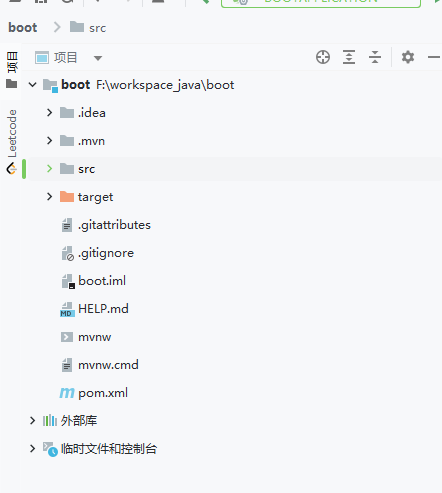
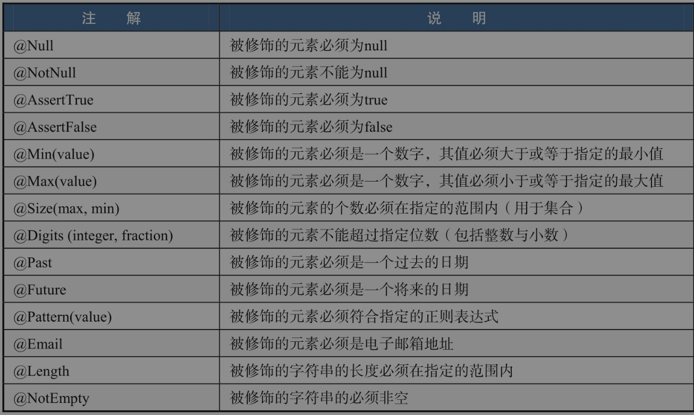
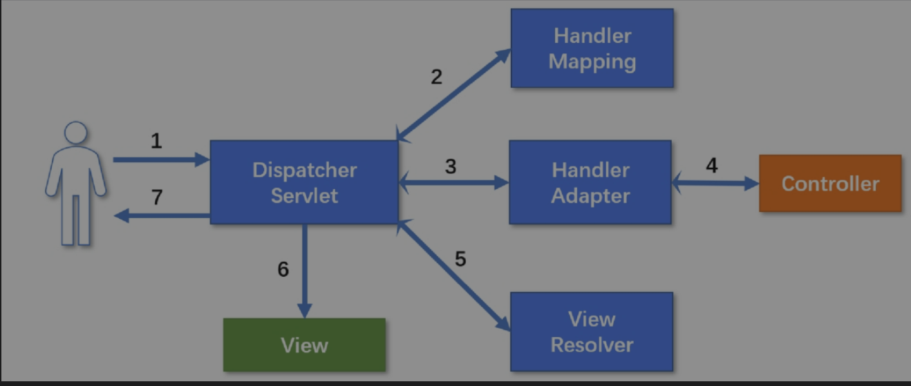
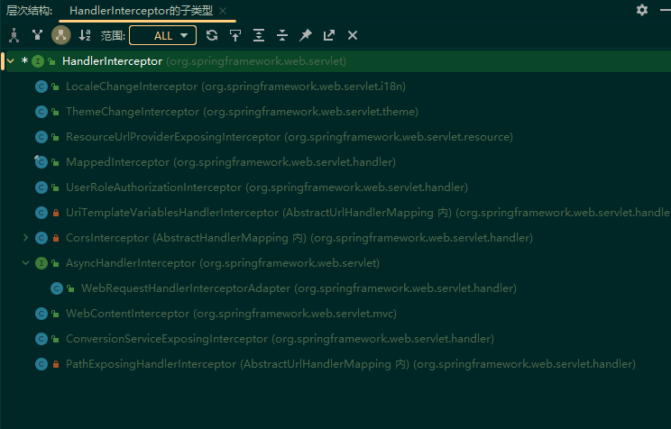
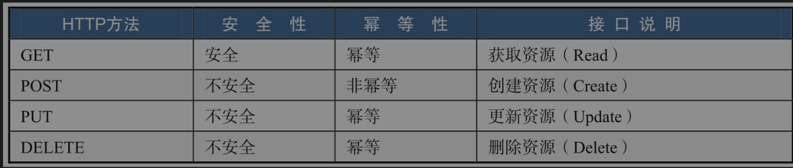
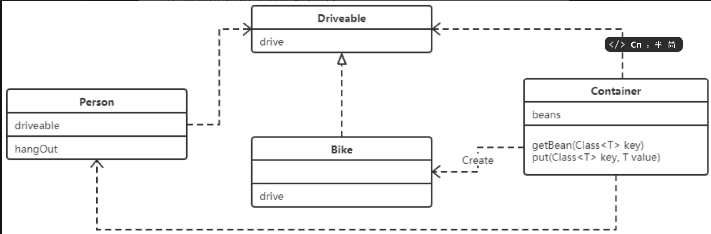
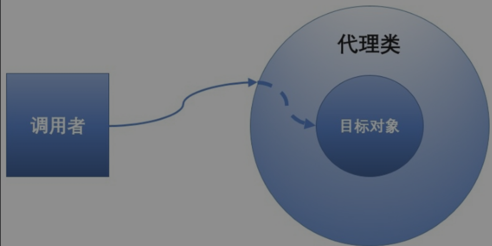

# springboot

## 快速构建项目

### 启动项目

首先，创建项目，选择合适的版本以及依赖，为了简便只选择web依赖，版本为springboot3.3.1,，JDK17

目录结构如上图所示。

项目代码中自动提供入口程序：

```apache
@SpringBootApplication
public class BootApplication {

    public static void main(String[] args) {
        SpringApplication.run(BootApplication.class, args);
    }

}
```

则在同级目录下创建一个HelloController，

```apache
/**
 * ClassName: HelloController
 * Package: com.lxbigdata.boot
 * Description:
 *
 * @author lx
 * @version 1.0
 */
@RestController
public class HelloController {
    @GetMapping("/hello")
    public String hello(){
        return "hello";
    }
}
```

其中的@RestController=@Controller+@ResponseBody,可以标识一个Controller并且使用JSON格式返回信息。

tomcat默认8080，则访问[localhost:8080/hello](http://localhost:8080/hello)，可以得到显示的hello

### 项目配置

之所以这么简单，核心思想是**约定优于配置**

查看项目的pom文件的依赖，核心就一个:

```apache
        <dependency>
            <groupId>org.springframework.boot</groupId>
            <artifactId>spring-boot-starter-web</artifactId>
        </dependency>
```

正常的maven项目，需要：收集web所用的jar包，将坐标添加到maven依赖，并不断调整版本直到可以运行，但是现在springboot提供经过调试的依赖集合。在创建项目的时候，选择了一个web依赖，则这里就一个web-starter,免去了反复粘贴依赖坐标集合。

还可以做一步选择，就是将Properties转换为yaml文件，这两者的区别就是properties是打平的，但是yaml为层级结构，更加清晰。如果项目中这两者共存，则先加载的yaml会被后加载的properties覆盖。

## Spring MVC

### MVC

是软件工程中一种软件架构模式，把软件系统分为三部分

* 模型Model，由一个实体bean实现，是数据的载体
* 视图View，在前后端不分离的情况下，由JSP担任，现在已经被前端取代。负责显示数据给用户，并控制用户的输入
* 控制器Controller，在JavaEE中，可能是一个servlet，而在SpringMVC中，核心是DispatcherServlet。用于处理用户请求，调用相应的Model方法，并返回相应的View。通常是包含HTTP请求的方法(可以使用注解标识)的类。

### 参数接收

有四种方式：：无注解，@RequestParam, @PathVariable, @RequestBody

**Spring MAC 常用注解**


| 注解            | 作用域  | 说明                                                     |
| --------------- | ------- | -------------------------------------------------------- |
| @Controller     | 类      | Controller标识，Spring容器会在启动的时候将其初始化       |
| @RequestMapping | 类/方法 | URL映射，设置接口的访问路径                              |
| @ResponseBody   | 类/方法 | 以JSON格式返回数据。如果修饰类，则其所有方法默认返回JSON |
| @RequestParam   | 参数    | 以名字接收参数，相当于ServletRequest.getParameter()      |
| @RequestBody    | 参数    | 接收JSON格式的参数，常用于AJAX请求，前后端分离场景下     |
| @PathVariable   | 参数    | 接收URL中的值                                            |

组合注解：

@RestController=@Controller+@ResponseBody

@GetMapping=@RequestMapping(method=RequestMethod.GET)。可以映射一个请求路径，并且该路径只响应GET方法

@PostMapping=@RequestMapping(method=RequestMethod.POST)

@PutMapping=@RequestMapping(method=RequestMethod.PUT)

@PatchMapping=@RequestMapping(method=RequestMethod.PATCH)

@DeleteMapping=@RequestMapping(method=RequestMethod.DELETE)

> AJAX请求：JAX（Asynchronous JavaScript and XML）是一种用于在网页上进行异步数据交换的技术，允许网页在不重新加载整个页面的情况下与服务器进行通信。虽然AJAX最初使用XML作为数据格式，但现在通常使用JSON格式，因为它更轻量且易于处理。

**例子**

分别创建User Data类，以及Controller

```apache
@Data
@AllArgsConstructor
public class User {
    private String name;
    private Integer age;
}
```

```apache
@RestController
public class ParamController {
    //无参数
    //http://localhost:8080/noAnnotation?name=＠no方式&age=1
    @GetMapping("/noAnnotation")
    public User noAnnotation(User user){
        return user;
    }
    //@RequestParam注解,相当于调用request.getParameter方法
    //http://localhost:8080/requestparam?name=＠RequestParam方式&age=2
    @GetMapping("/requestParam")
    public User requestParam(@RequestParam String name, @RequestParam Integer age){
        return new User(name,age);
    }
    //PathVariable注解,两个配合从路径中获取参数
    //http://localhost:8080/pathvariable/＠PathVariable方式/3
    @GetMapping("/pathVariable/{name}/{age}")
    public User pathVariable(@PathVariable String name, @PathVariable Integer age){
        return new User(name,age);
    }
    //@RequestBody注解,将请求体中的json数据映射为对象
    //这个方式需要post请求，因为是上传资源
    @PostMapping("/requestBody")
    public User requestBody(@RequestBody User user){
        return user;
    }
}
```

则可以通过各种方式解析参数。注意最后一种方式，由于是上传数据，使用POST方式，可以在idea自带的http客户端写如下的http请求，可在控制台得到输出

```apache
POST http://localhost:8080/requestBody
Content-Type: application/json

{
  "name": "Request Body",
  "age": 4
}
```

### 参数校验

此处只是最基本的参数校验逻辑

只需要引入validation-starter，则可以在数据类上做校验。比如post上传数据时候字段属性如果不正确，则会输出错误日志

```apache
@Data
@AllArgsConstructor
public class User {
    @NotBlank(message = "name is not blank")
    private String name;
    @Min(value = 1, message = "age can not lower than 1")
    private Integer age;
}
```

**常见的注解**



### 原理解析

**整体流程**



假设现在浏览器发起一个请求(如如http://localhost：8080/hello),则会经历如下步骤

1. DispatcherServlet接收用户请求
2. DispatcherServlet根据用户请求的HandlerMapping找到对应的Handler，得到一个HandlerExcutionChain
3. DispatcherServlet通过HandlerAdapter调用COntroller进行后续业务的逻辑处理，等待4返回
4. 处理完业务逻辑，将ModelAndView返回给DispatcherServlet
5. DispatcherServlet通过ViewResolver进行视图解析，并返回view
6. DispathcerServlet对view进行渲染
7. 最终将结果返回给用户

**当返回json类型数据的时候，会省去对视图处理的部分，常见的@RestController就有这个功能**

---

**核心组件**

Handler，HandlerMapping，HandlerAdapter (和Netty等架构异曲同工)

其中Handler是用来具体做事情的，**对应Controller中的方法**。所有有＠RequestMapping的方法都可以被看作一个Handler。

而handlerMapping是用来找到Handler的，是请求路径和Handler的映射关系

而HandlerAdapter是一个适配器，用来和具体的Handler配合使用，该接口的注释如下：

> MVC framework SPI, allowing parameterization of the core MVC workflow.
> Interface that must be implemented for each handler type to handle a request. This interface is used to allow the DispatcherServlet to be indefinitely extensible. **The DispatcherServlet accesses all installed handlers through this interface,** meaning that it does not contain code specific to any handler type.
> Note that a handler can be of type Object. This is to enable handlers from other frameworks to be integrated with this framework without custom coding, as well as to allow for annotation-driven handler objects that do not obey any specific Java interface.
> This interface is not intended for application developers. It is available to handlers who want to develop their own web workflow.
> Note: HandlerAdapter implementors may implement the org.springframework.core.Ordered interface to be able to specify a sorting order (and thus a priority) for getting applied by the DispatcherServlet. Non-Ordered instances get treated as the lowest priority.

在Netty中，同样有ChannelHandler和HandlerAdapter的配合，适配器可以将自定义一个Handler所需要的努力做到最低，因为他们提供了大部分方法的默认实现，使得开发者只需要关心核心逻辑即可

DispatcherServlet的核心方法是doDispatcher:

> Process the actual dispatching to the handler.
> The handler will be obtained by applying the servlet's HandlerMappings in order. The HandlerAdapter will be obtained by querying the servlet's installed HandlerAdapters to find the first that supports the handler class.
> All HTTP methods are handled by this method. It's up to HandlerAdapters or handlers themselves to decide which methods are acceptable.
> 形参:
> request – current HTTP request response – current HTTP response
> 抛出:
> Exception – in case of any kind of processing failure

该方法的核心步骤如下：

```apache
// Determine handler for the current request.
mappedHandler = getHandler(processedRequest);
// Determine handler adapter for the current request.
HandlerAdapter ha = getHandlerAdapter(mappedHandler.getHandler());
// Actually invoke the handler.
mv = ha.handle(processedRequest, response, mappedHandler.getHandler());
//
processDispatchResult(processedRequest, response, mappedHandler, mv, dispatchException);
```

首先，根据请求，找到HandlerExecutionChain

> HandlerExecutionChain 是 Spring MVC 框架中的一个核心类，用于封装处理请求的处理器（Handler）以及与该处理器关联的拦截器（Interceptors）。它可以包含一个Handler和多个Interceptor
>
> 根据mapping，可以找到Chain。然后根据chain，在请求到达处理器之前，调用preHandle,处理之后，调用postHandle，请求完成之后，调用afterCompletion方法

然后根据其中的Handler找到HandlerAdapter

然后处理请求消息，最后返回结果

其中查找HandlerExecutionChain的方法如下：

```apache
	protected HandlerExecutionChain getHandler(HttpServletRequest request) throws Exception {
		if (this.handlerMappings != null) {
			for (HandlerMapping mapping : this.handlerMappings) {
				HandlerExecutionChain handler = mapping.getHandler(request);
				if (handler != null) {
					return handler;
				}
			}
		}
		return null;
	}
```

而查找Adpater的方法如下：

```apache
	protected HandlerAdapter getHandlerAdapter(Object handler) throws ServletException {
		if (this.handlerAdapters != null) {
			for (HandlerAdapter adapter : this.handlerAdapters) {
				if (adapter.supports(handler)) {
					return adapter;
				}
			}
		}
		throw new ServletException("No adapter for handler [" + handler +
				"]: The DispatcherServlet configuration needs to include a HandlerAdapter that supports this handler");
	}
```

### 拦截器

使用场景：登录认证，权限认证，记录日志，性能监控

接口继承关系如下：



主要有AsyncHandlerIntercptor,WebContentInterceptor,MappedInterceptor

自定义·一个拦截器，实现其核心方法即可。

**多个拦截器的执行顺序**

相当于安装了多个InboundHanlder和OutboundHandler，则进入按照顺序，而出去则倒序。

in1        -------->     in2

out1     <-------      out2

## Restful

### SpringDoc

SpringDoc是一款用于生成、描述、调用和可视化RESTful风格的Web服务接口文档的框架。最大特点是可以使接口文档和代码实时同步。

接口文档，是联系前后端开发的枢纽。

具体配置：

```apache
        <!-- springdoc -->
        <dependency>
            <groupId>org.springdoc</groupId>
            <artifactId>springdoc-openapi-starter-webmvc-ui</artifactId>
            <version>2.4.0</version>
        </dependency>
```

```apache
# springdoc
springdoc:
  api-docs:
    path: /v3/api-docs
  swagger-ui:
    doc-expansion: none
    url: "/v3/api-docs"
    path: /swagger-ui.html
```

即可直接访问接口文档。

**todo**

具体配置

### Rest

定义：表现层转换，也就是由HTTP操作引起的各种资源状态转换。

**资源**

资源的范围比较宽泛，比如一个文件（图片、文档、音乐等）、一条数据（用户信息、订单等）都可以被看作资源（每个资源都有一个对应的URI）

**表现层**

资源以什么样的形式来展现自己——例如，文本可以是JSON或XML格式的，图片可以是JPEG或其他格式的

**状态转换**

由HTTP的各种动作引起的状态转换。

CRUD可以对应HTTP的post，delete，put，get

HTTP各种操作的安全性和幂等性如下：



**RestFul**风格

要求：用URI定位资源，URI由名词组成，使用HTTP操作资源

例如GET "http:localhost:8080/rest/user/1" 就是一个Restful风格的操作，对应代码如下：

示例

```apache
@RestController
public class restfulController {
    //增
    @PostMapping("/user")
    @Operation(summary = "add user")
    public boolean add(@RequestBody User user){
        return user == null;
    }
    //删
    @DeleteMapping("/user/{id}")
    @Operation(summary = "delete user by id")
    public boolean delete(@PathVariable Integer id){
        return id == null;
    }
    //改。PATCH用于更新部分字段，而PUT用于更新全部字段
    @PutMapping("/user")
    @Operation(summary = "update user")
    public boolean update(@RequestBody User user){
        return user == null;
    }
    //查
    @GetMapping("/user/{id}")
    @Operation(summary = "get user by id")
    public User get(@PathVariable Integer id){
        return new User("hhh"+id, 18);
    }
}
```


## IOC和AOP

Spring的核心思想是IOC以及AOP，而SpringBoot在此基础上进行了自动配置。

### IOC

Inversion of Control，控制翻转，是一种编程思想，不需要任何新的技术。通常的实现方式有两种：依赖注入和依赖查找。

依赖查找：依赖查找会主动获取，在需要的时候通过调用框架提供的方法来获取对象，并且在获取时需要提供相关的配置文件路径、key等信息来确定获取对象的状态。

依赖注入：Springboot中使用的是基于注解的依赖输入。


为什么要有控制反转这种编程模式？

Class A代表A是一个类，而A a=new A()代表创建一个A类型的对象a。在没有控制反转的情况下，在A类中使用B类的b对象时，需要在A类中新建一个b对象。如果我们使用控制反转，则只需要先在A类中声明一个私有的b对象，即private B b，然后将创建b对象的工作交由容器来完成。容器会根据注解或者配置文件将b对象注入A类的实例中。

比如下面的例子：

首先，是各种交通方式的接口，当一个person要修改它的drive行为的时候，正常情况下，需要违反开闭原则，不断修改已有的内部代码。

```apache
public interface Driveable {
    void drive();
}

class Car implements Driveable{
    @Override
    public void drive() {
        System.out.println("Car drive");
    }
}
```

```apache
public class Person {
    public void hangOut(){
//        Driveable car = new Car();
//        car.drive();
        Driveable bike = new Bike();
        bike.drive();
    }
}
```

如果使用了IOC方式，则可以改造Person类，将交通工具从方法中提取出来，变为Person类的私有变量：

```apache
@AllArgsConstructor
public class Person {
    private Driveable driveable;
    public void hangOut(){
        driveable.drive();
    }
}
```

模拟Springbean容器,其用一个map维护初始化的时候注入的bean.

```apache
public class Container {
    private Map<Class<?>,Object> beans = new ConcurrentHashMap<>();

    /**
     * 获取这个已经注入过的bean
     * @param clazz
     * @return
     * @param <T>
     */
    public <T> T getBean(Class<T> clazz){
        Object bean = beans.get(clazz);
        if(bean == null || !clazz.isInstance(bean)){
            return null;
        }else{
            return (T)bean;
        }
    }

    /**
     * 如果容器中不存在，则添加bean
     * @param clazz
     * @param bean
     * @param <T>
     */
    public <T> void put(Class<T> clazz,T bean){
        beans.putIfAbsent(clazz,bean);
    }
}
```

则这时候如果一个人向动态修改它的Drive行为的含义，则可以不用修改内部代码

```apache
public class IOCTest {
    //bean容器
    private Container container;
    //模拟Spring容器初始化
    @BeforeEach
    public void init(){
        container = new Container();
        container.put(Car.class,new Car());
        container.put(Bike.class,new Bike());
    }
    @Test
    public void test(){
        //模拟autowired注入
        Bike bike = container.getBean(Bike.class);
        Person a = new Person(bike);
        a.hangOut();
        //如果要换车，只需要修改容器中的bean即可,不用再修改Person类
        Car car = container.getBean(Car.class);
        a = new Person(car);
        a.hangOut();
    }
}
```


**IOC的意义**

好处之一当然是不用再手动创建对象，直接使用@Autowired注解就可以。

但是最核心的好处是：让代码脱离了对具体实现的依赖。原始的Person同时依赖于Driveable接口以及其具体实现。但是现在不依赖于具体实现了，只依赖于抽象的接口。




### AOP

程序设计思想的4类：

* OOP：面向对象编程
* AOP：面向切面编程
* POP：面向过程编程
* FP：函数式编程

而AOP其实是OOP的一种扩展。

考虑如果让在一段程序中加入计算运行时间的逻辑，直接枚举并编码，则还可以接受。但是当有几百个业务逻辑，并且统计时间频繁变动的时候，就不能这样了。

但是通过观察，热河业务逻辑的执行时间所需要的操作都是一样的，都是结束时间-开始时间，求两个时间点的差值。常规思路就是将其封装为一个方法，哪里需要就在哪里调用。但是，**这是一种代码的入侵**。

AOP就是为了弥补这种不足，OOP擅长解决纵向的业务逻辑，但是对于横向的公共操作却比较乏力，这就需要AOP来解决。

比如登录，搜索，下单逻辑，都需要性能统计，记录日志，权限检查，这就可以使用AOP操作。**这就是相当于在多个纵向柱面横向切过的操作**


**核心概念**

Advice：通知，想让AOP做的事情，比如性能统计

JoinPoint：连接点，允许AOP通知的地方，比如在方法被调用前执行权限检查，则JoinPoint就是方法调用前。

PointCut:  切入点，用于筛选JoinPoint的条件，对Joinpoint做一次filter,然后对剩下的做Advice

Aspect: 切面，一个包含PointCut以及Advice的集合，完整的定义了在什么条件下做什么事情。图中的每个横线就是一个Apsect。比如当下单接口被调用的时候进行权限检查。


**应用场景**

从Advice的时机来看，有

* Before：在目标方法执行前调用Advice
* After[finally]: 目标方法执行结束后
* After[Returning]：目标方法执行成功后
* After-Throwing:目标方法抛出异常后
* Around：环绕/包裹目标方法调用Advice,是一个可定制化调用的Advice

常见场景：

* 参数检查，日志记录，异常处理，性能统计
* 事务控制，权限控制，缓存处理


**例子**

首先定义一个正常的Controller

```apache
@Slf4j
@RestController
@RequestMapping("/aspect")
public class AspectController {
    @GetMapping
    public Result aspect(String message){
        log.info("aspect controller");
        return Result.success(message);
    }
    @GetMapping("/exception")
    public Result exception(){
        log.info("aspect controller");
        throw new RuntimeException("aspect exception");
    }
}
```

然后定义切面，可以对匹配到的切点的前后执行操作，而不入侵源代码。

```apache
@Slf4j
@Aspect
@Component
public class WebAspect {
    /**
     * 定义切点集合
     * execution是用来匹配连接点的执行方法
     * public 表示匹配方法的权限范围
     * * 表示匹配所有类型返回值
     * com.lxbigdata.boot.Controllers为包路径
     * *.*(..)表示匹配包下的所有类的所用方法的所有参数
     */
    @Pointcut("execution(public * com.lxbigdata.boot.Controllers.*.*(..))")
    public void pointCut(){

    }

    /**
     * 获取请求路径等信息
     * @param joinPoint
     */
    @Before(value = "pointCut()")
    public void before(JoinPoint joinPoint){
        String methodName = joinPoint.getSignature().getName();
        String className = joinPoint.getTarget().getClass().getName();
        Object[] args = joinPoint.getArgs();
        String[] parameterNames = ((MethodSignature) joinPoint.getSignature()).getParameterNames();

        HttpServletRequest request = ((ServletRequestAttributes) RequestContextHolder.getRequestAttributes()).getRequest();

        Map<String,Object> paramMap = new HashMap<>();
        for(int i = 0;i<parameterNames.length;i++){
            paramMap.put(parameterNames[i],args[i]);
        }
        log.info("brfore path:{}",request.getServletPath());
        log.info("class name:{}",className);
        log.info("method name:{}",methodName);
        log.info("param:{}",paramMap.toString());
    }

    /**
     * 打印目标方法名
     * @param joinPoint
     */
    @After(value = "pointCut()")
    public void After(JoinPoint joinPoint){
        log.info("{} after",joinPoint.getSignature().getName());
    }

    /**
     * 打印目标方法的返回值
     * @param joinPoint
     * @param result
     */
    @AfterReturning(value = "pointCut()",returning = "result")
    public void AfterReturning(JoinPoint joinPoint,Object result){
        log.info("{} afterReturning",joinPoint.getSignature().getName());
        log.info("result:{}",result);
    }

    public void AfterThrowing(JoinPoint joinPoint,Exception e){
        log.info("{} afterThrowing",joinPoint.getSignature().getName());
        log.info("exception:{}",e.getMessage());
    }
}
```


**执行顺序**

同一个切面的执行顺序：before -> after[Returning,Throwing], after

不同切面的执行顺序：和Adapter一样，使用inbound/outbound的安装执行逻辑


**原理解析**

Spring的AOP是用代理的方式实现的。每个切面都是Spring容器中的一个Bean，在目标方法被调用时，Spring把切面应用到目标对象上，为目标对象动态创建代理，这个过程叫作Weaving（织入）。切面会在指定（符合切点条件）的连接点织入目标对象中。

当调用者调用目标对象时，调用请求会被代理类拦截，而在目标对象真正被调用之前，会先织入切面逻辑。当应用需要目标对象时，Spring才会创建代理对象，因为Spring采用的是运行期织入的实现方式。

形象来说，就是把原方法包一层。

weaving的实现的可以在不同的情况下实现：编译期，类加载器，运行期




### 程序入口

在没有Springboot之前，都是使用Web容器，将应用打包到容器的相应目录，最后启动容器。

源码如下：

```apache
	public ConfigurableApplicationContext run(String... args) {
		Startup startup = Startup.create();
		if (this.registerShutdownHook) {
			SpringApplication.shutdownHook.enableShutdownHookAddition();
		}
		DefaultBootstrapContext bootstrapContext = createBootstrapContext();
		ConfigurableApplicationContext context = null;
		configureHeadlessProperty();
		SpringApplicationRunListeners listeners = getRunListeners(args);
		listeners.starting(bootstrapContext, this.mainApplicationClass);
		try {
			ApplicationArguments applicationArguments = new DefaultApplicationArguments(args);
			ConfigurableEnvironment environment = prepareEnvironment(listeners, bootstrapContext, applicationArguments);
			Banner printedBanner = printBanner(environment);
			context = createApplicationContext();
			context.setApplicationStartup(this.applicationStartup);
			prepareContext(bootstrapContext, context, environment, listeners, applicationArguments, printedBanner);
			refreshContext(context);
			afterRefresh(context, applicationArguments);
			startup.started();
			if (this.logStartupInfo) {
				new StartupInfoLogger(this.mainApplicationClass).logStarted(getApplicationLog(), startup);
			}
			listeners.started(context, startup.timeTakenToStarted());
			callRunners(context, applicationArguments);
		}
		catch (Throwable ex) {
			throw handleRunFailure(context, ex, listeners);
		}
		try {
			if (context.isRunning()) {
				listeners.ready(context, startup.ready());
			}
		}
		catch (Throwable ex) {
			throw handleRunFailure(context, ex, null);
		}
		return context;
	}
```

步骤如下：

1. 应用启动计时开始
2. 声明上下文
3. 设置属性
4. 启动监听器
5. 初始化默认应用参数
6. 准备应用环境
7. 打印Banner（logo）
8. 创建上下文声明，构建上下文，刷新上下文，刷新上下文后处理
9. 启动计时结束，打印启动日志
10. 发布上下文，启动完成事件
11. 调用runners
12. 启动应用发生异常的处理
13. 发布上下文就绪事件
