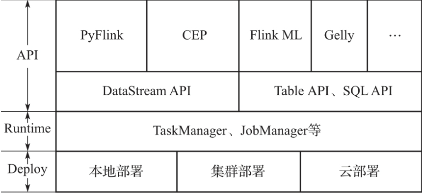
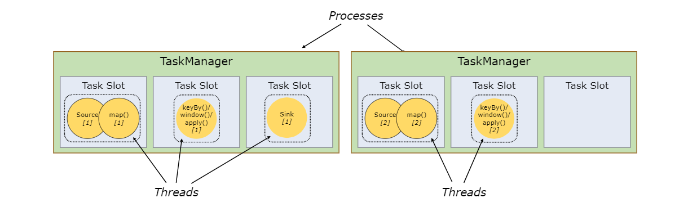
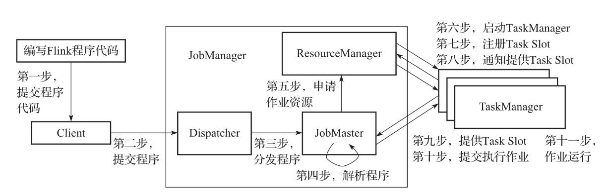
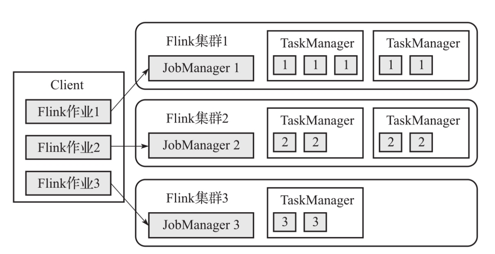
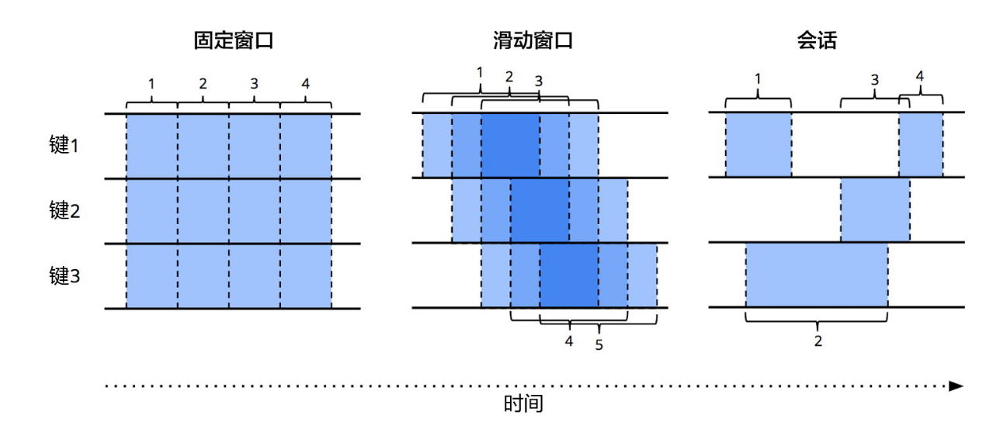
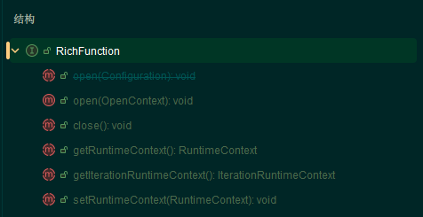
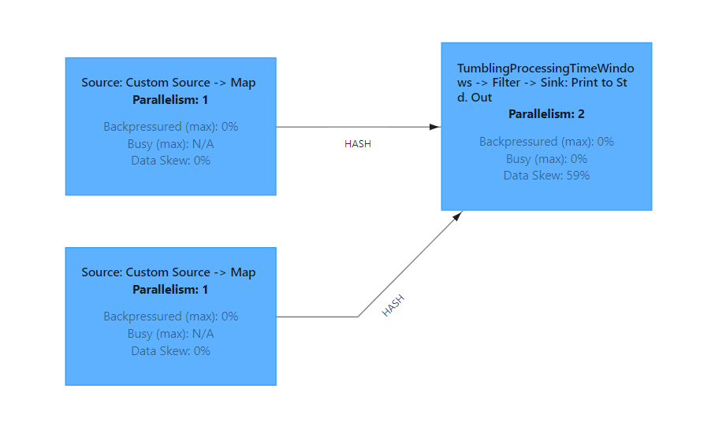
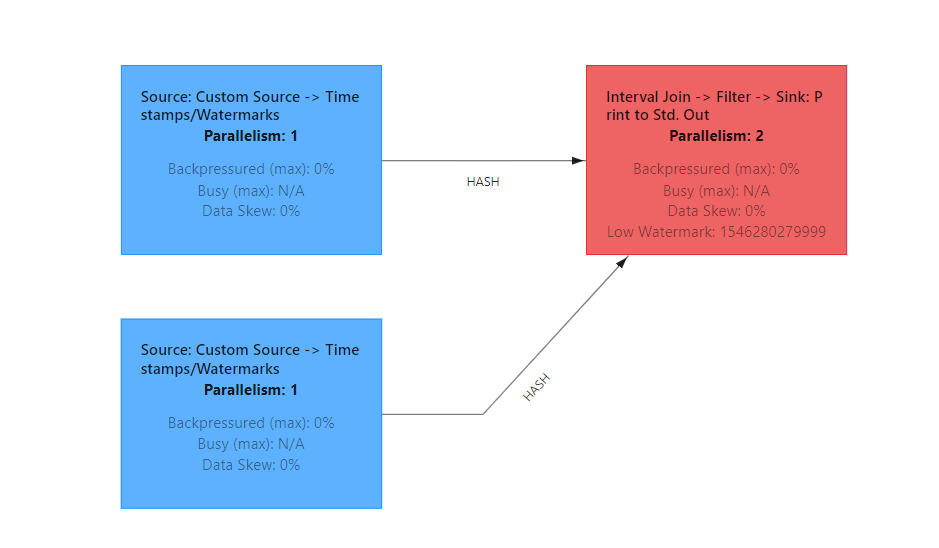

# Flink总结

> [Apache Flink Documentation | Apache Flink](https://nightlies.apache.org/flink/flink-docs-release-1.20/zh/)
>
> [Flink流式计算在节省资源方面的简单分析 ](https://mp.weixin.qq.com/s/mN4eQklYJAy4qXK3vhWK3Q)
>
> 必须声明一点，Flink是移动数据而不是移动计算，Flink和Spark模型有本质的不同。Spark之所以说是移动计算，是因为在批处理任务执行的时候将task发到尽可能同数据近的节点，这是批处理的操作，一个stage结束才开始下一个stage，所以有机会根据输出/存储的数据位置控制task的发送位置。但是Flink的流处理是直接开启整个计算图，然后等待数据流入，所以Flink本质是移动数据。当然，这里特指其流处理模式。其实Flink也可以跑批，这时候它就会控制计算任务是一个个启动而不是全部启动，类似Spark的方式。

## Flink Core

### Flink架构

> [Flink 架构 | Apache Flink](https://nightlies.apache.org/flink/flink-docs-release-1.20/zh/docs/concepts/flink-architecture/)

Flink架构一共分为三层，分别是`Deploy`,`Runtime`,以及`API`层，如下图所示:



#### Flink Runtime

**核心组件**

Flink是一个标准的主从分布式引擎，其`Runtime`架构，核心组件包括: Client,JobManager,TaskManager.

首先是`Client`,其只是负责准备数据流，然后将其发送给`JobManager`。

然后是`JobManager`，其包括三大核心组件:

* `ResourceManager`：负责集群中资源管理和分配，比如`task-slots`。Flink针对不同的资源提供者，比如`YARN,K8s`都特化了不同的`ResuorceManager`。
* `Dispatcher`，可以为提交上来的每一个`Job`启动一个`JobMaster`,同时运行着`Flink web-ui`。
* `JobMaster`：负责单个`JobGraph`的执行。

最后是`TaskManager`，其也称为`worker`，用于执行作业流的`task`，并缓存和交换数据流。其上资源调度的最小单位是`task-slot`，一个`slot`可以执行一个`task`，当然，这个`task`可能有多个算子(算子链的情况)。

针对`TaskManager`这点，这里着重说明一下。

一个`TasnManger`是一个JVM进程，而一个`TaskSlot`是一个执行线程。这里和普通线程池不同就是其会将该进程的内存资源对每个`slot`进行平均，但是`CPU`资源并不会平均分配，依旧是一个进程内CPU共享。

一个进程内的`tasks`好处显而易见，它们共享`TCP连接，文件缓存`等资源，减少了开销。



`Flink`中的算子链，其实就是`Spark`中对应的`一个stage`中的`task`，利用并行计算将效率最大化。具体来说，一个`chain task`可以被投放到一个`backend`的线程池的一个线程执行-即`task-slot`，因为操作系统的最小执行单位是线程，所以该集群的最小执行单位、资源分配单位就是`slot`。

`Flink`允许一个`job`内的所有`tasks`共享`slot`。

> 集群所需的task slot == Job中的最大并行度

**作业提交流程**

其作业的提交流程包括11步，如下:



精确到每一步:

1. 编写Flink代码，将作业进行submit,首先到 Client。
2. Client会将`Job`进行切分，转换为`JobGraph`（app模式在JobManager执行这步），将其提交到集群中的`Dispatcher`。
3. 集群中的`Dispathcer`启动一个`JobMaster`，后者将任务逻辑进行解析，解析为`ExecutionGraph`，其是在物理层面具有并行度的执行图，也就是说其可以被分发到多个节点进行并行计算。同时会运行`Flink-webui`。
4. `JobMaster`向`ResuorceManager`申请所需要的计算节点资源，`ResourceManager`随后向资源提供框架，比如`YARN`申请对应资源。
5. 随后在集群中开启`TaskManager`进程，然后将资源划分，向`RM`注册`task-slot`。
6. 随后告诉`JobMaster`其可用的`slot`资源，随后可以在其上执行作业。（通过rpc）发到对应节点即可。

#### 2种部署模式

> Pre-job模式已经废弃，所以不总结

**Session模式**

提前准备一个`Flink`集群，并全局复用。用户的`Client`只管提交作业即可，其余的`JobManager,taskManager`均复用一个集群的。

> 注意这里的Job解析为`JobGraph`同样是在Client端进行

特点如下:

* 集群和作业声明周期不同
* 不用作业资源不隔离
* 作业部署速度快，这是主要目的，比如即席查询场景

**Application模式**

这里的`Job解析为JobGraph`就在`JobManager`端执行，通过它来解析并下载依赖，使得`Client`十分轻量级。



特点如下:

* 集群和作业生命周期相同。
* 不同Job之间资源完全隔离，每个都是起一个小集群，(这是主要特点，完全隔离)
* 部署速度慢
* 资源抢占

### DataStream API

`Flink`一共有四种API

* code
  * 有状态流
  * DataStream
* 关系型
  * Table API
  * SQL API

#### 从官网例子迭代

官网的例子是逐步推进的欺诈检测例子，相比常见的`wordcount`，它更有代表性。

整体的思路，就是基于先验知识，进行异常点检测，发现异动点。

**主程序**

首先来看主程:

```java
public class FraudDetectionJob {
	public static void main(String[] args) throws Exception {
		//
		StreamExecutionEnvironment env = StreamExecutionEnvironment.getExecutionEnvironment();
		DataStream<Transaction> transactions = env
			.addSource(new TransactionSource())
			.name("transactions");
		DataStream<Alert> alerts = transactions
				.keyBy(x -> x.getAccountId())
				.process(new FraudDetector())
				.name("fraud-detector");
		alerts
			.addSink(new AlertSink())
			.name("send-alerts");

		env.execute("Fraud Detection"); //不能忘了
	}
}
```

首先就是创建一个`env`，创建`Flink`运行环境。如果要有`web-ui`，则需要配置`rest-port`。

然后是添加数据流，这里使用`Flink`内置的`mock`数据源，其有三个字段:

* accountId
* timestamp
* amount

然后对数据流进行转换操作，首先进行`keyby`，其创建一个`keyedStream`，后续的函数会分别作用于每个流之上。其实就是要进行一次`exchange`，保证后续的每个并行`task`流入的数据是同一个`key`。同时，`keyBy`操作可以保证用户追踪流的状态上下文等细粒度控制。

然后就是对每个流(key相同)进行业务逻辑的处理，就是这里传入的自定义处理逻辑，随后再看。

最后将每个流输出的结果添加到自定义`sink`中。

计算图从一开始就全部启动，等待数据流入，这点和`Spark批处理`很不相同。

**第一版业务逻辑**

```java
public class FraudDetector extends KeyedProcessFunction<Long,Transaction,Alert>{
	private static final long serialVersionUID = 1L;
	private static final double SMALL_AMOUNT = 1.00;
	private static final double LARGE_AMOUNT = 500;
	private transient ValueState<Boolean> flagState; //维护一个流的state，其穿透context
	//每个流开一次，操作其全局变量与状态
	@Override
	public void open(Configuration parameters) throws Exception {
		//一个valueState描述符，作用类比 fd，或者handle。
		//给本流注册一个state
		ValueStateDescriptor<Boolean> flag = new ValueStateDescriptor<>("flag", Types.BOOLEAN);
		flagState = this.getRuntimeContext().getState(flag);
	}

	@Override
	public void processElement(Transaction value, Context ctx, Collector<Alert> out) throws Exception {
		Boolean lastTransWasSmall = flagState.value();
		if(lastTransWasSmall != null){
			if(value.getAmount() > LARGE_AMOUNT){
				Alert alert = new Alert();
				alert.setId(value.getAccountId());
				out.collect(alert);
			}
			flagState.clear();
		}
		if(value.getAmount() < SMALL_AMOUNT){
			flagState.update(true);
		}
	}
}
```

这是一个作用于`keyedStream`上的函数，所以可以维护`state`。这里使用一个`ValueState`来记录上一个的金额是否满足了条件。

所以它不断匹配第一个满足条件的小金额，然后在之后将状态机转换，开始匹配下一个大金额。

> 看出来其用CEP写应该会很简单，后续会专门使用CEP写一次。

上述逻辑已经比较完备，唯一缺点就是没有时效性保证。也就是说，一旦匹配到第一个小金额，状态机就不会回退，会一直等到下一个大金额，哪怕时间间隔是一年。所以会有下述的第二版。

**第二版-引入时间**

依旧是因为`keyedStream`，所以可以有定义逻辑的操作，也就是在特殊时间触发回调函数。显然，该业务逻辑的定时回调函数应该是清空之前匹配的小数据，从头开始，因为过期了。

```java
public class FraudDetector extends KeyedProcessFunction<Long,Transaction,Alert>{
	private static final long serialVersionUID = 1L;
	private static final double SMALL_AMOUNT = 1.00;
	private static final double LARGE_AMOUNT = 500;
	private transient ValueState<Boolean> flagState; //维护一个流的state，其穿透context
	private transient ValueState<Long> timerState;
	//每个流开一次，操作其全局变量与状态
	@Override
	public void open(Configuration parameters) throws Exception {
		//一个valueState描述符，作用类比 fd
		//给本流注册一个state
		ValueStateDescriptor<Boolean> flagD = new ValueStateDescriptor<>("flag", Types.BOOLEAN);
		flagState = this.getRuntimeContext().getState(flagD);

		//同样操作，注册一个timer并拿到其fd
		ValueStateDescriptor<Long> timerD = new ValueStateDescriptor<>("timer-state", Types.LONG);
		timerState = this.getRuntimeContext().getState(timerD);
	}

	@Override
	public void processElement(Transaction value, Context ctx, Collector<Alert> out) throws Exception {
		Boolean lastTransWasSmall = flagState.value();
		if(lastTransWasSmall != null){
			if(value.getAmount() > LARGE_AMOUNT){
				Alert alert = new Alert();
				alert.setId(value.getAccountId());
				out.collect(alert);
			}
			flagState.clear();
		}
		if(value.getAmount() < SMALL_AMOUNT){
			flagState.update(true);

			//注册一个timer，到时间就触发onTimer回调。
			//这里之所以额外维护一个state作为timer，是因为定时任务是事件匹配所驱动的。
			long timer = ctx.timerService().currentProcessingTime() + 1000 * 60;
			ctx.timerService().registerProcessingTimeTimer(timer);
		}
	}

	@Override
	public void onTimer(long timestamp, KeyedProcessFunction<Long, Transaction, Alert>.OnTimerContext ctx, Collector<Alert> out) throws Exception {
		timerState.clear();
		flagState.clear();
	}

}
```

#### Source

**简单数据源**

对于已有类型的简单数据源，使用`fromData`即可.

```java
		ArrayList<Integer> integers = new ArrayList<>(10);
		for (int i = 0; i < 10; i++) {
			integers.add(i);
		}
		DataStreamSource<Integer> integerDataStreamSource = env.fromData(integers);
```

**自定义数据源**

```java
    public static class Order {
        public int id;
        public int num;
        public String name;
    }

    //自定义数据源
    private static class UserDefinedSource implements ParallelSourceFunction<Tuple3<Integer, Long, Order>> {
        private volatile boolean running = true;

        @Override
        public void run(SourceContext<Tuple3<Integer, Long, Order>> ctx) throws Exception {
            while (running) {
                int id = RandomUtils.nextInt(0, 100);
                int num = RandomUtils.nextInt(0, 999);
                String name = RandomStringUtils.randomAlphabetic(5);
                Order order = new Order();
                order.id = id;
                order.num = num;
                order.name = name;
                ctx.collect(Tuple3.of(id, System.currentTimeMillis(), order));
                Thread.sleep(3000);
            }
        }

        @Override
        public void cancel() {
            running = false;
        }
    }
```

只需要实现各种`SourceFunction`接口的两个方法，分别是输出数据和流的关闭逻辑也就是`run和cancel函数`。

**Kafka数据源**

这里需要额外添加依赖，可以指定主题进行消费。

```java
public class FlinkKafkaUtils {

    public static Properties getProducerProperties(String brokers) {
        Properties properties = getCommonProperties();
        properties.setProperty("bootstrap.servers", brokers);
        properties.setProperty("metadata.broker.list", brokers);
        properties.setProperty("zookeeper.connect", Constants.HOST_NAME+":"+Constants.ZOOKEEPER_PORT);
        return properties;
    }

    public static Properties getCommonProperties() {
        Properties properties = new Properties();
        properties.setProperty("linger.ms", "100");
        properties.setProperty("retries", "100");
        properties.setProperty("retry.backoff.ms", "200");
        properties.setProperty("buffer.memory", "524288");
        properties.setProperty("batch.size", "100");
        properties.setProperty("max.request.size", "524288");
        properties.setProperty("compression.type", "snappy");
        properties.setProperty("request.timeout.ms", "180000");
        properties.setProperty("max.block.ms", "180000");
        return properties;
    }

    public static FlinkKafkaConsumer<String> getKafkaEventSource(String topic){
        Properties props = getProducerProperties(Constants.BROKERS);
        props.setProperty("auto.offset.reset", "latest");
        //指定Topic
        FlinkKafkaConsumer<String> source = new FlinkKafkaConsumer<>(topic, new SimpleStringSchema(), props);
        return source;
    }

    public static FlinkKafkaConsumer<String> getKafkaEventSource(){
        Properties props = getProducerProperties(Constants.BROKERS);
        props.setProperty("auto.offset.reset", "latest");
        //指定Topic
//        FlinkKafkaConsumer<String> source = new FlinkKafkaConsumer<>(Constants.CLIENT_LOG, new SimpleStringSchema(), props);
        FlinkKafkaConsumer<String> source = new FlinkKafkaConsumer<>(Constants.STOCK_LOG, new SimpleStringSchema(), props);
        return source;
    }
}
```

#### Operator-概述

> [概览 | Apache Flink](https://nightlies.apache.org/flink/flink-docs-release-1.20/zh/docs/dev/datastream/operators/overview/)

**数据流转换**

* map
* flatmap
* filter
* keyBy，`数组，以及没有重写hashCode方法的POJO类`不能作为key
* reduce，将局部流数据进行滚动聚合
* window：对键控流对每个流上进行开窗，开窗就是根据某些特征对流数据进行分组(每组数据是一个`iterator`)，流转换为`WindowedStream`
* windowAll：对普通流的所有数据进行开窗,流转换为`AllWindowedStream`
* window apply：对流的每个开窗使用`function`，此处需要是`[All]WindowFunction`
* window reduce：对流的每个开窗做`reduce`并返回结果
* union：同类型多流合并，只保证单流数据相对位置不变
* connect: 不同类型多流合并
* window join：根据指定的`key`和`窗口`对数据进行`join`。是`type JOIN = (DataStream,DataStream) => DataStream `
* interval join : 并不和开窗耦合，只是将两个键控流中`某个key`相等并且在指定范围内的数据进行`Join`
* ......

**物理分区分布**

* partitionCustom：自定义分区，可传入分区器
* shuffle：随机分区
* broadcast：将该流元素广播到每个分区

**资源隔离**

多个算子在特定情况可以进行chain,然后可以在同一个线程中执行（slot）。默认开启算子链模式。

那么如何禁用呢?

只需要后跟一个`disableChaining`即可，即可将算子链打断。

如何控制算子执行的`slot`呢?

可以通过`slotSharingGroup("name")`来将某些算子放入同一个`slot`中去执行。

#### 从《流式系统》看算子

> 结合《流式系统》书籍进行总结

数据的处理，通常可以通过`what,where,when,how`模式进行总结。

* what：计算输出什么结果
* where：以事件时间计，结果在何处被计算
* when：以处理时间计，结果在何时被物化
* how：结果的改进/修正如何相互关联。是丢弃，累积，还是替换?

**what**

这个问题通过具体使用的开窗函数进行回答，也就是对每个窗口的处理逻辑。

开窗函数有如下几种，控制程度依次增加:

* reduce：输入输出类型一直，从左到右卷。
* aggregate:输入输出类型可以不同，最终基于累加器计算出输出结果，粒度更细。
* process:前两者都是边来边更新，这个函数是到触发时间时拿到数据的`iterator`以及上下文，可以进行任意逻辑的计算。

可以看到，其实`process`是在表达能力和性能之间做了权衡，暴露给用户更强的操控力。

> `ProcessWindowFunction`还可以让用户拿到当前流甚至所有流的当前窗口的state，进行更强的操作。

**where**

开窗，回答的就是where。

开窗是处理无界流的关键，因为它可以将满足一定特征的数据装入大小有限的桶中，再对每个桶进行处理。这就是上面的概述所说的开窗就是依据某个特征对数据流进行分组。

开窗可以作用于普通流，以及键控流，通常都是使用键控流再开窗，这样的流具有并行处理窗口函数的能力。

窗口的生命周期: 在第一个属于该窗口的元素到达的时候创建，然后在时间超过窗口的截止时间戳 + 用户定义的`allowed-lateness`之后被完全删除。当然，这里清空(`purge`)的的是窗口的数据元素，并不是窗口元数据，也就说，窗口也可能会进入新的数据。

```java
stream
       .keyBy(...)               <-  仅 keyed 窗口需要
       .window(...)              <-  必填项："assigner"
      [.trigger(...)]            <-  可选项："trigger" (省略则使用默认 trigger)
      [.evictor(...)]            <-  可选项："evictor" (省略则不使用 evictor)
      [.allowedLateness(...)]    <-  可选项："lateness" (省略则为 0)
      [.sideOutputLateData(...)] <-  可选项："output tag" (省略则不对迟到数据使用 side output)
       .reduce/aggregate/apply()      <-  必填项："function"
      [.getSideOutput(...)]      <-  可选项："output tag"
```

如何按照时间边界来划分多条数据流呢?

通常有三种方式:

* 滚动窗口/固定窗口(Tumbing Windows)
* 滑动窗口(Sliding Windows)
* 会话窗口(Session Windows)



在Flink中，可以通过`Window Assigners`进行指定，也就是指定`key`被划分到什么位置.

比如还是官网的例子，使用`Transcation数据源`，数据形式如下:

```plaintext
7> Transaction{accountId=1, timestamp=1546272000000, amount=188.23}
8> Transaction{accountId=2, timestamp=1546272360000, amount=374.79}
9> Transaction{accountId=3, timestamp=1546272720000, amount=112.15}
```

则如果要对其进行固定开窗(滚动开窗),则可以如下方式:

```java
        stream
                .keyBy(Transaction::getAccountId)
                .window(TumblingEventTimeWindows.of(Time.seconds(5)))
```

如果是滑动窗口，则是`SlidingEventTimeWindows.ofxxx`。

会话窗口的话，可以有不同策略，分别是固定间隔，动态间隔等。

**when**

触发器(trigger)就是用来实现每个窗口的结果，以处理时间计(或者其他标准)，该何时物化输出的。

主要的触发器有两类：

* 完整性触发器:到达某个阈值一次性输出最终结果。语义类似于批处理。
* 重复更新触发器:对每个数据进来，所计算的中间结果，都输出下来，这个最常见。

前者到某个阈值之后直接输出最终结果，而后者会输出每个数据到来之后的结果。

如果你熟悉`Scala`，则完整性触发器效果就是`reduce`，而重复更新触发器效果就是`scanLeft`。

而Flink中，分配窗口的时候会分配默认触发器，这个默认触发器是`完整性触发器`。分别有`ProcessingTime`语义和`eventTime`语义。

如何指定`重复更新触发器`呢?

Flink中有一个`CountTrigger`，可以基于数量来触发窗口计算。

> Flink中只有使用`event-time`的时候才有watermark(其实是启发式水位)，其余部分都是固定的，也就是窗口在结束的时间线统一触发输出。

#### watermark

`Flink`不同于`Spark`，它的计算图一旦构成，就会全部启动，所以会有人说`Flink`是移动数据而不是移动计算，因为它整体来看是数据从固定流图中进行流动。而不是和Spark一样整体上来看是串行启动。

而数据的流动，靠的就是`watermark`。

**作用**

关于流式数据处理的`when`部分，上面已经介绍了是通过`trigger`来进行触发。

那么`trigger`到底根据什么可以判定数据流的某个窗口不会再有数据进来了(从而开始触发计算)呢？

答案就是`watermark`，它给`trigger`一个断言(assert），让其可以放心进行输出最终结果/关闭窗口。它也是推动无界流处理进度的核心概念。

具体而言，水位告诉`trigger`，当前系统的数据不会再有比时间`T`更晚的数据进来。

**性质**

通常，我们都是利用水位所提供的断言性质，来实现两方面的需求:

* 进行窗口的最终计算/触发计算，以及关闭窗口
* 对数据进行排查，看哪部分数据推进的慢/有问题

**分类**

根据`watermark`所提供的断言到底准不准，可以分为`完美水位和启发式水位`。这是一个权衡的艺术。

而水位到底准不准，主要和一个因素有关，就是`timestamp`的语义，到底是`event-time`,`injection-time`,还是`process-time`。

> `injection-time`本身又是一个权衡的产物。

因为真实的数据的产生来自外部系统，`Flink`不可能掌握外部系统的所有信息(由于外部系统本身，网络拥堵等原因)。所以我们得出一个结论，就是一般情况下，使用`event-time`语义不可能达成完美水位。

如果要完美水位，则有两种方法:

* 使用`injection-time/process-time`语义，让`Flink`掌控全局数据推进。
* 使用静态的，按`event-time`排序的数据集。

启发式水位的创建(针对`event-time语义`)，其效果的差距会很大，因为终究会有迟到的数据。要建立一个好的启发式水位，则有如下方式:

* 使用动态的，按照`event-time`排序的动态数据集(方便对数据整体进行估算，来优化启发式水位设置)，说的就是`Kafka`。

> 再次强调，Flink的watermark特指启发式水位，针对`event-time`语义。

Flink中的内置的基于事件时间的水位生成器策略有两种。

* forMonoTimeStamps：适用于数据源数据按照事件时间有序存储,比如Kafka
* forBoundOutofOrderness：适用于考虑延迟(或者数据源乱序存储)的情况，将数据的水位推进延迟一段时间。

**多stage传递**

对于不同stage(经过exchange)而言(Stage内部是并行逻辑，可以统一视作一个大算子链)

* 其输入的水位是`上游各数据源Stage的event-time`最小值。
* 其输出的水位是以下三者的最小值
  * 输入水位
  * 状态组件水位
  * 输出缓冲区水位

```java
public class watermarkDemo {
    public static void main(String[] args) throws Exception {
        Configuration conf = new Configuration();
        conf.setString("rest.port", "9091");
        conf.setBoolean("web.ui.enable", true);
        StreamExecutionEnvironment env = StreamExecutionEnvironment.createLocalEnvironmentWithWebUI(conf);
        //启发式水位的标准实现之一:假定数据源数据按时间戳递增存储(Kafka就完美符合)
        WatermarkStrategy<Transaction> strategy01 = WatermarkStrategy.<Transaction>forMonotonousTimestamps()
                .withTimestampAssigner((element, Timestamp) -> element.getTimestamp()); //如何从元数据中获取时间戳
        //如果数据源存储还时间乱序的话,或者网络发送乱序，则需要使用forBoundedOutOfOrderness实现
        WatermarkStrategy<Transaction> strategy02 = WatermarkStrategy.<Transaction>forBoundedOutOfOrderness(Duration.ofSeconds(1))
                .withTimestampAssigner((element, Timestamp) -> element.getTimestamp());
        DataStream<Transaction> stream = env.addSource(new TransactionSource())
                .assignTimestampsAndWatermarks(strategy01); //通常水位直接在源端设置
        stream
                .keyBy(Transaction::getAccountId)
                .window(TumblingEventTimeWindows.of(Duration.ofSeconds(10)))
                .aggregate(new AggregateFunction<Transaction, Tuple2<Double, Integer>, Double>() {
                    @Override
                    public Tuple2<Double, Integer> createAccumulator() {
                        return new Tuple2<>(0.0, 0);
                    }

                    @Override
                    public Tuple2<Double, Integer> add(Transaction value, Tuple2<Double, Integer> accumulator) {
                        return new Tuple2<>(accumulator.f0 + value.getAmount(), accumulator.f1 + 1);
                    }

                    @Override
                    public Double getResult(Tuple2<Double, Integer> accumulator) {
                        var total = accumulator.f0;
                        var count = accumulator.f1;
                        if (count == 0) return 0.0;
                        return total / count;
                    }

                    @Override
                    public Tuple2<Double, Integer> merge(Tuple2<Double, Integer> a, Tuple2<Double, Integer> b) {
                        return new Tuple2<>(a.f0 + b.f0, a.f1 + b.f1);
                    }
                })
                .filter(x -> x > 1000)
                .print();

        env.execute();
    }
}
```

#### Sink

也就是处理之后的数据都发送/存储到哪里。

* 打印到控制台，则strean.print()
* 发送到`Kafka`，则先创建一个SinkFunction，它是一个`Kafka生产者`，然后stream.addSink即可。
* 自定义Sink,则需要实现`SinkFunction`接口的`invoke`方法。

```java
    public static class MySink implements SinkFunction<Integer>{
        @Override
        public void invoke(Integer value, Context context) throws Exception {
            System.out.println(value);
        }
    }
```

#### 算子数据传输策略

一共有8种数据传输策略。

* Forward: 上游一个subtask只流向下游一个subtask，Flink在能`Forward`的情况下都会使用它
* Rebalance：上游的一个subtask数据均匀发送到下游每个subtask，一般用于数据倾斜处理(打散)。也就是说，他一般也是用于多线并行的情况，只不过该变了数据分布而已，计算逻辑照常。它可以处理上下游并行度相同的问题，也可以处理上下游并行度不同的情况(默认就是rebalance)。
* Shuffle：只是和`rebalance`的分发逻辑不同，一个是`round-robin`，一个是`random`.其余完全一致。
* KeyGroup：使用`keyby`之后，上下游传输逻辑就是`keyGroup`，一般通过`Hash`来决定发送到下游哪个`subtask`，一定会保证同一个key的全部在一个`subtask`中。要注意它和`rebalance以及shuffle`完全不同，这里要和`spark`区分开。
* Rescale：将上游`subtask`的数据均匀发送给下游的`subtask`，不过并不是全部的，而是下游局部的`subtask`。
* Broadcast：上游一个`subtask`数据会全部发送给所有的下游`subtask`。
* Global: 将上游所有`subtask`数据汇聚到下游一个`subtask`中。

#### RichFunction



文档中的定义如下:

> An base interface for all rich user-defined functions. This class defines methods for the life cycle of the functions, as well as methods to access the context in which the functions are executed.

也就是说，通过`RichFunction`，我们可以控制这个函数的整个生命周期的行为。

其中的`open/close`，是每个`subtask`初始化、结束时候会执行一次。

而`getRuntieContext`，就是本`subtask`的执行上下文。

> 注意这里为什么是subtask，因为`Flink`是流处理，会直接开多并行度的全局计算图。而同一个stage(比如Map[x])中会有多个并行的subtask，这里每个`subtask`都要初始化一次。

#### 双流Join

Flink进行双流Join的算子有两个:

* window join：根据指定的 key 和窗口 join 两个数据流。
* interval join：根据 key 相等并且满足指定的时间范围内（`e1.timestamp + lowerBound <= e2.timestamp <= e1.timestamp + upperBound`）的条件将分别属于两个 keyed stream 的元素 e1 和 e2 Join 在一起。

其中,

* `type window-join = （DataStream,DataStream） => DataStream`
* `type interval-join = （KeyedStream,KeyedStream） => DataStream`

**window join**

如下例子:

对两个流进行Join，开窗为处理时间的固定窗口，长度为5。它会将两个流中相同窗口内的指定键一直的数据做笛卡尔积(一一处理)，然后输出。

```java
public class DoubleJoinDemo {
    public static void main(String[] args) {
        Configuration conf = new Configuration();
        conf.setString("rest.port", "9091");
        conf.setBoolean("web.ui.enable", true);
        StreamExecutionEnvironment env = StreamExecutionEnvironment.createLocalEnvironmentWithWebUI(conf);
        env.setParallelism(2);
        DataStreamSource<Transaction> stream01 = env.addSource(new TransactionSource());
        DataStreamSource<Transaction> stream02 = env.addSource(new TransactionSource());
        stream01
                .join(stream02)
                .where(Transaction::getAccountId).equalTo(Transaction::getAccountId)
                .window(TumblingProcessingTimeWindows.of(Duration.ofSeconds(5)))
                .apply(new JoinFunction<Transaction, Transaction, String>(){

                    @Override
                    public String join(Transaction first, Transaction second) throws Exception {
                        return first.getAmount() + "" + second.getAmount();
                    }
                })
                .filter(x -> x.startsWith("1"))
                .print();
        try {
            env.execute();
        } catch (Exception e) {
            e.printStackTrace();
        }
    }
}
```



**interval join**

这种join和窗口没有关系，或者说它是两边窗口无限大的情况。因为通常某些操作必然有先后顺序，不会划分到同一窗口。

interval join只支持`event-time`。ok，那么必然要指定`watermarkStateagy`。并且可以指定窗口左右区间包含不包含。

```java
public class IntervalJoinDemo {
    public static void main(String[] args) {
        Configuration conf = new Configuration();
        conf.setString("rest.port", "9091");
        conf.setBoolean("web.ui.enable", true);
        StreamExecutionEnvironment env = StreamExecutionEnvironment.createLocalEnvironmentWithWebUI(conf);
        env.setParallelism(2);

        WatermarkStrategy<Transaction> strategy = WatermarkStrategy.<Transaction>forMonotonousTimestamps()
                .withTimestampAssigner((element, timestamp) -> element.getTimestamp());

       DataStream<Transaction> stream01 = env.addSource(new TransactionSource()).assignTimestampsAndWatermarks(strategy);
        DataStream<Transaction> stream02 = env.addSource(new TransactionSource()).assignTimestampsAndWatermarks(strategy);
        KeyedStream<Transaction, Long> keyedStream01 = stream01.keyBy(Transaction::getAccountId);
        KeyedStream<Transaction, Long> keyedStream02 = stream02.keyBy(Transaction::getAccountId);

        keyedStream01
                .intervalJoin(keyedStream02)
                .between(Duration.ofMillis(-500), Duration.ofMillis(500))
                .lowerBoundExclusive()
                .upperBoundExclusive()
                .process(new ProcessJoinFunction<Transaction, Transaction, Double>() {
                    @Override
                    public void processElement(Transaction left, Transaction right, Context ctx, Collector<Double> out) throws Exception {
                        out.collect(left.getAmount() + right.getAmount());
                    }
                })
                .filter(x -> x > 1000)
                .print();
        try {
            env.execute();
        } catch (Exception e){
            e.printStackTrace();
        }

    }
}
```



#### 数据乱序

> 数据乱序是导致完美水位无法产生的根本原因。

**产生原因**

* 数据源本身乱序存储
* 数据源的产生就是乱序，比如用户突然开启飞行模式
* 共享资源限制，比如网络拥塞

**可能的解决方案**

* 让水位延迟推进: forboundedOutOfOrderness
* 水位正常推进，但是窗口延迟关闭，仍然可以重新触发计算: allowLateness
* 旁路输出

注意几者可以结合提高效率。

> 注意allLateness在Flink中的实现是重新输出新结果，并不会覆盖旧结果。它会将原有数据存储在subtask本地状态中，等待结合输出新的结果。显然，会导致状态存储过大的问题。
>
> 也就是说，同一个窗口可能会送给下游多个结果，需要下游进行取舍/更新结果。

**排查思路**

1. 数据处理前，对数据乱序程度进行排查，看看乱序的限度到底有多大(不断调整延迟让数据丢失最少，就可以看出最大延迟)
2. 数据处理时，及时监控乱序程度以及水位推进情况。使用`Flink-metric`体系进行监控
3. 数据处理后，根据结果及时调整前面设置的参数，保障下一次产出。

### 状态

> 这里当前基于的版本是`Flink1.20`，而`Flink2.0`的版本引入了存算分离和异步状态API，在后面再分析。

#### 实现思路

主要有三点:

* 状态本地持久化
* 精确一次的一致性快照保证异常容错
* 统一API接口

**状态本地持久化**

`Flink`的状态数据，存储在`subtask`的本地机器的内存与磁盘上。

这样可以在对状态进行更新、访问的时候使得延迟达到最低。

> 但是状态本地化的同时带来问题，如果计算节点宕机，则状态存储会一并丢失-容错很难做。
>
> 状态集中管理的关系型数据库的容错管理相比之下就方便一些。

那怎么解决呢？

Flink采用了快照机制，定时将状态快照，统一存储到远端，比如HDFS上。这样节点宕机之后的状态恢复压力减小很多。

**精确一次的一致性快照**

Flink实现了一个名为`checkpoint`的分布式轻量级异步快照，保证了精确一次的数据处理，以及一致性状态。其实主要存储的就是`state`。

通过它实现了处理数据逻辑，和异常容错机制的解耦，用户只需要在使用状态接口的时候开启`checkpoint`即可。

当有状态算子并行度发生变化怎么办？如何将磁盘中存储的数据重新分配？

Flink将状态进行了分类:

* 算子状态:可以平均分割
* 键值状态：自动根据键值和最大并行度进行分配

当任务中增加、减少了算子，该怎么办？

Flink提出`savepoint`机制，也就是用户手动触发的`checkpoint`。

#### 两种状态

Flink状态可以分为两类，分别是算子状态，和键值状态。以及一种特化的算子状态-广播状态

**算子状态**

> 最常见的场景就是数据源连接

因为状态本地化的原因，Flink中每个subtask只能访问本地的状态数据。所以一个穿透当前`subtask`的状态就是算子状态。

Flink内置的KafkaConsumer就使用了算子状态，通常情况下，其对每个`partition`开一个`Source[x]`，也就是一个subtask,然后在该subtask内维护消费的`offset`。

> 所以Flink和Kafka的结合属于外部维护offset，在我的kafka文档中分析过这种情况

具体API:

* ListState
* UnionListState

**键值状态**

键值状态针对键控流。

因为虽然是进行了`keyBy`，但是一个subtask并不是只会流一种key(其实`Spark`也一样，总不能并行度上亿吧)。那么如何给上层用户提供单个key处理的假象呢？

考虑Java并发编程中的`theadLocal`，它就是一个全局的存储在堆上的Map，维护每个线程对应的副本值。

到了这里类似，在`subtask`中维护一个Map，给每个key对应的state都存储上。

也就说，这个状态值粒度被缩小到了`一个subtask的一种key`，所以称为键值状态。

键值状态更常见:

* ValueState
* MapState
* ListState
* ReducingState
* AggregatingState

**广播状态**

广播状态作用粒度同样是一个`subtask`.

其通常用在规则日志流中。也就是说，获取最新的一条规则日志流，然后将当前正在处理的流和其进行关联(connect)

然后就可以将当前规则广播到所有处理(process)算子当中。

> 需要开自定义算子

#### 精确一次性与快照

> 首先是处理系统内部精确一次性，然后是端到端精确一致性。

**单机系统**

首先看单机系统。

一个单机系统的数据处理，可以分为数据读取，数据处理，状态存储，数据输出。

因为数据读取到内存-数据处理-状态存储 这个过程并不是原子性的，所以必然会有问题。（Kafka的消费问题也是这个原因）

那发生单机故障在恢复的时候，会有什么后果呢？

* 至多一次
* 至少一次
* 精确一次

首先是至多一次. 它只依靠状态持久化。会丢数据，也就是数据读取进来但是没有处理，但是数据源没有任何标记，认为其已经处理完毕。

然后是至少一次，它依靠状态持久化 + 数据源`offset`。这样可以做到数据重放，起码不会丢数据。但是不能判定数据到底有没有处理过，所以可能会重复，也就是至少一次。

最终是精确一次。它依靠状态-对应`offset`持久化 。也就是说，把`offset`的管理和状态管理统一起来。这样每次恢复，都知道当前已经有的状态，以及该从哪里重放。需要注意，这里的持久化需要和数据处理操作，也就是状态修改是互斥的，不能并行执行。

则单机系统的精确一次性实现流程如下:

* 数据源端
  * 有重放的数据源，比如Kafka
* 数据处理端
  * 有远端持久化存储:如比HDFS。
  * 一致性快照由单机应用自身定期触发，同时持久化状态和对应的数据源偏移量，并和状态修改保持互斥。
  * 宕机恢复的时候先读取持久化状态，再对数据源从对应偏移量开始进行重放。

如此，可以完美实现单机的精确一次性。

**分布式系统**
> Flink精确一次性的本质，其实是分布式事务。

分布式系统如何实现内部的精确一次性处理呢？

对于分布式系统，比如Flink来说，只需要看逻辑数据流图即可。因为执行层面的每个算子内的`subtask`只有数据的区别，其他完全一致。

所以整体的分布式保证可以从三部分看：

* 数据源(Source)
* 转换过程
* 数据汇

数据源(Source)，可以直接照搬单机的精确一次性模式。其实数据源放在外部数据系统，比如`Kafka`来说，就是消费者。当然可以采用上面的例子。
> 具体来说，Source需要在进行checkpoint的时候直接进行快照，同时持久化offset。等到故障恢复的时候到对应的offset开始进行数据重放。

那么中间的Transform算子可不可以照搬呢？
> 中间的Transform算子使用chandy-lamport算法,通过marker机制/barrier机制来进行精确一次性。

当然不可以。因为网络信道本质是不可回溯的。

假设现在Transform算子也可以记录上游的`offset`，但是还是会出问题。因为系统内部，上游无法确定发送给下游的数据是否为收到，也就是处于`unknow`状态。那么上游只能认为已经发送，而下游并没有收到。这样下游记录的上游的`offset`和上游记录自身的`offset`会存在不一致，导致数据丢失。

并且无法重发-因为上游无法从下游/很难从下游获取到底哪个数据丢失了。

一个可行的解决办法就是，下游算子在停止处理数据并将状态持久化的时候，将网络信道的数据全部接受，一并持久化，防止它们丢失在信道中。

> barrier的作用和watermark类似

那么下游算子到底等待多长时间呢？当`Source`算子开始进行状态持久化的时候，也就是其认为数据被处理完毕之后，向下游发送一条`barrier`的特殊数据作为信号，则下游可以认为信道清空了。

上述操作，就可以将上下游的`offset`进行对齐。仔细思考，下游其实就可以不用存储`offset`了，因为状态连带下次恢复要计算的数据全部已经持久化了。

最后是Sink。Sink算子上游是算子，等同于Transform算子。
> 同样是进行快照，同时不停止处理数据，等到数据全部收到之后持久化。


**优化**

上面是将状态和后续到达数据全部持久化，可不可以直接接着计算呢？

当然可以，只要将计算延长至`barrier`数据到达之前即可。

**最终的Flink checkpoint机制**

* 触发：由`JobMaster`内部的协调器统一发送命令，给最上游的`Source`算子的所有`subtask`开始进行一致性快照。
* 状态存储: `Source`算子存储`state + 对应offset`，而其余算子存储`state`即可
* 流程:
  * `Source`算子在收到协调器发送的`event`之后，停止发送数据，同时将`barrier`发送/广播给下游的subtask，开始进行持久化。
  * 下游算子正常处理数据，直到`barrier`，停止处理并继续向下游发送`barrier`，同时进行持久化。
  * 最终协调器收到所有subtask发送的`event`，则认为checkpoint结束。

> 下述是结合chandy-lamport算法的总结


所谓分布式快照，就是在特定时间点记录下来的分布式系统的全局状态，这个全局状态既包含所有进程的状态也包括链路的状态，主要用于分布式系统的故障
恢复、死锁检测和垃圾收集等。由于链路本身只负责传递消息，其状态不容易被记录，所以很难在同一瞬间捕捉所有进程和链路的状态，而Chandy-Lamport
算法则通过`每个进程记录与自己相关的状态`，并最终合并出全局状态来达到了同样的效果。

假设分布式系统有如下三部分组成：
* 节点进程i
* 节点进程j
* 信道进程Cij

如果要对此系统做快照，则最简单的是分别的三个进程保存状态。但是有如下问题：

* 系统无法全部暂停
* 发送消息可能不同步。比如节点i和信道Cij同时收到消息，进行快照，而j后收到消息，已经消费完Cij的msg了才进行快照。则此时信道Cij的msg就被重复消费了。

而Chandy-Lpamport算法可以解决上述问题。

该算法可以分成3个阶段，下面分别进行描述：

* 系统中的任何一个节点都可以发起快照操作。
* 对于发起快照 操作的节点 i:
  
   * 节点i对本地进程生成快照
   * 向其他所有节点发送`Marker`消息
   * 对于流入信道的消息生成快照
   * 如果此节点收到了从Node j (j != i)发送过来的一条`Marker`消息，则停止记录信道Node j->Node i上的消息。
 * 对于其他节点Node j (j != i)
   * 如果Node j第一次从信道Ck->j (k != j)上收到了`Marker`消息，则对本地进程生成快照，然后给所有其他节点发送一条`Marker`消息
   * 对于所有从其他节点l (l != k)发送过来的消息，和本地快照一并记录下来
   * 如果此节点上收到了从Node l (l != k)发送过来的一条`Marker`消息，则停止记录信道Node l->Node j上的消息。
 * 当所有的节点都从其他节点收到了`Marker`以后，算法停止，分布式系统的快照生成完成
 * 在一个系统中可以有多个快照同时进行，发起节点也可以不同，只要在发起快照时给它赋予一个全局唯一的ID，然后发起节点把这个ID附在`Marker`消息上，同时每个节点在做本地快照时在快照副本上记录这是对于哪一个ID生成的副本，然后也把ID附在发送出的`Marker`消息上.

这就是Chandy-Lamport分布式快照的实现原理。

Flink以该算法为基础，实现了异步屏障快照算法。简单的说，Flink的JobManager会周期性的向每个SourceTask发送一条包含一个新checkpointId
的消息，间隔时间由配置env.enableCheckpointing(间隔时间毫秒)控制，以初始化一个checkpoint。当SourceTask收到这条消息时就会停止向下游发送
消息，广播一种特殊的记录checkpoint barrier(作用类似于Chandy-Lamport算法中的特殊标记信息)，并在StateBackend生成一个包含本地状态的checkpoint。


Flink内部的分布式快照机制如下：

1. 作业状态初始化
2. 数据流入
3. 执行快照。
   1. 此时JobManager触发执行快照，并将命令发送给所有节点的SubTask。
   2. Source算子的Subtask：收到命令停止处理数据，保存本地状态，向所有下游算子发送barrier。
   3. KeyBy/Reduce算子的Subtask：收到命令后，将上游的每个信道数据依旧收集，直到该信道的barrier传入。然后向所有下游发送barrier,并本地保存状态。
   4. Sink算子的Subtask：收到命令之后停止处理数据。然后收到上游barrier之后，将信道数据持久化到状态后端中。
4. 快照完成，JobMannager收到所有的subtask都执行完毕，则一次checkpoint完成。


**端到端精确一次性**

现在系统内部可以实现精确一次性，如何端到端精确一次性呢？

* Sink：面临的主要问题是数据重复，也就是专门指的是两次快照之间的数据(未被持久化的中间态数据)。
  * 下游存储中的选型，需要支持进行幂等写入，也就是中间态数据可以重复写入到下游存储中，而唯一/幂等性操作在下游进行保证。比如通过Redis进行幂等写入，同一个key进行旧值覆盖。但是它本质上并没有解决数据重复输出的问题，
  * 从根本上解决重复输出，也就是在Sink和下游存储中构建分布式事务，让中间未持久化的数据，要么被完整写入，要么完全不被写入。那么构建分布式事务的方式？首先，可以使用WAL实现(提升精确一次概率，但是不能完全精确一次性，原因在于保存在本地和发送下游，这两步并不是原子性的)。也就是在两次快照间隔之间，先不把数据发送到下游存储，而是存储到Sink中状态中。当快照执行完毕，则统一将Sink保存的数据发送到下游存储引擎中，WAL日志功能Flink有专门抽象类。其次，可以通过两阶段提交构建分布式事务(相比于WAL效果更好)。在两次快照间隔中，中间的数据并不是稳定的，但是这时候就将其输出到下游存储引擎中(prepare阶段)。当第二次快照执行完毕，则认为此次的中间操作数据有效，可以提交，通知下游存储进行提交(ommmit阶段)。

* 而Source比较简单，只要支持数据重放，并且在checkpoint的时候将offset保存下来就可以。

#### 状态后端

除了远端存储，`subtask`本地的状态如何存储呢？

`Flink`内置两种状态后端:

* HashMap - 内存
* RockDB - 磁盘，类似leveldb,都是本地LSM KV存储引擎

> 从2.0开始还有新的状态后端

```java
        Configuration conf = new Configuration();
        conf.set(StateBackendOptions.STATE_BACKEND,"hashmap");
//        conf.set(StateBackendOptions.STATE_BACKEND,"rocksdb");
        StreamExecutionEnvironment env = StreamExecutionEnvironment.getExecutionEnvironment(conf);
```

配置如上。默认是`hashmap`。

#### 有状态流与事件驱动

> [事件驱动应用 | Apache Flink](https://nightlies.apache.org/flink/flink-docs-release-1.20/zh/docs/learn-flink/event_driven/)

其实最开始的官网欺诈检测列子，使用的就是有状态流API。

它不同于窗口函数，可以提供任意粒度的时间控制，比如自定时过期时间来重新改变状态机进行时间匹配。

```java
public class FraudDetector extends KeyedProcessFunction<Long,Transaction,Alert>{
	private static final long serialVersionUID = 1L;
	private static final double SMALL_AMOUNT = 1.00;
	private static final double LARGE_AMOUNT = 500;
	private transient ValueState<Boolean> flagState; //维护一个流的state，其穿透context
	private transient ValueState<Long> timerState;
	//每个流开一次，操作其全局变量与状态
	@Override
	public void open(Configuration parameters) throws Exception {
		//一个valueState描述符，作用类比 fd
		//给本流注册一个state
		ValueStateDescriptor<Boolean> flagD = new ValueStateDescriptor<>("flag", Types.BOOLEAN);
		flagState = this.getRuntimeContext().getState(flagD);

		//同样操作，注册一个timer并拿到其fd
		ValueStateDescriptor<Long> timerD = new ValueStateDescriptor<>("timer-state", Types.LONG);
		timerState = this.getRuntimeContext().getState(timerD);
	}

	@Override
	public void processElement(Transaction value, Context ctx, Collector<Alert> out) throws Exception {
		Boolean lastTransWasSmall = flagState.value();
		if(lastTransWasSmall != null){
			if(value.getAmount() > LARGE_AMOUNT){
				Alert alert = new Alert();
				alert.setId(value.getAccountId());
				out.collect(alert);
			}
			flagState.clear();
		}
		if(value.getAmount() < SMALL_AMOUNT){
			flagState.update(true);

			//注册一个timer，到时间就触发onTimer回调。
			//这里之所以额外维护一个state作为timer，是因为定时任务是事件匹配所驱动的。
			long timer = ctx.timerService().currentProcessingTime() + 1000 * 60;
			ctx.timerService().registerProcessingTimeTimer(timer);
		}
	}

	@Override
	public void onTimer(long timestamp, KeyedProcessFunction<Long, Transaction, Alert>.OnTimerContext ctx, Collector<Alert> out) throws Exception {
		timerState.clear();
		flagState.clear();
	}

}
```

具体有5种有状态流处理函数:

* KeyedProcessFunction,专门作用于键控流
* CoProcessFunction，作用于进行conncect之后的流
* ProcessWindowFunction：作用于窗口数据，可拿到状态
* ProcessJoinFunction：作用于`interval-join`之后的数据。这种Join也只能通过这种方式进行处理。
* BroadcastProcessFunction：作用于广播状态场景。

```java
        keyedStream01
                .intervalJoin(keyedStream02)
                .between(Duration.ofMillis(-500), Duration.ofMillis(500))
                .lowerBoundExclusive()
                .upperBoundExclusive()
                .process(new ProcessJoinFunction<Transaction, Transaction, Double>() {
                    @Override
                    public void processElement(Transaction left, Transaction right, Context ctx, Collector<Double> out) throws Exception {
                        out.collect(left.getAmount() + right.getAmount());
                    }
                })
                .filter(x -> x > 1000)
                .print();
        try {
            env.execute();
        } catch (Exception e){
            e.printStackTrace();
        }
```


#### 广播状态

> [Broadcast State 模式 | Apache Flink](https://nightlies.apache.org/flink/flink-docs-release-1.20/zh/docs/dev/datastream/fault-tolerance/broadcast_state/)

广播状态，通常用于一个简单的规则流发布的场景，可以做简单的匹配，或单纯的过滤。

```java
public class BroadCastDemo {
    public static void main(String[] args) {
        Configuration conf = new Configuration();
        conf.setString("rest.port", "9091");
        conf.setBoolean("web.ui.enable", true);
        StreamExecutionEnvironment env = StreamExecutionEnvironment.createLocalEnvironmentWithWebUI(conf);
        DataStreamSource<Transaction> datastream = env.addSource(new TransactionSource());
        DataStreamSource<Rule> rulestream = env.addSource(new RuleStreamSource());
        KeyedStream<Transaction, Long> userPartitionedStream = datastream.keyBy(Transaction::getAccountId);
        MapStateDescriptor<String, Rule> descriptor = new MapStateDescriptor<>("ruleBroadcastState", String.class, Rule.class);
        BroadcastStream<Rule> ruleBroadcastStream = rulestream.broadcast(descriptor);

        SingleOutputStreamOperator<String> processed = userPartitionedStream
                .connect(ruleBroadcastStream)
                .process(new KeyedBroadcastProcessFunction<Long, Transaction, Rule, String>() {
                    private MapStateDescriptor<String, Rule> descriptor = new MapStateDescriptor<>("ruleBroadcastState", String.class, Rule.class);
                    //处理主数据流元素
                    @Override
                    public void processElement(Transaction value, ReadOnlyContext ctx, Collector<String> out) throws Exception {
                        Rule rule = ctx.getBroadcastState(descriptor).get("rule");
                        if (rule != null) {
                            if (rule.isValid(value)) {
                                out.collect(value.toString());
                            }
                        }
                    }
                    //处理广播规则流元素
                    @Override
                    public void processBroadcastElement(Rule value, Context ctx, Collector<String> out) throws Exception {
                        ctx.getBroadcastState(descriptor).put("rule", value);
                    }
                });
        processed.print();
        try {
            env.execute();
        } catch (Exception e) {
            throw new RuntimeException(e);
        }
    }
    private static class RuleStreamSource implements SourceFunction<Rule> {
        private boolean running = true;
        @Override
        public void run(SourceContext<Rule> ctx) throws Exception {
            while(running){
                Thread.sleep(500);
                ctx.collect(new Rule(RandomUtils.nextDouble()));
            }
        }
        @Override
        public void cancel() {
            running = false;
        }
    }
    public static class Rule{
        private Double amountLimit;
        public Rule(Double amountLimit){
            this.amountLimit = amountLimit;
        }
        public boolean isValid(Transaction transaction) {
            return transaction.getAmount() < amountLimit;
        }
    }
}
```

这个实例对`Flink`官网例子进行修改，通过内置数据源去做广播流。使用方法:

* 为广播流分配一个状态fd
* 然后和主数据流(通常为键控流)进行connect
* 对流进行process，此时一个`subtask`可以同时拿到最新的rule，以及最新的数据。但是两者在两个函数内，怎么交互呢？
  就是通过一个`subtask`内的全部变量-state来交互。这里的状态fd和第一步定义的需要完全一致。然后就可以在主数据流处理逻辑中使用了。


## 实时数仓一般架构

> 总结自此文章：https://developer.aliyun.com/article/1189954

### 实时数仓使用场景

1. 大型活动的指标统计，百万级别QPS
2. 业务核心看板
3. 推荐场景，需要数据不断流(当然使用Flink)来训练模型

基于Lambda架构下的数仓，一般实时链路采用Kafka + Flink。

Kafka负责数据存储，而Flink负责数据计算。一般维度表还会存储在KV DB中。

### 分层建设

#### ODS层

ODS层直接对应原始数据，流量大，多业务复用，格式复杂。一般会进行如下操作：

1. 日志格式转换拆解。
2. 数据分流，将数据分为不同的主题域(从Kafka读，经过业务处理，再写入Kafka中)。
   

比如，kafka Topic数据源包括所有用户的销售订单信息InputModel。销售订单包括体育会场，美妆会场，服装会场的。我们现在需要将其拆分到不同的Kafka Topic中，常见方案有如下几种：

1. 创建三个流，使用filter分别出三个Topic的数据，再分别发送到不同的Sink算子中。这种方式并不合适，因为Source如果输入是100W QPS，那么Source的输出就会是300W QPS，成倍数增长。
2. 使用一个流，使用有状态函数进行侧写(`ctx.output(tag, value)`)，下游sink只需要执行(sink.geSideOutput(tag).print())，就可以源源不断输出对应的数据。


#### DWD层

DWD层，一般会将事实表和维度表进行关联(JOIN)建设，比如直播生产DWD表，以及直播侧维表进行关联。

维度关联的方案有如下几种：

1. 维度表比较稳定，使用KV存储，借助UDF进行关联。
2. 维度表变化很大并且时效性要求较高，则使用`interval join`。
3. 维度表变化很大并且稳定性要求较高，则使用自定义方案。

一般DWS层也不需要建立，可以直接到ADS层。

#### ADS层

。。。未完待续

## Flink常见问题

### 窗口无结果

event-time window不输出结果。

 * 用户编码问题。可能根本没有通过assignTimestampsAndWatermarks设置watermark策略。
 * 上游数据太少/中间处理完毕之后结果数据太少，导致watermark推进不了。
 * watermark不对齐，也就是上游多个watermark的最小值太小了。

解决方案如下：

* 正确编码
* 在数据源部分就设置watermark，而不是中间设置。比如直接使用FlinkKafkaConsumer的参数来设置watermark。

### 数据乱序

数据乱序导致的问题：窗口计算结果错误。比如通过1min 事件时间计的滚动窗口，则如果窗口判断可以结束了，而后续还有迟到的数据，则计算结果客观来看是错误的。

本质原因有两个：

1. 原始数据乱序
2. Flink本身机制问题，就是采用的启发式水位，存在迟到数据被抛弃的情况。

解决方案如下：

1. 从源头避免乱序。本质上是不能避免的。
2. 让迟到数据被计算。

第二种方案的思路：

* 使用forBounded水位策略
* allowLateness()函数，允许延迟(但是不要太长，防止状态累积过大)
* 将乱序数据放入侧写流。这个函数调用放到窗口函数之前就可以实现。

## 流式SQL

### 理论基础

流式SQL的核心，是在经典SQL基础之上，引入了时变关系。

如果把经典关系看做由x-y轴组成的二维表，那么时变关系就是引入z轴来随着时间的变化捕捉二维表的不同版本(快照)。

假如说某个时刻，二维关系是如下状态,其中的time是process_time语义。

```sql
12:07> SELECT * FROM UserScores;
--------------------------
| Name  | Score | Time   |
--------------------------
| Julie | 7     | 12:01  |
| Frank | 3     | 12:03  |
| Julie | 1     | 12:03  |
| Julie | 4     | 12:07  |
--------------------------
```

但是可能在12:01的时候，关系是如下的：

```sql
12:01> SELECT * FROM UserScores; 
-------------------------
| Name  | Score | Time  |
-------------------------
| Julie | 7     | 12:01 |
-------------------------
```

整体随着时间的推移，时变关系如下，也就是z轴方向排列4张表。

```sql
12:07> SELECT TVR * FROM UserScores;
---------------------------------------------------------
|       [-inf, 12:01)       |       [12:01, 12:03)      |
| ------------------------- | ------------------------- |
| | Name  | Score | Time  | | | Name  | Score | Time  | |
| ------------------------- | ------------------------- |
| |       |       |       | | | Julie | 7     | 12:01 | |
| |       |       |       | | |       |       |       | |
| |       |       |       | | |       |       |       | |
| |       |       |       | | |       |       |       | |
| ------------------------- | ------------------------- |
---------------------------------------------------------
|       [12:03, 12:07)      |       [12:07, now)        |
| ------------------------- | ------------------------- |
| | Name  | Score | Time  | | | Name  | Score | Time  | |
| ------------------------- | ------------------------- |
| | Julie | 7     | 12:01 | | | Julie | 7     | 12:01 | |
| | Frank | 3     | 12:03 | | | Frank | 3     | 12:03 | |
| | Julie | 1     | 12:03 | | | Julie | 1     | 12:03 | |
| |       |       |       | | | Julie | 4     | 12:07 | |
| ------------------------- | ------------------------- |
---------------------------------------------------------
```

如果我们要对时变关系进行关系代数运算(SQL的过滤，选择，分组聚合)等操作，那么其实就是对每个二维关系快照的操作。


那么和流有什么关系呢？流并不能捕捉到每个状态快照，它是捕捉的每个导致状态快照发生变化的变动序列(操作序列，或者说是增量变更)。

举例如下,分别是表版本和流版本的示例：

```sql
                                          12:01> SELECT STREAM Name, 
12:03> SELECT TABLE Name,                          SUM(Score) as Total,
         SUM(Score) as Total,                      MAX(Time) as Time,
         MAX(Time) as Time                         Sys.Undo as Undo
       FROM UserScores GROUP BY Name;            FROM UserScores GROUP BY Name;
-------------------------                 --------------------------------
| Name  | Total | Time  |                 | Name  | Total | Time  | Undo |
-------------------------                 --------------------------------
| Julie | 8     | 12:03 |                 | Julie | 7     | 12:01 |      |
| Frank | 3     | 12:03 |                 | Frank | 3     | 12:03 |      |
-------------------------                 | Julie | 7     | 12:03 | undo |
                                          | Julie | 8     | 12:03 |      |
                                          ........ [12:01, 12:03] ........ 
```

所以说，流和表其实是一体两面。


### Beam模型

《流式系统》中 介绍的Beam模型，就是一种流偏好的模型：对流进行转换， 得到新的流

对于Beam模型，其转换操作都是通过流的形式来进行的，而表总是被特殊对待：要么是Source/Sink端的抽象，要么是在处理过程中被隐藏，也就是说Beam在任何涉及到表的地方，都将其隐藏在两个转换之间。

### SQL模型

SQL模型一直都是表偏好的模型，对表进行转换，得到新的表。

对于SQL模型，其转换操作都是通过表的方式进行的，而流(比如select 过程中的一个个record)总是被隐藏。

### 流表混合

如果输入有表，又有流，那么输出应该是表还是流呢？

结论如下：

1. 如果所有输入都是表，输出才会使表
2. 如果有一个输入是流，输出就会是流


### 操作基础

标准的Flink SQL操作逻辑如下：

1. 输入流转换为SQL 动态输入表
2. 执行连续查询，产生动态输出表，连续查询过程中通常是有状态的
3. 将动态输出表映射为输出流，然后将输出流存储到下游Sink中

**Source表**

```sql
CREATE TABLE employee_information (
    emp_id INT,
    name VARCHAR,
    dept_id INT
) WITH ( 
    'connector' = 'filesystem',
    'path' = '/path/to/something.csv',
    'format' = 'csv'
);
```

以表形式存在的数据源，每当有新数据写入时，都可以被操作。

如果对当前表执行连续操作：

```sql
SELECT * from employee_information WHERE dept_id = 1;
```

则当source表每进来一行数据，则会立即读取并输出结果。

技术实现上，Flink采用动态表的技术，实现输入输出和表的映射。

**连续查询**

```sql
SELECT 
   dept_id,
   COUNT(*) as emp_count 
FROM employee_information 
GROUP BY dept_id;
```

它会对源表每个新来的数据进行读取，并更新聚合结果。

技术实现上，Flink通过类似物化视图的方式来实现转换操作。记录对源表(动态表)的操作(INSERT, UPDATE, DELETE)序列,也就是一个更新日志流，则不断对物化视图应用更新日志流，得到不断更新的物化视图。

**sink表**

比如如下sql:

```sql
INSERT INTO department_counts
SELECT 
   dept_id,
   COUNT(*) as emp_count 
FROM employee_information
GROUP BY dept_id;
```

sink表会将聚合结果源源不断写入到指定的表中(对应聚合结果直接替换，比如从20 -> 30)。

sink表会有3种底层实现：

1. append-only 日志流，也就是每个日志操作的record范围不会重叠。
2. retract-only 日志流，也就是包含新增日志操作和undo日志操作，保证日志输出一直最新的结果。则insert是一次新增，而delete一次undo，而update一次undo和一次新增。
3. upsert-only 日志流，语义同其他数据库的upsert语义。

再比如使用SQL统计每种商品的历史累积销售额：

```sql
//source表
CREATE TABLE source_table (
    pId BIGINT,
    income BIGINT
) WITH (
    ...
);
//sink表
CREATE TABLE sink_table(
    pId BIGINT,
    all BIGINT
) WITH (
    ...
)
//连续查询
INSERT INTO sink_table
SELECT 
    pId,
    SUM(income) as all
FROM source_table
GROUP BY PId;
```

则当动态输入表数据一行一行插入的时候，连续查询结果会一直更新，同时动态输出表的结果也是一直更新的。

再比如每种商品每1min的销售额，则流程如下：
可以看到，只要时间窗口等配置清楚，sql依旧是直接从语义转换就可以，相当直观。

```sql
//source表
CREATE TABLE source_table(
    pId BIGINT,
    income BIGINT,
    time BIGINT, //ms
    row_time AS TO_TIMESTAMP(time,3), //从time字段构建事件时间戳
    WATERMARK FOR row_time AS row_time - INTERVAL '5' SECOND
) WITH (
    ...
);

//sink表
//这里的输出其实是appnend only的，因为时间窗口并不能回溯
CREATE TABLE sink_table(
    pId BIGINT,
    sum_income BIGINT
    minutes STRING
) WITH (
    ...
);

//执行查询，当本地事件时间的watermark >= 窗口的end，才会触发窗口输出，而不是来一条输出一个结果
INSERT INTO sink_table
SELECT 
    pId,
    SUM(income) AS sum_income,
    TUMBLE(row_time, INTERVAL '1' MINUTES) AS minutes
FROM source_table
GROUP BY pId,TUMBLE(row_time, INTERVAL '1' MINUTES)
```