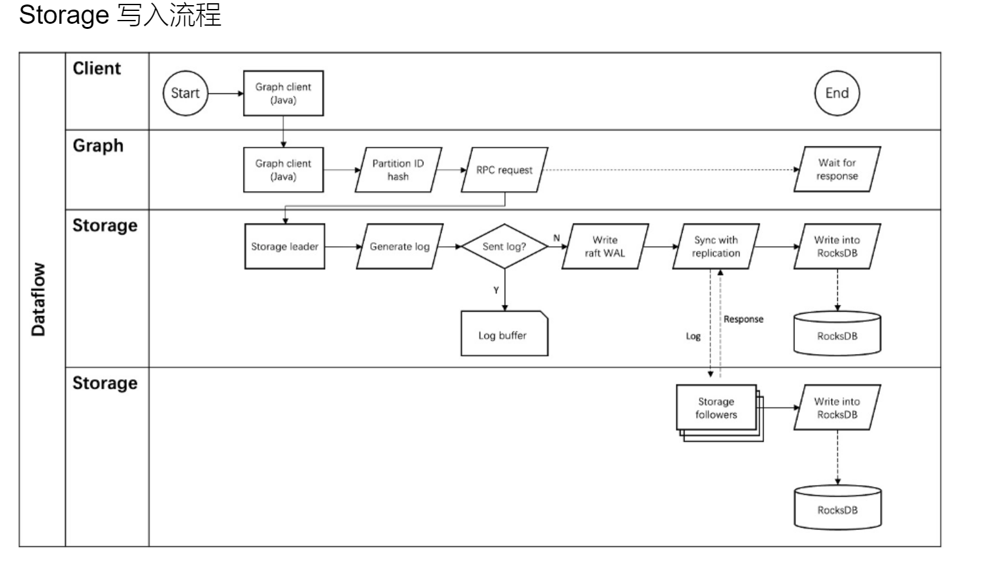
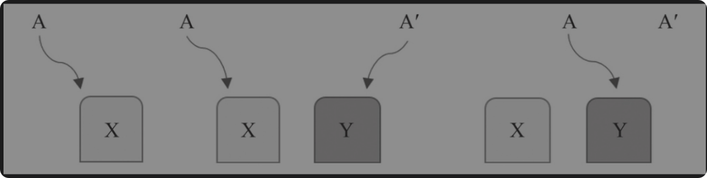

# 图数据库总结
> 参考嬴图团队所创的《图数据库原理，架构与应用》

## 基础和原理

图数据库有三大核心组件，图计算，图存储和图查询语言。传统的数据库架构都是以存储为中心的，而计算通常是依附着存储引擎来做的。但是图数据库中因为要解决复杂遍历与查询计算的效率问题，所以图计算也是一个核心组件。甚至可以说，图数据库就是做图计算的。

### 图计算

图计算的本质，就是面向复杂的网络进行计算，或者说是面向关联数据和关联关系之间的计算。图数据库，可以看做一种高维数据库，而传统的关系型数据库就是二维数据库。

**查询模式**

第一，从关联或者离散角度来看，分为离散查询和关联查询。

对于离散查询，就是面向元数据的查询。这里的元数据(meta-data)指的是顶点和边,这两个是最小粒度的数据，通常用唯一的ID来标识，不能进一步细分了
> 其中的边ID其实使用两个点ID以及边排序值一起组成的。

对于关联查询，其是图数据库最具特色的图计算操作。例如，路径查询，K邻近查询，子图查询等都属于关联查询。其通常是从某个顶点出发，通过对边，点，以及他们各自的属性进行过滤，然后返回结果。

第二，从遍历操作来看，是BFS和DFS。

**数据结构**

1. 顶点。某个类型(Tag)的顶点集合，可以看做传统数据库中的一张表(比如Person(name,age))。而顶点间的基于路径/属性的关联关系，可以看作传统数据库的JOIN操作。
2. 边，也就是关系。一般连接的是两个顶点。
3. 路径，表达的是一组相连的顶点和边的组合，多条路径可以构成一张网络，也称为子图。

传统的图存储的三种方式：相邻链表，相邻矩阵，关联矩阵。而工业界的图数据库极少用这三种数据结构，而是基于以上数据结构的改造。

1. 相邻链表，通常记录着以某个点为起点，其邻点及边信息。但是反过来的话需要存储额外信息。
2. 邻接矩阵，通常记录着所有点之间的边信息，但是存储空间大，且查找效率低。因为矩阵往往是很稀疏的，而稀疏矩阵需要特殊的存储方式，只使用常规矩阵存储，则会导致空间浪费。

针对存储问题，通常使用邻接链表表示比较好。

针对查询问题，邻接链表的遍历会有热点问题，会随着最长链的增加而增加，为O(n)。但是邻接矩阵就是恒定的O(1)。同时链表并发能力很弱。所以Facebook使用邻接链表存储的时候，限制了单个节点对应链表长度不超过6000(也就是关注不能超过6000人)，其他社交用户也有类似设计。

那么如何解决这两个问题呢？也就是在存储维度，使用更可控的，占用更小空间的数据结构来存储大量数据。而在计算维度，低延迟访问，并且并发能力高。

考虑设计一种新的数据结构，有如下形式：

1. 访问Vertex的为O(1)
2. 访问edge为O(2)或者O(1)

如果使用哈希函数来存储，则通过Vertex ID可以在O(1)内访问到对应的Vertex。而通过edge ID，则可以在O(1)内访问到对应的edge(通过in-node ID和out node ID，则可以在O(2)时间复杂度内访问)。这一部分使用常规的unordered_map来存储很好，但是会丧失并发性。所以还需要从设计并发性数据结构，以及使用并发性算法的两个关键角度来考虑。

### 图存储

**基础概念**

存储方式有很多。

主流存储引擎，就是基于B-Tree的读多写少存储引擎，以及LSM-Tree的写多读少存储引擎(前者mutable,后者immutable)
> 除此之外，还有基于文件的，基于堆的，基于hash buckets，以及基于ISAM(很早之前的)的存储引擎。

这里详情可以看我的存储引擎总结：[存储引擎总结](./存储引擎.md)

图的存储，主要就是存储顶点和边。

* 顶点：每个顶点可以看作内部元素有着某种规则排列的数组(`Vertex(id,values)`)，而多个顶点的组合就是一个二维数组(`Array[Vertex]`)

* 边：边的数据结构较为复杂，通常是四元组(`Edge(EdgeType,from,to,rank)`)。单个Edage就是长度固定的数值，而多个边的集合就是二维数组(`Array[Edge]`)

如果顶点和边完全静态，则可以复用传统存储引擎。原因就是传统存储引擎适合读多写少的场景，而完全静态，则刚好适合此场景，静态数据可以被有效组织，以及预先构建索引来优化。但是现实中并不是这么做的。

下面来说原生图 & 非原生图的概念。所谓非原生图是指它的存储和计算是通过传统的表结构(行/列数据库)的方式进行，也就是模拟表结构。而原生图基于`Vertex & Edge`为基本单位，为特化的存储效率。

非原生图的存储结构，举一个简单的例子。

现在有员工表，员工-部门对应表，部门表，则如果查询某个员工所在的部门信息，则定位员工`O(logN)`,通常树最高为4，也就是O(4)。然后定位对应关系，如果有三组关系，则需要`3 * O(logN)`。则对应部门具体信息，也就是`3 * O(logN)`。综合下来，会有O(40)左右的时间复杂度。就这还是不考虑磁盘定位寻址的情况下。

而如果使用原生图`近邻无索引`的存储方式，则只有`O(4) + 3*O(1)`的复杂度，远远小于非原生图的时间复杂度。

通常，查询复杂度每增加一层(也就是一个hop，也就是从一个顶点出发，沿着边访问邻接顶点，每经过一条边就是一个hop，增加一层)，原生图效率会比非原生图效率增加3倍。并且到了5层之后，非原生图已经不能返回了。

**图的存储结构和构图**

> SQL并不适合存储异构数据，并且超过2层的JOIN也不被推荐。

原生图的存储，核心在以下几点：

* 元数据，这里指的是最小粒度的数据，也就是顶点 & 边。
* 次生数据，也就是实体属性数据和关系属性数据(比如Vertex(ID，values)中的value)
* 衍生数据，也就是高维组合数据，比如共同好友数的计算。

这里主要关注元数据，也就是最小粒度数据的存储。

点可以视作行来存储，属性作为列。但是边呢？如果`EdgeID,start,from,other`作为列，那么如何表达反向边(逆边)?

通常，针对反向边的存储，可以以边为核心进行存储。也就是存储两个边，一个正向边，一个反向边。

> 工业界的实现通常是通过实现边的中心，以及多边图的存储来实现。

## 高性能图存储

### 存算分离

存算分离架构，是现在的主推架构，也就是将存储层和计算层分离开，将存储层和计算层分别部署在不同的服务器上，然后通过网络进行通信。

* 存储层负责图的持久化管理，支持高效的元素查询与扫描。通常通过KV Store来存储图数据。

* 计算层负责图的计算，负责图语义解析，查询计划生成，图算法执行。

考虑的主要因素主要有：内外存占比，缓存的使用，排序的使用，数据的变更的细节。

这里主要关注排序的使用，以及数据变更的细节部分。

* 排序的使用，分为连续存储和非连续存储。连续存储，通常表现为有序数组 + 索引。只有删除有缺点，会是O(n)的。这时候需要使用(switch-on-delete)，也就是将要删除的数据移动到末尾再删除，可优化为O(1)。而非连续存储(链表，通常是Tree等)，删除效率也较高，但是连续读取效率较低:`K(logN)`。常见的优化实现，就是Wiskkey。它专门面向SSD进行优化，将key分离出来，只有key需要排序。当key的存储为4KB及以上，则性能提升较大，而key为1kB的时候，和LSM-Tree性能差距不大。

* COW,也就是copy on write(写时复制)，是一种无锁修改技巧。初始状态是多个进程共享一份数据，数据只读。则读取请求的时候，无需复制。而对于写入请求，则如果某个进程需要修改数据，则系统先复制一个副本，修改只作用于副本，其他进程仍然读取原始数据。当所有进程完成修改后，再把副本替换成原始数据(这一步是CAS操作，是原子的)。这里全程是immutable更新，KV Store一般会采用这种。

### Scalable

> 首先来看垂直扩展

一个常识性知识是，只有在垂直扩展没有可能的时候，才去追求水平可扩展系统的构建和迭代。因为扩展单机(Monolithic)必然比扩展集群更加简单，效果也很好。

传统意义上的垂直扩展，就是对单机的存储，计算，网络三大核心进行扩展。

* 存储：内存，外存
* 计算：CPU，GPU
* 网络：网卡，网关，路由器等

在这本书中，笔者建议换一个角度进行思考，从终极目标-并发软件的设计来看，有如下核心：

* 并发思维,用于思考到底该从哪方面进行扩展，又如何协作。
* lock & shared mutable memory
* algorithm & data structure

有一个经典的例子：小文件例子，也就是用10Gbit/s传输100万个小文件，每个文件4KB。以及传输一个大文件，4GB，两者的时间差距是多少？

* 理想情况下，也就是两者数据量相等，则传输时间相同。

* 实际情况，后者比前者可能快100倍及以上。

 因为理论数据量一样，但是从系统的存储和网络两个核心来考虑就会完全不同。
 
 * 从存储来看，则每个小文件(这里刚好是一个block大小)都需要进行一次IO，则相当于100万次IO。单次IO时间是几亿个时钟周期，也就是ms级别。则总时间可能达到几百s的级别。
 * 从网络来看，则需要一次TCP连接，一次TCP数据传输，一次TCP断开(不考虑连接复用的情况下)。

显然，在这里网络带宽并不是 bottleneck，而IO才是(s级别 vs 100 s级别)

> 下面来看水平扩展

水平扩展，通常指的就是分布式扩展。核心有如下部分：

*  多实例的任务分解
*  多实例的相互合作
*  多实例的同步/一致性(依赖多实例的共识算法)
  

针对多实例的数据/状态同步，其实就是在多实例的共识达成之后进行的产物，而共识算法这部分比较复杂，具体可以看[最好的paxos](https://blog.openacid.com/algo/paxos/)来熟悉。

同步/一致性是一种逆熵过程，通常分为如下几种：

1. 读同步
2. 写同步
3. 全量数据同步

一致性非常重要，是分布式系统所有特性的基础。比如容错性需要保证冗余存储的数据一致性。

