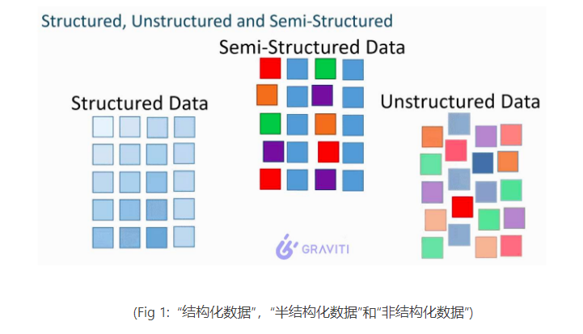

# 查缺补漏

> 记录每一次面试中有疑惑，或者觉得有意思的问题

## 大数据组件

### Spark

> [nsdi12-final138.pdf (usenix.org)](https://www.usenix.org/system/files/conference/nsdi12/nsdi12-final138.pdf)

#### resilient:复原性or弹性

面试被问到了Spark的RDD，也就是通常被翻译为`弹性分布式数据集`的抽象类。

RDD的中的弹性，到底是什么呢？我对这个犯了迷糊。收到弹性云计算等概念的影响，我开始往Spark的移动计算与保持数据`local`的特性去说。显然，没说到点上。

其实打开论文看标题(标题真的很重要，而不是基于经验直接看内容)。

> Resilient Distributed Datasets: A Fault-Tolerant Abstraction for In-Memory Cluster Computing

论文题目就说了，RDD-有容错的，面向基于内存的集群计算的一种抽象。所以很重要一点，就是`容错`。查看`resilient`翻译，发现首要的解释也是可恢复的，有适应力的。那么一切都解释的通了。

> In contrast to these systems, RDDs provide an interface based on coarse-grained transformations (e.g., map, filter and join) that apply the same operation to many data items. This allows them to efficiently provide fault tolerance by logging the transformations used to build a dataset (its lineage) rather than the actual data.1 If a partition of an RDD is lost, the RDD has enough information about how it was derived from other RDDs to recompute 1Checkpointing the data in some RDDs may be useful when a lineage chain grows large, however, and we discuss how to do it in §5.4. just that partition. Thus, lost data can be recovered, often quite quickly, without requiring costly replication.

其实这里的话就是解释了它的适应性的真正含义，也就是RDD的某些`partition`数据丢了，可以重新触发这部分的计算(可以通过把shuffle_0_0_0.data/index删除了来模拟。然后下游`task`发现根据`mapstatus`找不到`block`，也就拿不到迭代器之后，会触发缺失文件的重新生成）。

### Tez

> [Apache Tez – Welcome to Apache TEZ®](https://tez.apache.org/)
>
> [HIVE执行引擎TEZ学习以及实际使用 - 伯安知心 - 博客园 (cnblogs.com)](https://www.cnblogs.com/boanxin/p/13336930.html)

#### 使用原理与场景

这个组件之前只在书上看到过一次，居然被问到了。其实在Hive命令行登录的时候每次都会看到这个组件的提示(Hive2.x之后推荐Tez和Spark，而不是Hive on MR)

它通过DAG进行调度任务，其API其实更像Flink，有Source，Sink，ProcessorOperator等概念。具体就不展开了。

**特点**

和`YARN`与`Hive`强制绑定，就是为其特化的增强执行引擎。当然同时和`Spark`对比，也可以视作缺点。因为有`Spark on k8s`，并且`SparkSQL`和`Hive`交互也是比较流畅。

### Flink

#### 广播流和CEP

针对广播流的使用，我更新了`Flink总结`中的内容，详细实现了一个`Demo`，如下:

```java
public class BroadCastDemo {
    public static void main(String[] args) {
        Configuration conf = new Configuration();
        conf.setString("rest.port", "9091");
        conf.setBoolean("web.ui.enable", true);
        StreamExecutionEnvironment env = StreamExecutionEnvironment.createLocalEnvironmentWithWebUI(conf);
        DataStreamSource<Transaction> datastream = env.addSource(new TransactionSource());
        DataStreamSource<Rule> rulestream = env.addSource(new RuleStreamSource());
        KeyedStream<Transaction, Long> userPartitionedStream = datastream.keyBy(Transaction::getAccountId);
        MapStateDescriptor<String, Rule> descriptor = new MapStateDescriptor<>("ruleBroadcastState", String.class, Rule.class);
        BroadcastStream<Rule> ruleBroadcastStream = rulestream.broadcast(descriptor);

        SingleOutputStreamOperator<String> processed = userPartitionedStream
                .connect(ruleBroadcastStream) //connect两个流
                .process(new KeyedBroadcastProcessFunction<Long, Transaction, Rule, String>() {
                    private MapStateDescriptor<String, Rule> descriptor = new MapStateDescriptor<>("ruleBroadcastState", String.class, Rule.class);
                    //处理主数据流元素
                    @Override
                    public void processElement(Transaction value, ReadOnlyContext ctx, Collector<String> out) throws Exception {
                        Rule rule = ctx.getBroadcastState(descriptor).get("rule");
                        if (rule != null) {
                            if (rule.isValid(value)) {
                                out.collect(value.toString());
                            }
                        }
                    }
                    //处理广播规则流元素
                    @Override
                    public void processBroadcastElement(Rule value, Context ctx, Collector<String> out) throws Exception {
                        ctx.getBroadcastState(descriptor).put("rule", value);
                    }
                });
        processed.print();
        try {
            env.execute();
        } catch (Exception e) {
            throw new RuntimeException(e);
        }
    }
    private static class RuleStreamSource implements SourceFunction<Rule> {
        private boolean running = true;
        @Override
        public void run(SourceContext<Rule> ctx) throws Exception {
            while(running){
                Thread.sleep(500);
                ctx.collect(new Rule(RandomUtils.nextDouble()));
            }
        }
        @Override
        public void cancel() {
            running = false;
        }
    }
    public static class Rule{
        private Double amountLimit;
        public Rule(Double amountLimit){
            this.amountLimit = amountLimit;
        }
        public boolean isValid(Transaction transaction) {
            return transaction.getAmount() < amountLimit;
        }
    }
```

可以看到，广播流的控制其实也是可以很强的，甚至可以做状态机匹配(官网例子更加复杂，可是没有完整代码)。

在`Flink`项目中，就被问到了两者的区别，以及实现逻辑，总结如下:

* Flink 广播流，是可以满足动态修改简单规则的场景的。同样是将Kafka或者关系数据库的规则表作为Source就可以。
* Flink CEP，专门用于匹配复杂的事件规则，尤其是非确定有限状态机(其实CEP就来源于这个概念)。如果需要动态修改`Pattern`，则需要二次开发
* 两者的核心区别实际就是`Operator`对`State`的抽象控制的程度。

那么为什么需要动态CEP呢，其实，我认为这是一个编码复杂度的问题。

如果是简单的流过滤，或者状态机状态很少。则直接使用`Flink`广播流就可以。

但是如果状态机状态数量很多，规则复杂，那需要使用`Flink-CEP`。如果还需要不停机更新，则需要进行二次开发，实现动态CEP。

而具体动态CEP的实现，又有两种:

* Flink广播流广播规则
* Flink协调器分发规则

这其实是两种思路，其实在`task`端基本一致，只是在`master`端，一个需要新建广播流`source`，一个需要开发协调器扫数据库。`FILP200`推荐的是后者，原因很简单，就是保持`FLink`架构清晰，并且协调器本来就是做`subtask`协调的。

## 数仓理论

### 分层

数仓的本质就是提供数据服务，而其中的分层是一门艺术，其具体的分几层，怎么分，其实都和业务需求/用数需求紧密结合。

所以我认为一切从需求出发，考虑每个表该放的位置。

> 其实实时数仓甚至有不分层的，就是为了低延迟。

#### 维度退化后表的位置

这里了解到实际上`ODS`层一般什么都不做，甚至连简单的清晰都不用做。

这里是一个场景，也就是`ODS`层将数据接过来之后，如果现在要对该表扩充维度(从公共维度表做维度退化)，这张表该放在`ODS`还是`DWD`。

OK，这里思路就是，从数仓的本质出发。它是提供数据服务的，所以：

1. 首先，我们先统计下游用数需求，看一看这个表大概得使用频次，以及使用范围的情况。
2. 其次，如果确定维度表可以退化(`这点很重要，因为有的维度表不适合退化`)，则做想要的退化。
3. 最后，数据表放在哪里呢？这里就是收集需求，分层沉淀的意义了，如果基于这张表的不同类型服务需求越多，就越应该沉淀(泛化而不是特化)。
   具体沉淀位置，不需要只限制在`DWS-ADS`，其实每一层都可以做，只要经过评估之后可以更方便复用/更方便持久开发即可。

然后，就是到底可不可以/要不要维度退化:

* 可以退化：也就是维度表简单，或者数据量很小，或者不需要历史变化的时候，可以退化。
* 不应该退化:维度表可能变化/扩展，需要保留维度表的历史变化，或者需要保持数据一致性(退化就导致有副本了，非原子操作必然会出问题)。


### 数据相关

#### 结构化数据和非结构化数据

这个是让感受很深的一个话题，面试官针对这个问题给我讲了10分钟。

两者的本质区别是什么呢？



可以看到，结构化的数据的来源单一，但是非结构化数据来源多样，通常有如下种类:

* 文本文字
* 图像，图片
* 视频流，电视流

并且还有很重要一点，就是非结构化数据的增速特别快。增速快，来源多样，就说明往往数据的`价值密度`是很低的。

所以就可以两个方面去说:

* `存储`：非结构化数据比结构化数据更好存储。比如文档，图片等随便存储。但是结构化数据，比如关系型数据库，存储的成本是很高的。它更加要求数据存储的精确组织。举个例子，你想给其他人发送信息，直接写个文档发送过去就可以。但是关系型数据库并不是这样，你必须考虑性能和精确性来进行存储。
* `使用`：结构化数据比非结构化数据更好用。这就是结构化数据的`价值密度高`，分析起来使用`SQL`就够了。但是非结构化数据不行，它的`价值密度低`，并且格式多样。必须经过`ETL`之后，使用`Flink/Spark/大模型`等进行专门分析，才有效果。

## 数据结构与算法

### 数据结构

#### 从二叉树到B+Tree

这个其实我在自己的笔记中有总结，这里贴出链接

> [存储引擎 - lx-bigdata (melodylx666.github.io)](https://melodylx666.github.io/lx-bigdata/dataWarehouse/%E5%AD%98%E5%82%A8%E5%BC%95%E6%93%8E/#_7)
