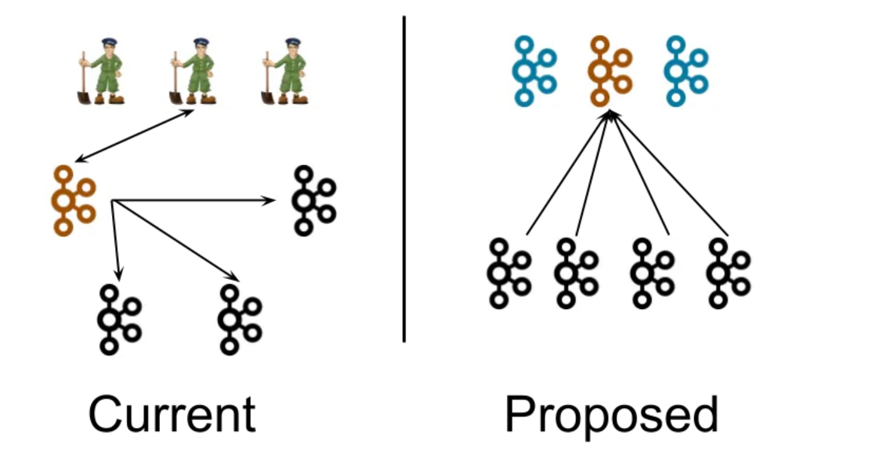
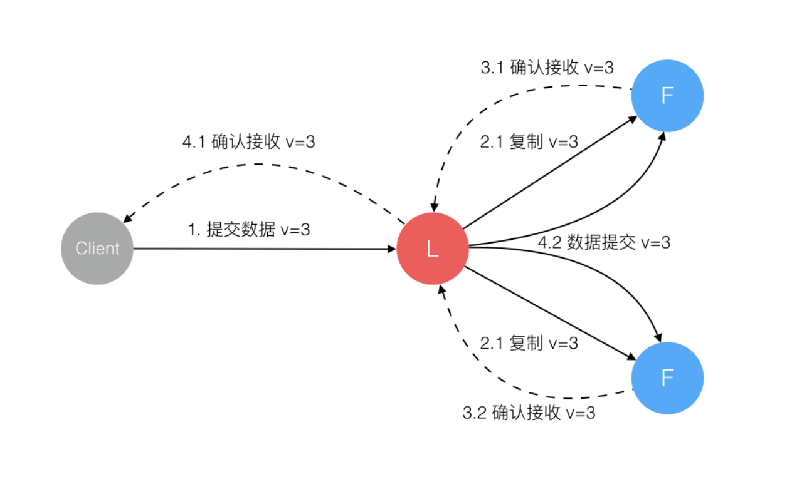
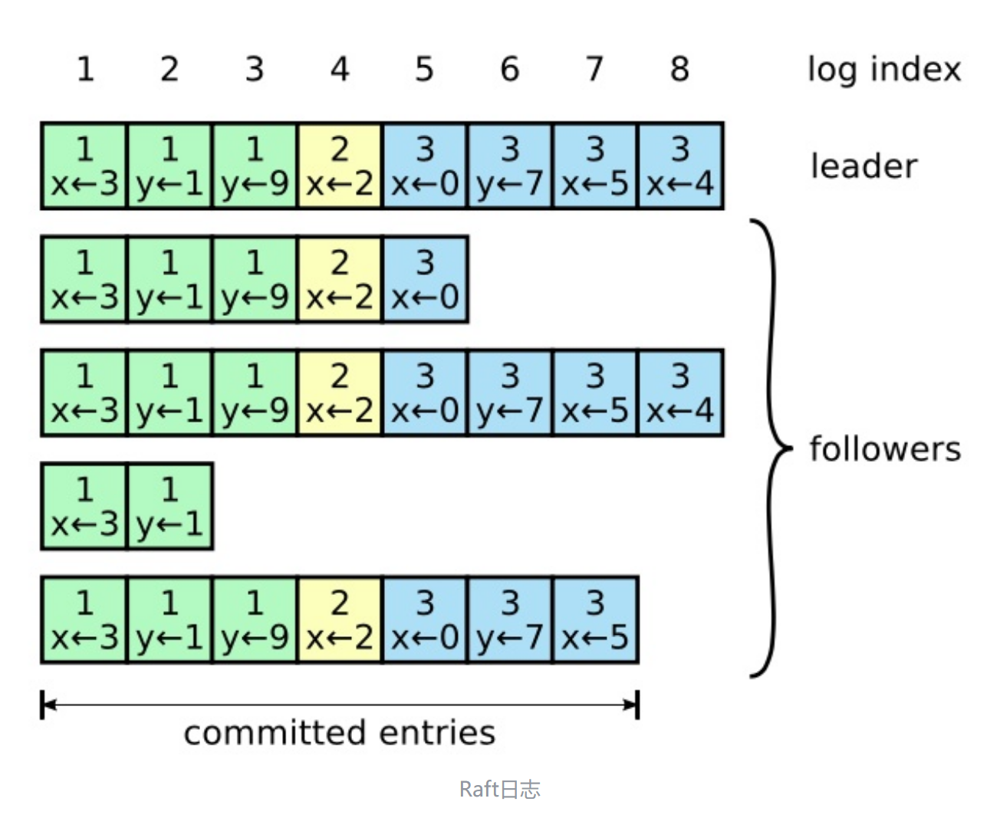
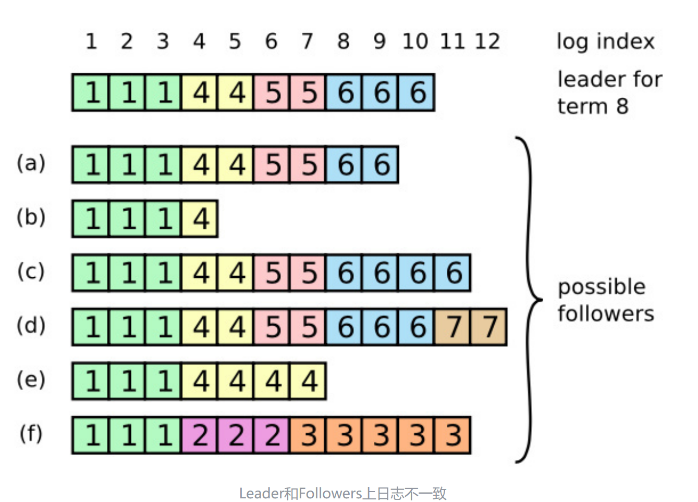
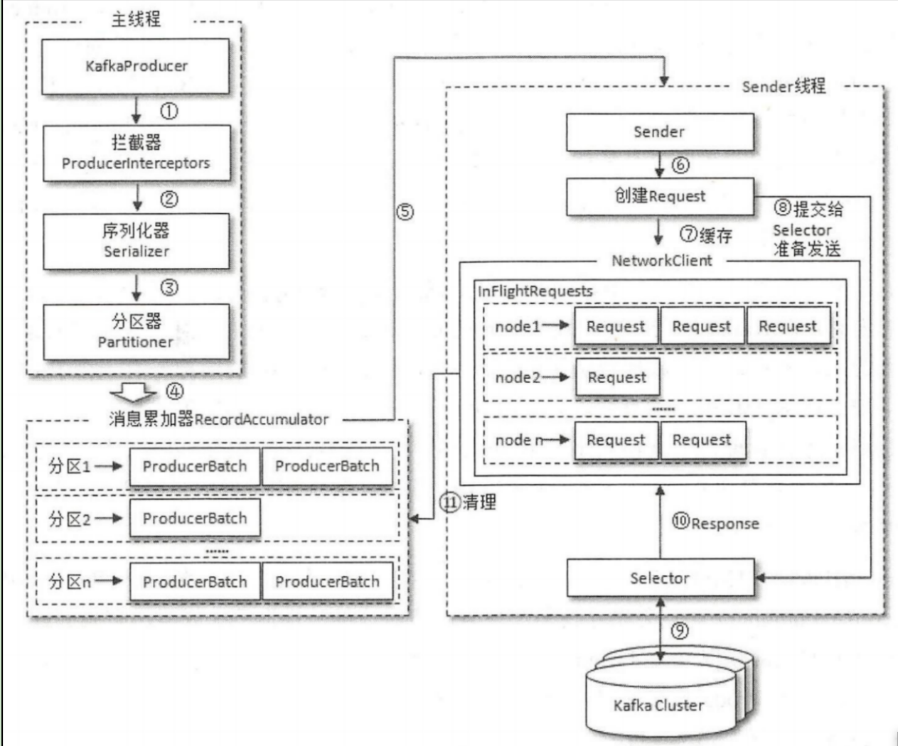

# Kafka总结

## API

总结各种API的使用方法

需要引入和Kafka版本对应的依赖：

```java
        <dependency>
            <groupId>org.apache.kafka</groupId>
            <artifactId>kafka-clients</artifactId>
            <version>3.6.2</version>
        </dependency>
```

### Topic

对于Topic的管理，主要通过`KafkaAdminClient`类来实现，它是一个线程安全的客户端管理类。

基本逻辑：操作该类API，返回的结果全部是`kafka`内部对`JDK8 Future`的封装的`kafkaFuture`集合。启动的是异步任务，并且安装的回调只有`thenApply`方法，在这里此方法默认在异步线程执行，并返回`future`给main线程。

#### 创建

使用`KafkaAdminClinet::createTopics`

```java
    public void createTopicDemo() {
        //1.自动分配,需要指定partition数量以及副本数量
        NewTopic topic01 = new NewTopic("test01", 1, (short) 1);
        //2.如果需要指定partition数量，以及每个partition的副本数量，则
//        var map = new HashMap<Integer, List<Integer>>();
//        map.put(0,List.of(0));//0号分区，分到0号broker上
//        NewTopic topic02 = new NewTopic("test02",map);

        //创建主题，拿到的是一组Future
        CreateTopicsResult result = adminClient.createTopics(List.of(topic01));
        //对这组future的控制可以精确到每一个future，也可以控制整个操作
        KafkaFuture<String> future = result.all().thenApply(v -> {
            return "ok";
        });
        try {
            System.out.println(future.get());
        } catch (Exception e) {
            e.printStackTrace();
        }
    }
```

#### 删除

在windows版本上删除API有bug。

```java
    //删除topic,在windows上删除topic有Bug
    @Test
    public void deleteTopicDemo() {
        KafkaFuture<Void> voidKafkaFuture = adminClient.deleteTopics(List.of("test01")).all().whenComplete((v, e) -> {
            if (e == null) {
                System.out.println("删除成功");
            } else {
                System.out.println("删除失败");
            }
        });
        try {
            voidKafkaFuture.get();
        } catch (Exception e) {
            e.printStackTrace();
        }
    }
```

#### 查看

```java
   public void listTopicDemo() {
        ListTopicsResult listTopicsResult = adminClient.listTopics();
        KafkaFuture<String> future = listTopicsResult.namesToListings().thenApply(v -> {
            v.forEach((k, v1) -> {
                System.out.println(k + ":" + v1.name());
                    }
            );
            return "ok";
        });
        try {
            System.out.println(future.get());
        } catch (Exception e) {
            e.printStackTrace();
        }
    }
```

### Producer

#### 创建

```java
    private static final KafkaProducer<String,String> producer;
    static {
        Properties props = new Properties();
        props.put(ProducerConfig.BOOTSTRAP_SERVERS_CONFIG, "localhost:9092");
        props.put(ProducerConfig.KEY_SERIALIZER_CLASS_CONFIG, "org.apache.kafka.common.serialization.StringSerializer");
        props.put(ProducerConfig.VALUE_SERIALIZER_CLASS_CONFIG, "org.apache.kafka.common.serialization.StringSerializer");

        producer = new KafkaProducer<String,String>(props);
    }
```

其中，一个`record`的`key-value`序列化格式是必须指定的。

其余常见参数：

* `acks` 其中-1是all
* `retries`:发送失败重试次数
* `batch.size`：数据发送批次大小
* `max.request.size`：一次请求的数据量上限
* `linger.ms`：数据在缓冲区保存的时间
* `buffer.memory`：生产者的缓冲区大小

#### 发送消息

生产者并不和`topic`绑定，一个生产者可以随意向不同的`topic`发送`record`。而`record`和`topic`绑定

Kafka所提供的是一个返回值为`JDK5 Future`的`send`API，但是在此基础之上封装了可以安装回调的方法，并且默认是异步回调，在I/O线程执行。

那么如果异步的回调很重，Kafka官方文档如下所示：

> Note that callbacks will generally execute in the I/ O thread of the producer and so should be reasonably fast or they will delay the sending of messages from other threads. If you want to execute blocking or computationally expensive callbacks it is recommended to use your own java. util. concurrent. Executor in the callback body to parallelize processing.

也就是说，可以通过横向再次使用异步线程，将异步回调的执行位置和I/O线程进行隔离，将回调任务的执行放在自己维护的线程池中。这样保证了最核心的发送消息不受影响。

```java
    public void sendMsgDemo() throws Exception {
        for(int i = 0; i < 10; i++){
            ProducerRecord<String, String> record = new ProducerRecord<>("test01", i + "", "hello kafka" + i);
            Callback callback = new Callback(){
                @Override
                public void onCompletion(RecordMetadata metadata, Exception exception) {
                    String topic = metadata.topic();
                    int partition = metadata.partition();
                    System.out.println("topic:"+topic+" partition:"+partition);
                }
            };
            producer.send(record,callback);
        }
        producer.flush();
        producer.close();
    }
```

### consumer

#### 创建

此时就是消息的反序列化是必须的了。

```java
    private static final KafkaConsumer<String,String> kafkaConsumer;
    static {
        Properties props = new Properties();
        props.put(ConsumerConfig.BOOTSTRAP_SERVERS_CONFIG,"localhost:9092");
        props.put(ConsumerConfig.GROUP_ID_CONFIG,"group1");
        props.put(ConsumerConfig.KEY_DESERIALIZER_CLASS_CONFIG,"org.apache.kafka.common.serialization.StringDeserializer");
        props.put(ConsumerConfig.VALUE_DESERIALIZER_CLASS_CONFIG,"org.apache.kafka.common.serialization.StringDeserializer");
        props.put(ConsumerConfig.ENABLE_AUTO_COMMIT_CONFIG,"true");

        kafkaConsumer = new KafkaConsumer<String,String>(props);
    }
```

#### 消费

下面基于的是`subscribe`方式,可以基于给定枚举值，也可以基于正则表达式。

消费的模式是`poll`的方式。

这个方法是*同步阻塞*的方法。

```java
    //subscribe方式
    //范围：静态：topicList 动态：pattern
    @Test
    public void subscribeDemo() throws Exception{
        kafkaConsumer.subscribe(List.of("test01"));
//        kafkaConsumer.subscribe(Pattern.compile("test.*"));
        ConsumerRecords<String, String> records = kafkaConsumer.poll(Duration.ofMillis(10000));
        records.forEach(record->{
            System.out.println(record.topic()+" "+record.offset()+" "+record.key()+" "+record.value());
        });
        kafkaConsumer.close();
    }
```

#### 消费位置与手动提交

这个很重要，比如现在先开启一个生产者，生产100条数据，然后停掉。再开启消费者，消费者是消费不到这100条数据的。

原因就是消费者每次消费完之后会有消费偏移量的记录。而如果面对一个全新的数据，是没有这个消费者的`offset`记录的，这时候就需要根据`auto.offset.reset`来判断将`offset`重置为什么，该值默认是`latest`，就是默认从该消费者订阅该主题开始生产的第一条数据开始消费。可以根据需要设置为`earliest`。

而如果设置了`enable.auto.commit`为`true`，则消费时会默认`5s`提交一次`offset`。这个逻辑是放在了`poll`方法里面做的，也就是当再次请求的时候，提交的是上一次截止的`offset`。问题就出现在这里，`consume(这里只是poll逻辑)`和`offset`的实际提交并不是`atomic`的，这就必然会导致下面的情况：

* `consume`做了，但是`offset`丢了。则带来的是**重复消费**。

如果更进一步，如果将业务逻辑的处理完毕作为实际的`consume`逻辑，而不是简单的`poll`完毕。考虑实际处理业务逻辑的线程很重，交给了一个线程池维护，而这里的`consumer`只负责拉取消息并存储到共享存储中(比如一个`blockingQueue`)中，这时候的业务和拉取的两个线程实际构成了消费者-生产者模式。而其中的共享存储只是一个内存集合，并没有做任何的高可用逻辑，这就导致这块的逻辑根本不可靠，**消息丢失**也就在所难免。而在`poll`之后的`offset`提交显然就是不符合`consume`做完就原子性提交`offset`的要求。所以各种方式的策略永远只是折中权衡之后的结果，没有通用的办法。`kafka`不可能把业务逻辑什么的全部考虑在内，暴露的细粒度API也正是为了将实现转换到特定的业务实现者身上。

所以原生的`kafka`所提供的依据`poll`来提交`offset`的逻辑并不可靠，这时候可以考虑手动提交。

**手动提交的方式**

提交的`offset`就是下一次开始消费的`offset`

同步提交

* `commitSync`：显然，就是同步阻塞等待提交完毕，或者如下使用指定主题和分区粒度的同步提交(`)。
* ```
     @Override
     public void commitSync(final Map<TopicPartition, OffsetAndMetadata> offsets) {
         commitSync(offsets, Duration.ofMillis(defaultApiTimeoutMs));
     }
  ```

异步提交

* `commitAsync`：开启异步线程执行`commit`任务，并且可以安装回调

这里就是把提交的任务同样放到异步线程中去做，这样的话效率极高，但是对准确性的保障更少了。同时，可以安装异步回调。

还有一种情况：这里如果需要在外部维护存储任务的`offset`，比如存储到DB中，则这里官方的API文档两种提交方式都有如下说明：

> This commits offsets only to Kafka. The offsets committed using this API will be used on the first fetch after every rebalance and also on startup. As such, if you need to store offsets in anything other than Kafka, this API should not be used.

这里似乎没有办法解决，但是我感觉通过`seek`方法每次将DB中`offset`读出来之后，直接`seek`到指定位置即可。

## 架构设计

### Paxos与Raft



#### Paxos

最经典的共识算法当然是`PAXOS`,而最经典的论文当然是读不懂的，下面是目前找到的最完备的`paxos`资料：

核心就是多数派读写。

[可靠分布式系统-paxos的直观解释 - OpenACID Blog](https://blog.openacid.com/algo/paxos/)

#### Raft

能找到的通俗易懂的文章如下：

> [Raft算法详解 - 知乎 (zhihu.com)](https://zhuanlan.zhihu.com/p/32052223)

Raft从多副本状态机的角度出发，将一致性问题进行拆分，分为`leader`选举，日志同步，安全性，日志压缩，成员变更等。

下面总结最核心的`leader选举`以及日志变更。

**leader选举**

集群通过心跳来维护选举的触发。当一个`follower`长时间没有感知到`leader`的`heartbeat`，则会认为其已经挂掉，于是开启一次选举。选举多数派为`leader`，并且`leader`必然有最新的`log`. 一个`leader`统治的时间称为一个`term`

**日志同步**

典型的写多读少的架构，都会使用`LSM Tree`进行存储。第一次接触到这个词还是在[深入浅出存储引擎 (豆瓣) (douban.com)](https://book.douban.com/subject/36894748/)这本书中。与之对应的是写少读多的`b+ tree`。Kafka不同于传统的消息队列，它使用了磁盘存储，其性能也得益于和内存存储相差无几的磁盘顺序读写，以及`zero copy`。

LSM的核心就是日志段 +WAL预写日志。

而Raft中，同样`leader`接收`client`请求，将日志进行对`follower`多数派写之后并确保ok之后，再执行commit。



`leader`向集群发出RPC请求，将最新的`log entry`全部写到`follower`.

集群整体的日志概览如下：



Raft中的日志存储，有两点重要性质

* 横着看，对于一个leader或者是一个follower，保证如果出现了两个log entry拥有同样的log index以及termID,则它们存储的命令是相同的(唯一性)。
* 竖着看，出现了两个log entry拥有同样的log index以及termID，则它们之前的所有log entry完全相同。

性质1是因为leader在一个term内对于给定的log index最多创建一个log entry，而该log entry在日志中相对位置永远不变

性质2是因为进行日志复制的Rpc(AppendEntries RPC)的时候，leader会把新的log entry包括的上一个log entry的log index和term一起发送，如果在follower中没有相应log entry，则他会拒绝新的log entry

如果进行了`leader`的选举，日志分布可能如下所示：



如上图所示，一个leader被选举出来，其日志不一定是最新的。一个follower可能会缺少leader中的一些log- entry,也可能比选举出来的leader日志还多

这时候，leader采取强制follower复制它的日志来处理日志不一致，follower上的不一致日志会被强制覆盖。具体操作是leader找到followers最长匹配前缀，保留不变，并覆盖之后的位置为leader位置的内容。

### 生产者和消费者设计

**sender thread实际上应该称为`I/O thread`**



#### 生产者

**消息发送**

核心方法是主线程调用的`dosend`方法。

该方法首先获取`topic`的元数据信息，然后将k-v序列化，选择发送的`partition`,然后将消息发送到缓冲区`accmulator`，其中一个`batch.size`默认是`16KB`。如果缓冲区满了，则唤醒`sender`线程异步发送消息，同时返回一个`Future`

而最为核心的sender，本质上是一个`Runnable实现类`，也就是一个Runnable任务，而最后还是需要依托于`Thread`实体来运行，也就是如下所示：

```java
            String ioThreadName = NETWORK_THREAD_PREFIX + " | " + clientId;
            this.ioThread = new KafkaThread(ioThreadName, this.sender, true);
```

其实通过前面的回调测试，就可以看出回调函数的执行位置：`kafka-producer-network-thread | producer-1`，也就是真正的负责发送数据的`I/O`线程。Kafka官方也一直把它叫做`I/O thread`，而这里的和集群通信使用的是`JDK NIO`.

**应答机制**

通过`acks`参数来进行控制。有以下三种情况：其中的参数大小代表着需要应答的broker的数量。

* acks=0,等同于`fire and forget`
* acks=1,等同于只需要`leader` 进行WAL即可。
* acks=all/-1，等同于需要`leader`与`follower`读写之后再确认，**同样会丢数据**

#### 消费者

**调用模型**

消费通过`poll`方法进行，内部调用链为`Consumer -> NetworkClient -> Selector -> NIO selctor`同样底层使用NIO进行通信。

**同`partition`间的关系**

至于和`partition`之间的关系，核心就是在一个消费者组内，数据源的同一个`partition`不能被两个`consumer`同时消费，显而易见，是因为可能出现消费顺序问题。而不同的消费者组之间是相互隔离互不影响的。

**`rebalance`**

由`coordinator`负责，具体方式是：对于该消费者组来说，在`broker`中选择一个`coordinator`，再在该消费者组中选择一个作为`leader`，进行通信并选择特定时机触发`rebalance`

负责同一个消费者组内分区的分配，触发时机为：

* 组成员发生变更
* 正则表达式订阅`topic`导致`topic`数量变了
* `topic`本身变化

分配方式：

* `range`: 假设该`consumer group`有2个`consumer`，订阅了`2个topic`，则分别针对每个`topic`进行平均划分，站在`topic`的角度，每个`consumer`获得的`range`大小类似。
* `round-robin`:将所有`topic`的`partition`汇聚，轮询发给每个`consumer`
* `sticky`：尽量保持原有关系不变


### 冗余存储与一致性

下面为旧版本的`kafka`

`kafka`是一个AP系统，适当放宽了一致性的条件。

冗余存储的类别(一个`partition`可能的身份)如下：

* `leader`：响应`client读写的副本`
* `follower`:被动接受`leader`的同步
* `ISR`副本：`leader`副本以及所有和`leader保持同步的副本`

所有的副本都有两个属性：LEO以及HW

* `LEO`:`log end offset`，记录了该副本的`log`的下一条消息的`offset`位置。如果一个消息占据一个位置，则`LEO=10`表示该副本存储了10条消息，`offset`范围为0到9
* `HW`，同`Flink`中的水位线概念一致，不过一个是基于时间，一个是基于位置。是一个`assert`，断言纵向来看所有的副本之后只会比这个位置大，而不会出现还有的没有到达这个位置。

而`consumer`消费的消息范围就是`leader`的HW以内的所有消息。

**LEO**

首先来看`follower-leo`

Kafka有两套`follower-leo`，分别存储在`leader`端，以及对应的`follower`端。

在该`follower`端本身存储的`leo`，会在其自己接收到`leader`端给自己的`log`的时候更新`leo`

而在`leader`端存储的`leo`，它更新的依据就是`follower`端向自己发送请求，它就认为这个`follower`已经有了这个`log`，并更新自己这边维护的这个`follower-leo`。

这里其实类似于前面消费者那里的问题，由于过程不是原子的，并且`poll`也不是真正的`consume`逻辑，则必然会出问题。

然后是`leader-leo`，它的更新逻辑很简单，自己写`log`的时候就直接更新了。


**HW**

首先是`follower-hw`.在更新完`follower-leo`之后，将其与`leader-hw`对比，则`follower-leo.min(leader-hw)`为自身的`hw`。

而`leader-hw`代表着最终系统可供消费的数据线，是最为核心的概念。`leader-hw`就是在`leader`端所维护的所有有效副本的`leo`的最小值，也就是纵向来看的最长匹配前缀。

这里可以看到几乎与raft的原理一致。


### 幂等性

kafka中开启幂等性：

* enable.idempotence = true
* retries > 0
* max.in.flight.requests.per.connection<=5
* acks = -1/all

这里的幂等性是指数据不会被重复发送(单个分区内)。

实现思路很简单，加上唯一标识即可，也就是给每个`producer`加上`id`,然后给每个消息加上自增`id`，则这样两者组成的二元组可以唯一标识每条消息。如果重试，则再次发送的消息的唯一标识和上次的一样，则会被幂等过滤掉。


### 性能

性能的影响因素，这里主要是`append-only`以及`zero-copy`。


#### append-only

顺序写的速度要远大于随机写，而磁盘(或者SSD)的顺序写某些情况下甚至可以达到内存的随机写，这是`append-only`的方式来应对大量写的关键。

> [关于顺序磁盘IO比内存随机IO快的讨论 - huxihx - 博客园 (cnblogs.com)](https://www.cnblogs.com/huxi2b/p/11005746.html)

#### zero-cpoy

> [彻底搞懂零拷贝技术( DMA、PageCache) - 知乎 (zhihu.com)](https://zhuanlan.zhihu.com/p/670576632)

内核态与用户态的切换，本质上通过改变CPU的特定寄存器，可以控制CPU的特权等级，从而执行不同等级的指令，并且可以控制访问由操作系统所维护的不同的内存区域以及数据。关于磁盘的读写，必须是特权指令，以保证OS的安全。但是如果用户进程有读取请求，那么可以通过系统调用来陷入内核态，执行指定的操作。当然切换的时候伴随着上下文切换。

考虑一个完整的IO流程：从磁盘读取数据，经过用户处理之后从再网卡发送出去。

而传统的I/O，数据拷贝都需要由`cpu`来做。

> 4次切换，4次拷贝(2 DMA, 2CPU)

而如果考虑`DMA`之后,相当于`cpu`把读写请求做一个异步任务放到`DMA`上，可以极大减轻`cpu`的压力。这时候一次完整的IO请求一共有4次数据拷贝，`DMA`两次，`cpu`两次。但是消耗不变，只是可以将CPU压力减小，转移到DMA上。

则耗时的地方就是`用户态与内核态的上下文切换`以及`数据拷贝`。注意这里用到了内核缓冲区，而大文件传输可以不同内核缓冲区，它不是必需品，只是加速工具。

**mmap+write**

> 4次切换，3次拷贝(2 DMA,1CPU)

而用户进程如果可以直接操作内核缓冲区的数据，那么就可以减少数据的拷贝。这就是`mmap`(memo map)的思路。

`mmap`会直接把内核缓冲区的数据共享到内存空间，这样可以先减少切换的两次的用户态/内核态切换的`数据拷贝`，同时增加一个从`缓冲区到socket缓冲区`的`数据拷贝`，最终减少了1次`数据拷贝`。这里还是会使用DMA

而系统调用还是两次，也就是内核态/用户态切换还是4次。

```java
    @Test
    public void mmapTest() throws Exception {
        Path path = Path.of("F:\\workspace_scala\\miniSpark\\data\\hamlet.txt");
        RandomAccessFile raf = new RandomAccessFile(path.toFile(), "rw");
        FileChannel channel = raf.getChannel();
        // 直接映射到内存，并且是内核态的直接内存，不是用户态内存，堆内存(HeapByteBuffer)。
        MappedByteBuffer buffer = channel.map(FileChannel.MapMode.READ_ONLY, 0, channel.size());
    }
```


**sendfile**

> 2次切换，3次拷贝(2 DMA, 1CPU)

和`mmap + write`区别就是两个系统调用合并。


**zero copy**

> 2次切换，2次拷贝(2DMA)

这里在进行网络通信的时候不再是将数据从`mmap`位置写到`socket缓冲区`，而是将描述信息发送过去，不耗`cpu`。最后`DMA`直接从`mmap`位置的缓冲区把数据读走就可以。也就是数据从磁盘读取到内核态缓冲区之后，始终位置不变，直到最后直接被`DMA`发送到网卡最后打出去。

```java
    @Test
    public void zeroCopyTest() throws Exception {
        Path path = Path.of("F:\\workspace_scala\\miniSpark\\data\\hamlet.txt");
        File file = path.toFile();
        RandomAccessFile raf = new RandomAccessFile(file, "rw");
        FileChannel channel = raf.getChannel();
        SocketChannel socketChannel = SocketChannel.open(new InetSocketAddress("localhost", 9999));
        channel.transferTo(0, channel.size(), socketChannel);
    }
```

然后可以在`port 9999`读取发送过来的数据.

```java
    @Test
    public void getSocketData(){
        try(ServerSocket serverSocket = new ServerSocket(9999)) {
            Socket clientSocket = serverSocket.accept();
            BufferedReader in = new BufferedReader(new InputStreamReader(clientSocket.getInputStream()));
            String line;
            while((line = in.readLine()) != null){
                System.out.println(line);
            }
            in.close();
            clientSocket.close();
            System.out.println("结束");
        } catch (IOException e) {
            e.printStackTrace();
        }
    }
```

**大文件**

大文件的IO就不使用内核缓冲区了，用异步IO直接从磁盘文件读取到用户缓冲区即可。
