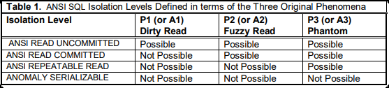
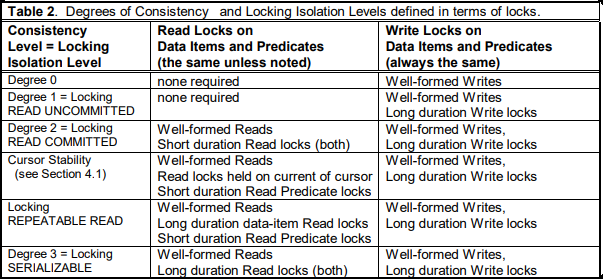
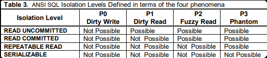
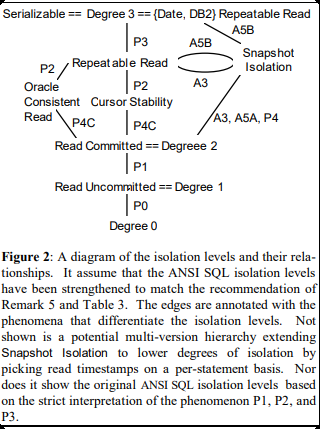

# 从论文学隔离级别
>https://www.microsoft.com/en-us/research/wp-content/uploads/2016/02/tr-95-51.pdf
> 
>https://tidb.net/blog/765da817

## ANSI SQL-92 隔离级别定义

SQL-92，通过解决三类现象，定义了四种隔离级别。隔离级别的实现并不限定实现方式(无论是锁还是MVCC)
> P1 (Dirty Read): Transaction T1 modifies a data item.
Another transaction T2 then reads that data item before T1
performs a COMMIT or ROLLBACK. If T1 then performs a
ROLLBACK, T2 has read a data item that was never
committed and so never really existed.

现象1：Dirty Read，又称为脏读。

- 宽泛解释P : w1[x]...r2[x]...（(c1 or a1) ... (c2 or a2) in any order）
- 严格解释A : w1[x]...r2[x]...a1 and c2（T1 回滚(rollback or abort)后 T2 已提交）

> P2 (Non-repeatable or Fuzzy Read): Transaction T1
reads a data item. Another transaction T2 then modifies or
deletes that data item and commits. If T1 then attempts to
reread the data item, it receives a modified value or
discovers that the data item has been deleted.

现象2：Fuzzy Read，又称为不可重复读。

- 宽泛解释P : r1[x]...w2[x]...（(c1 or a1) ... (c2 or a2) in any order）
- 严格解释A : r1[x]...w2[x]...c2...r1[x]...c1（T1 两次读之间 T2 提交

>P3 (Phantom): Transaction T1 reads a set of data items
satisfying some "search condition". Transaction T2
then creates data items that satisfy T1’s "search condition" and commits. If T1 then repeats its read with the
same "search condition", it gets a set of data items
different from the first read.

现象3：Phantom, 又称为幻读。

- 宽泛解释P : r1[P]...w2[y in P]...（(c1 or a1) ... (c2 or a2) in any order）
- 严格解释A : r1[P]...w2[y in P]...c2...r1[P]...c1（T1 第二次查询前 T2 提交）

> 其中A表示一定会发生问题的严格情况，而P表示可能发生问题

根据解决的现象，定义四种隔离级别：

ANSI-SQL-92的定义是由问题的。实际上，只解决了这三种问题，并到不了串行化的级别。
还需要额外解决一些其他异常(A)。并且，这里的P & A定义是基于`单版本数据模型`(基于锁的悲观并发控制)，而实际上还有基于MVCC，以及乐观的并发控制(也就是`多版本数据模型`)的实现。

## 基于锁的悲观并发控制

### 锁的分类
数据库中的锁，分为共享锁(读锁)和排他锁(写锁)。只有`read lock & read lock`是不冲突的。

对于这两种锁，又都可以分为Predicate lock & item lock，也就是谓词锁和记录锁。前者锁住满足条件的所有记录，以及间隙(针对幻影数据)。而后者只是锁定特殊记录。

### 锁的行为规范

> A transaction has well-formed writes (reads) if it requests
a Write (Read) lock on each data item or predicate before
writing (reading) that data item, or set of data items
defined by a predicate. The transaction is well-formed if it
has well-formed writes and reads. A transaction has twp phase writes (reads) if it does not set a new Write (Read)
lock on a data item after releasing a Write (Read) lock. A
transaction exhibits two-phase locking if it does not
request any new locks after releasing some lock.

一个事务是well-formed的，需要满足以下条件：

- 写入之前必须先获取写锁(Predicate lock or item lock)
- 读取之前必须先获取读锁(Predicate lock or item lock)

一个事务是two-phase-read/write的，需要满足以下条件：

- 不能在对一个data item 释放一个写锁之后再获取一个写锁
- 不能在对一个data item 释放一个读锁之后再获取一个读锁

而锁的持续时间，有如下定义:

- Long Duration Lock: 锁被该事务持有，直到该事务提交或者回滚。
- Short Duration Lock: 锁被该事务持有，该操作完成直接释放锁。

通过上述锁的行为描述，可以将锁实现的隔离级别进行如下描述:

这里和ANSI-SQL-92有一些核心区别：

- 等级划分还是4种，但是均比ANSI-SQL-92严格
- 针对Repeatable Read，ASNI允许Phantom出现，但是Locking不允许。

实际上，ANSI的Repeatable Read，并不能阻止幻读出现。前者聚焦于item,而后者聚焦于predicate。
如果站在是否`Repeatable`，则ANSI的Repeatable Read实际上并不能防止predicate情况下的幻读，后者层次更高，需要更严格的控制。

## 级别的修正与重新定义

这里从`Dirty Write`部分开始考虑。

定义`Dirty Write`：w1[x]...w2[x]...（T1 和 T2 的提交/回滚顺序任意），所有的隔离级别都应该禁止脏写。一般是通过锁机制来防止的。

正确的隔离级别应该采用P描述而不是A描述，也就是宽泛而不是严格。修正之后的隔离级别如下：

这个新版本就是锁机制的又一种表达方式，它们一一对应。

## Snapshot Isolation
Snapshot Isolation，也就是快照隔离。每个事务都从ReadView中获取数据，这个View是某个时间戳(Start_timestamp)之前的快照。
运行在快照隔离下的事务，读取的时候不会受到锁的阻塞，写入的时候也是修改的快照数据，不会立刻影响其他事务。

一个例子：r1[x0=50] w1[x1=10] r2[x0=50] r2[y0=50] c2 r1[y0=50] w1[y1=90] c1

采用First-committer-wins ：当T1准备commit的时候，会获得Commit-TimeStamp,该值大于所有已经存在的start_timestamp，以及commit_stamp。
当没有T2在[T1 start, T1 Commit]区间内写过T1也写过的数据时候，T1才能commit成功，否则T1被abort。T1 commit之后，其更改对所有start-ts > t1.commit_ts的事务可见。
采用该规则的核心是为了避免更新丢失。

快照隔离并不是等价于完全可串行化的效果，其阻止了幻读，但是没有阻止Write Skew。而repeatable read则阻止了幻读，但是没有阻止Write Skew。
由此可见，两者是同一水平的隔离。

快照隔离也是一种乐观并发控制系统，侧重扩大只读事务的并发优势，也就是更加偏向于读。

对于OLAP，更加适合采用快照隔离。而对于OLTP，更加适合采用锁机制，因为后者有通常有时间跨度长的事务，很可能被First-committer-wins所abort掉。

比如，MySQL就是通过MVCC + 锁(record lock & gap lock & Next-key lock)结合来实现隔离级别的。而像KV DB，通常都使用快照隔离。

