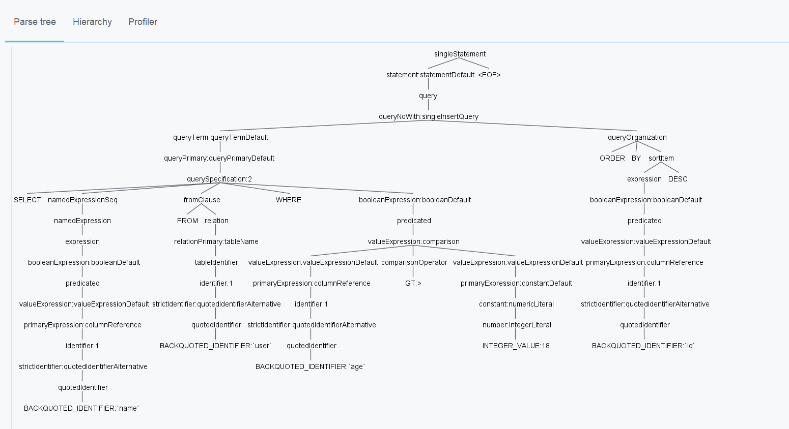
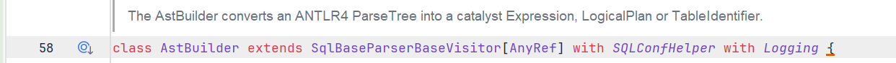

# 大数据SQL剖析

## 编译本质

### ANTLR与编译

通常意义上的SQL，算是一种DSL，也就是特定领域语言，其在完备性上与通用语言，如`Java,Scala`

等存在差距，但是擅长特定领域的工作。

它的构建与通用语言类似，分下面两部：

* 设计语法，以及语义，定义DSL中具体元素
* 实现词法分析器`Lexer`以及语法分析器`Parser`，完成对DSL的解析，最后执行

而`ANTLR`，一种语法分析工具，就是用于生成`Lexer,Parser`，以及基于监听器以及访问者模式的树遍历器。

#### 核心概念

**token**

以读书为例子，通常，我们并不是一个字符一个字符的读一句话，而是通过先将字符聚合为单词粒度，然后获取每个单词的意思从而理解整个句子。

将字符聚集为符号粒度(`token：词法符号`)的过程，称为词法分析，其通过词法分析器`lexer`来实现，它可以将`token`归类，比如`Int,Double，val`等。

一个`token`包含：`token对应的文本与其对应的类型(ID)`，其实一个type就是一个整数，而对应的文本就是一组字符。

比如在一个大数据引擎的`SqlBase.g4`文件中，通过ANTLR生成的`.tokens`文件中，`JOIN=48`，就是如此，一般`tokens`文件也就是几百个这样的等式组成。

**lexer**

词法分析器，将语言文本汇聚为一个个的`token`

**parser**

根据`.g4语法文件`，消费解析出的`token`流，将其转换为一个语法分析树(`parse tree`)。这个树的根节点永远是`输入的token`，从而表达出这个词组的含义。

`parse tree`的子树根节点是`语法规则`，而叶子结点是`token`

要注意，整个的过程，是一个`lazy`的过程，也就是如果不被消费，则不会有`token`生成。

**listener & visitor**

这个是两种访问语法树的方式。

`访问者模式`,是一种将算法与对象结构分离的模式。对象结构中的每个对象，可以以不同的方式进行处理。遍历的整个对象结构，每个位置的对象通过调用`accept`方法，将`visitor`包含进来，然后再在内部通过`visitor::visit`方法进行不同逻辑的处理。

#### SparkSQL Parser

> [DonnyZone/ANTLR4-SqlBase: 剥离的模块，用于查看Spark SQL生成的语法树 (github.com)](https://github.com/DonnyZone/ANTLR4-SqlBase)

通过剥离开的`sparksql`的g4文件，我们可以通过`ANTLR`生成`lexer,parser,listener,visitor等类文件`，并且可以直接使用。

**Demo**

将文本转化为`tokens`流

```java
    @Test
    public void tokenTest(){
        String query = "SELECT `name` FROM `user` WHERE `age`>18 ORDER BY `id` DESC" ;
        SqlBaseLexer lexer = new SqlBaseLexer(new ANTLRInputStream(query));
        CommonTokenStream commonTokenStream = new CommonTokenStream(lexer);
        SqlBaseParser parser = new SqlBaseParser(commonTokenStream);
        commonTokenStream.fill();
        List<Token> tokens = commonTokenStream.getTokens();
        tokens.forEach(token-> System.out.println(token.getText()+" "+token.getType()));
    }
```

上述的测试代码的整个流程：

* 用户输入SQL文本
* 使用`lexer`，将其转换为`token stream`
* 强迫将`token`加载，因为默认是懒加载就看不到了。
* 打印输出，结果如下

```plaintext
SELECT 8
  241
`name` 238
  241
FROM 9
  241
`user` 238
  241
WHERE 14
  241
`age` 238
> 122
18 233
  241
ORDER 21
  241
BY 16
  241
`id` 238
  241
DESC 40
<EOF> -1

```

可以推测出，空格是`241`。该结果完美符合`.tokens`文件。

使用访问者模式访问`parse tree`，根据具体框架，有具体的`visitor`实现类，从而得到想要的东西。

```java

        String query = "SELECT `name` FROM `user` WHERE `age`>18 ORDER BY `id` DESC" ;
//        String query2 = "SELECT `id`, COUNT(`name`) FROM `user` GROUP BY `id`";
        SqlBaseLexer lexer = new SqlBaseLexer(new ANTLRInputStream(query));
        CommonTokenStream commonTokenStream = new CommonTokenStream(lexer);
        SqlBaseParser parser = new SqlBaseParser(commonTokenStream);
        MyVisitor visitor = new MyVisitor();
        String res = visitor.visitSingleStatement(parser.singleStatement());
        System.out.println("res="+res);
```

使用`idea插件`可以看到整个`parser tree`



对应到`SparkSQL`中，其中的`ASTBuilder`就是一个`visitor`,其会根据`parse tree`，生成未解析的`logic plan（未绑定具体数据的plan）`，也就是逻辑算子树。

然后，使用`Analyzer`对每个节点绑定数据信息，生成`analyzed tree`

`sparksql`的AST就有`logic plan`这种形式，然后进行逻辑优化，以及物理优化。



> 关于AST tree与Parse tree的区别，前者是后者的浓缩，详见下文：
>
> [compiler construction - What's the difference between parse trees and abstract syntax trees (ASTs)? - Stack Overflow](https://stackoverflow.com/questions/5026517/whats-the-difference-between-parse-trees-and-abstract-syntax-trees-asts)

### HiveSQL概述

逻辑同上，这里执行到Hive自己的AST树表达形式。

同样需要执行`analyze`的部分，将`AST tree`转换为绑定数据信息的一个`logic plan（operator tree）`，称为逻辑算子树，之后进行逻辑优化，以及物理优化。

### SparkSQL概述

> [Spark SQL内核剖析 (豆瓣) (douban.com)](https://book.douban.com/subject/30296615/)

我写的解读很大一部分知识来源于上述这本书，这里我并不会再去大篇幅的摘抄，而是精简概述所需要的部分。

`Catalog`就是集群环境中的各种函数，以及元数据信息(库，表，分区，视图等)的统一抽象。具体包括了:

* 全局临时视图管理
* 函数资源加载器(UDF,以及Hive Func，通过jar包提供，所以需要加载)
* 函数注册接口
* 外部存储的`Catalog`，比如`Hive Catalog`，或者基于内存的`InMemory Catalog`

`unresovled logic plan`得到之后，需要进行具体的数据信息绑定，这里是通过`SparkSQL`中全局维护的`Catalog`来实现的，数据信息也只有从那里可以拿到。

这里着重描述`Analyze`的逻辑，因为具体的优化以及物理计划`Hive`与`Spark`并不同，后续优化分析的时候还会展开。

`Analyzer`基于内置的6类规则来对AST节点进行6种处理逻辑：

* 替换操作
* 具体算子的解析
* 对UDF进行处理
* null值处理
* 删除无用别名
* PullOutNondeterm inistic：// todo没看懂这个

用户可以规定迭代次数，不断使用`Analyzer`对`plan`进行转换。在`Spark3.3.3`中，迭代次数默认`100`。

然后后续就是最核心的`optimizer`，这里是`RBO`，也就是`rule based optimize`，SparkSQL与hiveSQL都内置了一系列规则，同样用于对树节点进行转换。

然后就是物理计划，这里的话一般会进行`CBO`，也就是`cost based optimize`，其分为两个部分，分别是信息统计，以及代价模型。最后进过评估，选择最优的路径进行执行。

## RBO与CBO

### RBO

RBO通常基于一组固定的规则，用于对`logical plan`进行转换。

在`SparkSQL`中，这些规则被封装为一个个的`batch`，在`Optimizer`类中可以具体查看。

一些常见的`谓词下推，列裁剪，简单等价重写`均在RBO。

### CBO

[基于成本的优化器 - Azure Databricks | Microsoft Learn](https://learn.microsoft.com/zh-cn/azure/databricks/optimizations/cbo)

大数据SQL在这里的处理依旧很初期，集中于一组Join排序的优化。而关系型数据库在此处发展完备。

这里因为RBO没办法拿实际数据量信息，所以需要在此阶段进行信息统计，并应用于代价模型来选取最佳计划。

为了防止统计信息过期，可以手动收集信息，就是使用:

```sql
ANALYZE TABLE table_name [ PARTITION clause ]
    COMPUTE [ DELTA ] STATISTICS [ NOSCAN | FOR COLUMNS col1 [, ...] | FOR ALL COLUMNS ]

ANALYZE TABLES [ { FROM | IN } schema_name ] COMPUTE STATISTICS [ NOSCAN ]
```

如果环境更为复杂，还可以动态采样，比如使用`Sample`算子，但这是同步阻塞的操作，所以要严格控制。

可以评估一些指标，比如：

* 网络IO +磁盘IO：一字节从HDFS读过来的时间，表有多少字节。
* CPU：一个最小操作的`CPU`消耗时间

然后通过计算公式，将其应用在每个树节点，最后相加则为某个计划的`cost`。

从中选取`cost`最小的`plan`即可。

## 聚合

### agregate

这里执行的是不包含窗口的聚合。

#### 聚合模式

`SparkSQL`中，聚合一共有4种模式

**Partial + Final**

其中`partial`是局部聚合，通常在`map`阶段。将输入转换为中间聚合的结果。

而`final`是最终聚合，通常在`reduce`阶段。将中间结果汇聚，并进行再次聚合。

通常一些优化思路中，开启预先聚合，就是使用的这种模式。

**Complete**

就是直接将数据拉到`reducer`阶段进行聚合，通常用在不支持局部聚合的聚合函数中。

**PartialMerge**

对一张`person`表，执行

```sql
select
    `person`.id,
    sum(`person`.score),
    count(distinct `person`.handsome)
from `person`
group by `person`.id;
```

这时候，同时出现了`sum`以及`count distinct`，则会使用到`partialMerge`模式。

物理执行计划如下所示：

```plaintext
== Physical Plan ==
*(3) HashAggregate(keys=[id#17], functions=[sum(cast(score#23 as double)), count(distinct handsome#22)], output=[id#17, sum(score)#34, count(DISTINCT handsome)#33L])
+- Exchange hashpartitioning(id#17, 200), ENSURE_REQUIREMENTS, [plan_id=52]
   +- *(2) HashAggregate(keys=[id#17], functions=[merge_sum(cast(score#23 as double)), partial_count(distinct handsome#22)], output=[id#17, sum#39, count#42L])
      +- *(2) HashAggregate(keys=[id#17, handsome#22], functions=[merge_sum(cast(score#23 as double))], output=[id#17, handsome#22, sum#39])
         +- Exchange hashpartitioning(id#17, handsome#22, 200), ENSURE_REQUIREMENTS, [plan_id=47]
            +- *(1) HashAggregate(keys=[id#17, handsome#22], functions=[partial_sum(cast(score#23 as double))], output=[id#17, handsome#22, sum#39])
               +- FileScan csv [id#17,handsome#22,score#23] Batched: false, DataFilters: [], Format: CSV, Location: InMemoryFileIndex(1 paths)[file:/F:/workspace_scala/miniSpark/data/person.csv], PartitionFilters: [], PushedFilters: [], ReadSchema: struct<id:string,handsome:string,score:string>


```

可以看到，对于`sum`以及`count distinct`，分别从局部到全局进行处理。首先，注重`sum`逻辑，然后将分组也就是`hash`的键做改变，再注重`count distinct`逻辑，最后全局做一次汇总。

#### 聚合算子

有两种模式的聚合算子，分别是`SortAggregateExec`以及`HashAggregateExec`.

**SortAggregateExec**

具体实现，就是对于数据进行按照`group id`进行分区，之后分区内排序，相同键相邻，然后进行聚合即可。

**HashAggregateExec**

具体实现相对复杂，大致思路就是在内存中开一个`Map`(Spark中有特殊的`AppendOnlyMap`)，然后不断对数据进行聚合或者添加，满了就溢出写入磁盘。溢出的时候需要排序并合并。

### window

窗口函数的具体细节太多了，具体可以看书。

其与普通`group by`的如下：

* 行数变化：`group by`聚合行数减小，但是开窗函数不变，为每行输出结果
* 功能增加：`group by`针对一个分区只能输出一种结果，但是开窗函数可以在分组窗口内做累积等逻辑，输出不同结果。并且支持的聚合韩束更多。
* 聚合模式不同：`group by`可以`partial + final`，而`window`只能`complete`模型运行，聚合逻辑全局在`reducer`端。
* 聚合算子不同：`group by`可以`hash or sort`,但是`window`只能`sort`，因为窗口默认都有排序要求。

### olap

#### 上卷与下钻

Sparksql中，支持`上卷`以及`下钻`，并有特定的语法支持。

**grouping sets**

```sql
select
  `person`.score,
  `person`.handsome,
  count(`person`.id) as id_count
from
  `person`
group by
  `person`.score,
  `person`.handsome grouping sets (
    (`person`.score, `person`.handsome),
    (`person`.score),
    (`person`.handsome)
  );
```

效果上等同于将不同粒度的聚合操作通过`union`拼接在一起。

**cube**

```sql
select
  `person`.score,
  `person`.handsome,
  count(`person`.id) as id_count
from
  `person`
group by
  cube(
    `person`.score,
    `person`.handsome
  );
```

下钻操作

`cube(a,b,c) = grouping sets((a,b,c),(a,b),(a,c),(b,c),(a),(b),(c),())`

**rollup**

上卷操作

`rollup(a,b,c) = grouping sets((),(a),(a,b),(a,b,c))`

**null值**

执行中的`null`值，与实际生产中的`null`值，通过`geouping`函数处理。其返回的结果如果是1，则代表是grouping的null值。如果是0，则是本身的null值。

#### 底层原理

`grouping sets`实质上是`Project + Expand + Aggregate`节点组合。

上述的`sql`的`resolved logical plan`如下：

```plaintext
== Analyzed Logical Plan ==
score: string, final_name: string, id_count: bigint
Aggregate [score#37, handsome#38, spark_grouping_id#36L], [score#37, concat(handsome#38, -, hello) AS final_name#31, count(id#17) AS id_count#32L]
+- Expand [[id#17, name#18, age#19, height#20, weight#21, handsome#22, score#23, score#34, handsome#35, 0], [id#17, name#18, age#19, height#20, weight#21, handsome#22, score#23, score#34, null, 1], [id#17, name#18, age#19, height#20, weight#21, handsome#22, score#23, null, handsome#35, 2]], [id#17, name#18, age#19, height#20, weight#21, handsome#22, score#23, score#37, handsome#38, spark_grouping_id#36L]
   +- Project [id#17, name#18, age#19, height#20, weight#21, handsome#22, score#23, score#23 AS score#34, handsome#22 AS handsome#35]
      +- SubqueryAlias person
         +- View (`person`, [id#17,name#18,age#19,height#20,weight#21,handsome#22,score#23])
            +- Relation [id#17,name#18,age#19,height#20,weight#21,handsome#22,score#23] csv
```

经过`optimize`之后如下：

```plaintext
Aggregate [score#37, handsome#38, spark_grouping_id#36L], [score#37, concat(handsome#38, -, hello) AS final_name#31, count(id#17) AS id_count#32L]
+- Expand [[id#17, score#23, handsome#22, 0], [id#17, score#23, null, 1], [id#17, null, handsome#22, 2]], [id#17, score#37, handsome#38, spark_grouping_id#36L]
   +- Project [id#17, score#23, handsome#22]
      +- Relation [id#17,name#18,age#19,height#20,weight#21,handsome#22,score#23] csv
```

其中`Project`部分就对应着数据源进行选择，以及列裁剪之后的部分。

而`Expand`部分中的结果，就是添加特殊的分组标签。其对每行数据应用投影操作，输出多行数据。而输出的行数，就是这里额外添加的分组标签。不用的列会将其作为`null`然后进行操作。里面一个`Seq[Seq[Expression]]`，具体每种分组策略都展示出来了，ID有`0,1,2`。

最后的`Aggregate`就是针对每种组合，也就是`score,handsome,[0,1,2]`，分别进行聚合操作，最后汇总。

其物理计划如下：

由于`count`支持局部聚合，所以是`partial + final`，有预先聚合。

```plaintext
== Physical Plan ==
*(2) HashAggregate(keys=[score#37, handsome#38, spark_grouping_id#36L], functions=[count(id#17)], output=[score#37, final_name#31, id_count#32L])
+- Exchange hashpartitioning(score#37, handsome#38, spark_grouping_id#36L, 200), ENSURE_REQUIREMENTS, [plan_id=47]
   +- *(1) HashAggregate(keys=[score#37, handsome#38, spark_grouping_id#36L], functions=[partial_count(id#17)], output=[score#37, handsome#38, spark_grouping_id#36L, count#50L])
      +- *(1) Expand [[id#17, score#23, handsome#22, 0], [id#17, score#23, null, 1], [id#17, null, handsome#22, 2]], [id#17, score#37, handsome#38, spark_grouping_id#36L]
         +- FileScan csv [id#17,handsome#22,score#23] Batched: false, DataFilters: [], Format: CSV, Location: InMemoryFileIndex(1 paths)[file:/F:/workspace_scala/miniSpark/data/person.csv], PartitionFilters: [], PushedFilters: [], ReadSchema: struct<id:string,handsome:string,score:string>

```

## 连接

### 执行计划

执行一个`person`表和`person_info`表的`join`：

```sql
select
  `person`.id,
  `person`.name,
  `person_info`.class_name
from
  `person`
  join `person_info` on `person`.id = `person_info`.id
where `person`.score > 90;
```

执行计划如下：

```plaintext
== Parsed Logical Plan ==
'Project ['person.id, 'person.name, 'person_info.class_name]
+- 'Filter ('person.score > 90)
   +- 'Join Inner, ('person.id = 'person_info.id)
      :- 'UnresolvedRelation [person], [], false
      +- 'UnresolvedRelation [person_info], [], false

== Analyzed Logical Plan ==
id: string, name: string, class_name: string
Project [id#17, name#18, class_name#70]
+- Filter (cast(score#23 as int) > 90)
   +- Join Inner, (id#17 = id#69)
      :- SubqueryAlias person
      :  +- View (`person`, [id#17,name#18,age#19,height#20,weight#21,handsome#22,score#23])
      :     +- Relation [id#17,name#18,age#19,height#20,weight#21,handsome#22,score#23] csv
      +- SubqueryAlias person_info
         +- View (`person_info`, [id#69,class_name#70])
            +- Relation [id#69,class_name#70] csv

== Optimized Logical Plan ==
Project [id#17, name#18, class_name#70]
+- Join Inner, (id#17 = id#69)
   :- Project [id#17, name#18]
   :  +- Filter ((isnotnull(score#23) AND (cast(score#23 as int) > 90)) AND isnotnull(id#17))
   :     +- Relation [id#17,name#18,age#19,height#20,weight#21,handsome#22,score#23] csv
   +- Filter isnotnull(id#69)
      +- Relation [id#69,class_name#70] csv

== Physical Plan ==
*(2) Project [id#17, name#18, class_name#70]
+- *(2) BroadcastHashJoin [id#17], [id#69], Inner, BuildRight, false
   :- *(2) Project [id#17, name#18]
   :  +- *(2) Filter ((isnotnull(score#23) AND (cast(score#23 as int) > 90)) AND isnotnull(id#17))
   :     +- FileScan csv [id#17,name#18,score#23] Batched: false, DataFilters: [isnotnull(score#23), (cast(score#23 as int) > 90), isnotnull(id#17)], Format: CSV, Location: InMemoryFileIndex(1 paths)[file:/F:/workspace_scala/miniSpark/data/person.csv], PartitionFilters: [], PushedFilters: [IsNotNull(score), IsNotNull(id)], ReadSchema: struct<id:string,name:string,score:string>
   +- BroadcastExchange HashedRelationBroadcastMode(List(input[0, string, false]),false), [plan_id=116]
      +- *(1) Filter isnotnull(id#69)
         +- FileScan csv [id#69,class_name#70] Batched: false, DataFilters: [isnotnull(id#69)], Format: CSV, Location: InMemoryFileIndex(1 paths)[file:/F:/workspace_scala/miniSpark/data/person_info.csv], PartitionFilters: [], PushedFilters: [IsNotNull(id)], ReadSchema: struct<id:string,class_name:string>

```

从逻辑计划看出，依次进行了数据绑定，变为`resolved`。

然后进行列裁剪，以及`push down（谓词下推到靠近数据源）`操作，变为优化好的`optimized plan。`

### 5种JOIN

#### 具体类型

* BoardcastHashJoin
* ShuffleHashJoin
* SortMergeJoin
* BoardcastNestedLoopJoin
* CartesionProductJoin

#### 划分依据

**数据表能否被广播**

适用于`小小表`

通过`spark.sql.autoBoardcastJoinThreshold`参数设置广播表大小。默认`10MB`.

**BuildSide**

也就是左表/右表能否被特殊作用，这里其实是看左右两边哪个是流式表，哪个是构建表。

**能否构建HashMap**

在单个分区上创建`HashMap`以用来进行单分区的JOIN，有内存限制，所以需要判断条件。

#### 构建细节

* canboardcast  &canBuild=> BoardcastHashJoin
* canbuildLocalHashMap & 无排序 & canBuild  & muchsmaller=> ShuffleHashJoin
* 要排序 || 非等值Join => sortMergeJoin
* 笛卡尔积 => ca......
* 最后：BoardcastLoopJoin

**流式表和构建表**

SparkSQL包括其他大数据SQL很多都遵循这样一个原则，就是将`A join B`的两个表区分开来。

`流式表`:拿到的是`streaming iter`，是遍历每条数据

`构建表`:拿到的是`build iter`，是根据`key`找到对应的数据

则如果`build table`在右侧，就成为这个Join是`build right`。

**各种Join的build规定**

`BuildRight`:`left join,left semi join,inner join`

`BuildLeft`：`right join, right semi join,inner join`

#### 执行机制

**BroadcastHashJoin**

数仓中的表一般分为事实表以及维度表，而对应的就是大表和小小表。

为了避免`shuffle`，则可以选择由`Driver`收集并广播小小表(`build table`)，则大表的分区数据可以在本地进行`join`.

假设sql如下：

```sql
select
   /*+ BROADCASTJOIN(person_info) */
  `person`.id,
  `person`.name,
  `person_info`.class_name
from
  `person`
  left join `person_info` on `person`.id = `person_info`.id
where `person`.score > 90;
```

则物理执行计划如下：

```plaintext
== Physical Plan ==
*(2) Project [id#17, name#18, class_name#70]
+- *(2) BroadcastHashJoin [id#17], [id#69], LeftOuter, BuildRight, false
   :- *(2) Project [id#17, name#18]
   :  +- *(2) Filter (isnotnull(score#23) AND (cast(score#23 as int) > 90))
   :     +- FileScan csv [id#17,name#18,score#23] Batched: false, DataFilters: [isnotnull(score#23), (cast(score#23 as int) > 90)], Format: CSV, Location: InMemoryFileIndex(1 paths)[file:/F:/workspace_scala/miniSpark/data/person.csv], PartitionFilters: [], PushedFilters: [IsNotNull(score)], ReadSchema: struct<id:string,name:string,score:string>
   +- BroadcastExchange HashedRelationBroadcastMode(List(input[0, string, false]),false), [plan_id=116]
      +- *(1) Filter isnotnull(id#69)
         +- FileScan csv [id#69,class_name#70] Batched: false, DataFilters: [isnotnull(id#69)], Format: CSV, Location: InMemoryFileIndex(1 paths)[file:/F:/workspace_scala/miniSpark/data/person_info.csv], PartitionFilters: [], PushedFilters: [IsNotNull(id)], ReadSchema: struct<id:string,class_name:string>

```

可以看到是将右表广播的，进行了Exchange，然后将两者进行hash join。

**ShuffleHashJoin**

构建条件比较严苛。需要`canBuildHashMap` & 有明显数据量差(比值>=3) & 不能被`ShuffleSortMergeJoin抢先`。

经过考虑，直接加入`Hint`强制进行`ShuffleHashJoin`,但是这里`buildSide`不强制是某个表，让Spark自己选，然后构建`HashMap`。

这里已经关掉了`AQE`

```sql
select
   /*+SHUFFLE_HASH(person,person_info)*/
  `person`.id,
  `person`.name,
  `person_info`.class_name
from
  `person`
  left join `person_info` on `person`.id = `person_info`.id
where `person`.score > 90;
```

物理执行计划如下：

```plaintext
== Physical Plan ==
*(3) Project [id#17, name#18, class_name#70]
+- *(3) ShuffledHashJoin [id#17], [id#69], LeftOuter, BuildRight
   :- Exchange hashpartitioning(id#17, 200), ENSURE_REQUIREMENTS, [plan_id=116]
   :  +- *(1) Project [id#17, name#18]
   :     +- *(1) Filter (isnotnull(score#23) AND (cast(score#23 as int) > 90))
   :        +- FileScan csv [id#17,name#18,score#23] Batched: false, DataFilters: [isnotnull(score#23), (cast(score#23 as int) > 90)], Format: CSV, Location: InMemoryFileIndex(1 paths)[file:/F:/workspace_scala/miniSpark/data/person.csv], PartitionFilters: [], PushedFilters: [IsNotNull(score)], ReadSchema: struct<id:string,name:string,score:string>
   +- Exchange hashpartitioning(id#69, 200), ENSURE_REQUIREMENTS, [plan_id=121]
      +- *(2) Filter isnotnull(id#69)
         +- FileScan csv [id#69,class_name#70] Batched: false, DataFilters: [isnotnull(id#69)], Format: CSV, Location: InMemoryFileIndex(1 paths)[file:/F:/workspace_scala/miniSpark/data/person_info.csv], PartitionFilters: [], PushedFilters: [IsNotNull(id)], ReadSchema: struct<id:string,class_name:string>

```

可以看到两者都进行了`shuffle`，然后在每个分区上进行`hashjoin`。

**SortMergeJoin**

通常用于大表对大表。

不用将任何表的数据完全加载到内存。首先将两个表的数据进行`shuffle`，然后在分区内进行排序。此时两个表的对应位置均已排好序。则进行归并排序并join结果即可。

## 参数调优

这里主要暂时记载没有默认开启或者特殊化的优化手段。

常规的加资源，加并行度以及一些默认开启的优化手段就不记载了。

### Hint

> [提示 - Azure Databricks - Databricks SQL | Microsoft Learn](https://learn.microsoft.com/zh-cn/azure/databricks/sql/language-manual/sql-ref-syntax-qry-select-hints)

统一语法如下：

```sql
/*+ { partition_hint | join_hint | skew_hint } [, ...] */
```

#### partition

```sql
> SELECT /*+ COALESCE(3) */ * FROM t;

> SELECT /*+ REPARTITION(3) */ * FROM t;

> SELECT /*+ REPARTITION(c) */ * FROM t;

> SELECT /*+ REPARTITION(3, c) */ * FROM t;

> SELECT /*+ REPARTITION_BY_RANGE(c) */ * FROM t;

> SELECT /*+ REPARTITION_BY_RANGE(3, c) */ * FROM t;

> SELECT /*+ REBALANCE */ * FROM t;

> SELECT /*+ REBALANCE(c) */ * FROM t;

-- When a column name has been occluded by an alias you must refere to it by the alias name.
> SELECT /*+ REBALANCE(d) */ * FROM t AS s(d);

-- multiple partitioning hints
> EXPLAIN EXTENDED SELECT /*+ REPARTITION(100), COALESCE(500), REPARTITION_BY_RANGE(3, c) */ * FROM t;
== Parsed Logical Plan ==
'UnresolvedHint REPARTITION, [100]
+- 'UnresolvedHint COALESCE, [500]
   +- 'UnresolvedHint REPARTITION_BY_RANGE, [3, 'c]
      +- 'Project [*]
         +- 'UnresolvedRelation [t]

== Analyzed Logical Plan ==
name: string, c: int
Repartition 100, true
+- Repartition 500, false
   +- RepartitionByExpression [c#30 ASC NULLS FIRST], 3
      +- Project [name#29, c#30]
         +- SubqueryAlias spark_catalog.default.t
            +- Relation[name#29,c#30] parquet

== Optimized Logical Plan ==
Repartition 100, true
+- Relation[name#29,c#30] parquet

== Physical Plan ==
Exchange RoundRobinPartitioning(100), false, [id=#121]
+- *(1) ColumnarToRow
   +- FileScan parquet default.t[name#29,c#30] Batched: true, DataFilters: [], Format: Parquet,
      Location: CatalogFileIndex[file:/spark/spark-warehouse/t], PartitionFilters: [],
      PushedFilters: [], ReadSchema: struct<name:string>
```

其中：

`REBALANCE` 提示可用于重新平衡查询结果输出分区，使每个分区的大小合理（不小也不大）。 它可以将列名作为参数，并尽量按这些列对查询结果进行分区。 这项工作属于尽力而为：如果存在倾斜，Spark 会拆分倾斜的分区，以使这些分区不会太大。 当需要将此查询的结果写入表时，此提示很有用，可避免文件过小/过大。 如果未启用 AQE，则忽略此提示。

#### join

* **`BROADCAST ( table_name )`**
  使用广播联接。 无论 `autoBroadcastJoinThreshold` 如何，都将广播带有提示的联接端。 如果联接的两端都具有广播提示，则广播较小的一端（根据统计信息确定）。
* **`MERGE ( table_name )`**
  使用随机排序合并联接(SortMergeJoin)。
* **`SHUFFLE_HASH ( table_name )`**
  使用随机哈希联接。 如果两端都有随机哈希提示，Databricks SQL 会选择较小的一端作为生成端（根据统计信息确定）。
* **`SHUFFLE_REPLICATE_NL ( table_name )`**
  使用随机复制嵌套循环联接。

这些Hint可以一次写多个，但是SparkSQL会选择优先级高的:

`BroadcastJoin > sortMergeJoin > ShuffleHashJoin > NLJoin`。

```sql
-- Join Hints for broadcast join
> SELECT /*+ BROADCAST(t1) */ * FROM t1 INNER JOIN t2 ON t1.key = t2.key;
> SELECT /*+ BROADCASTJOIN (t1) */ * FROM t1 left JOIN t2 ON t1.key = t2.key;
> SELECT /*+ MAPJOIN(t2) */ * FROM t1 right JOIN t2 ON t1.key = t2.key;

-- Join Hints for shuffle sort merge join
> SELECT /*+ SHUFFLE_MERGE(t1) */ * FROM t1 INNER JOIN t2 ON t1.key = t2.key;
> SELECT /*+ MERGEJOIN(t2) */ * FROM t1 INNER JOIN t2 ON t1.key = t2.key;
> SELECT /*+ MERGE(t1) */ * FROM t1 INNER JOIN t2 ON t1.key = t2.key;

-- Join Hints for shuffle hash join
> SELECT /*+ SHUFFLE_HASH(t1) */ * FROM t1 INNER JOIN t2 ON t1.key = t2.key;

-- Join Hints for shuffle-and-replicate nested loop join
> SELECT /*+ SHUFFLE_REPLICATE_NL(t1) */ * FROM t1 INNER JOIN t2 ON t1.key = t2.key;

-- When different join strategy hints are specified on both sides of a join, Databricks SQL
-- prioritizes the BROADCAST hint over the MERGE hint over the SHUFFLE_HASH hint
-- over the SHUFFLE_REPLICATE_NL hint.
-- Databricks SQL will issue Warning in the following example
-- org.apache.spark.sql.catalyst.analysis.HintErrorLogger: Hint (strategy=merge)
-- is overridden by another hint and will not take effect.
> SELECT /*+ BROADCAST(t1), MERGE(t1, t2) */ * FROM t1 INNER JOIN t2 ON t1.key = t2.key;

-- When a table name is occluded by an alias you must use the alias name in the hint
> SELECT /*+ BROADCAST(t1), MERGE(s1, s2) */ * FROM t1 AS s1 INNER JOIN t2 AS s2 ON s1.key = s2.key;
```

#### skew

### AQE

#### 原理

`AQE`是在查询执行期间发生的查询重新优化。

运行时重新优化的推动因素是`SparkSQL`在随机和广播交换（在 AQE 中称为查询阶段(相对的是`读数据阶段`)）结束时具有最新的准确统计信息。 因此，`SparkSQL` 可以选择更好的物理策略、选择最佳的随机后分区大小和数目，或执行以前需要`Hint`的优化（例如倾斜联接处理）。

这在未启用统计信息收集功能或统计信息过时的情况下会非常有用。 在静态派生的统计信息不准确的情况下（例如在复杂查询的过程中或在发生数据倾斜之后），也很有用。

#### 功能和范围

**开启**

```sql
set spark.sql.adaptive.enabled = true
```

从`Spark3.2`开始就默认开启。

**功能**

* 将`SortMergeJoin -> BroadcastHashJoin`
* 在随机交换后将分区进行动态联合（将小分区合并为大小合理的分区）。 非常小的任务具有较差的 I/O 吞吐量，并且往往会产生更多计划开销和任务设置开销。 合并小型任务可节省资源并提高群集吞吐量。
* 动态处理`ShuffleSortMergeJoin与ShuffleHashJoin`中的倾斜，方法是将倾斜的任务拆分（如果需要，还要进行复制）为大小大致相等的任务。
* 动态检测并传播空关系。

**范围**

* 非流式处理
* 至少有一个`exchange`或者一个`subquery`

#### 其他

[自适应查询执行 - Azure Databricks | Microsoft Learn](https://learn.microsoft.com/zh-cn/azure/databricks/optimizations/aqe#query-plans)

### DDP

[[SPARK][SQL] 聊一聊Spark 3.0中的DPP特性 - 知乎 (zhihu.com)](https://zhuanlan.zhihu.com/p/548757324)

### SPJ

[性能调优 - Spark 4.0.0-preview2 Documentation (apache.org)](https://spark.apache.org/docs/4.0.0-preview2/sql-performance-tuning.html#storage-partition-join)


## 火山模型与向量化

### 火山模型

#### 原理

> [物理执行引擎之火山引擎 - 《Andy 的研究笔记》 - 极客文档 (geekdaxue.co)](https://geekdaxue.co/read/dr.andy@vwmkb2/sd7z1u)

火山模型诞生的时候，人们注重于优化IO的效率。

其将关系代数中的每个操作抽象为`Operator`，并构建为树。然后从根开始递归调用`next`，就可以得到输出的`tuple`。

SparkSQL中的执行计划也体现了这一点。

#### 缺点

火山模型一次处理一行，缺点如下：

* 虚函数调用过多，消耗CPU。Java的虚函数与普通函数的调用区别就是其是一个间接调用，会多一次压栈出栈的过程，并且CPU无法预测跳转位置。这样CPU开销是翻倍的。
* 缓存不友好，每次只能拉取一行数据，并且当前算子的缓存可能被下层算子冲掉。

#### 改进

**问题一**

针对虚函数调用过多的问题，`SparkSQL`采用了代码生成来解决，自动生成代码来执行`Operator的逻辑`，避免虚函数调用。其将一个`stage`中的`operator`全部压缩为单个函数调用，是一个大的`for-loop`。

`SparkSQL`中使用如下参数开启和关闭：

```sql
set spark.sql.codegen.wholeStage = true / false;
```

**问题二**

每次处理一行数据，则可以改为SIMD指令并行，一次处理多行数据，并且缓存对齐。已经有开源项目支持该功能。

### 向量化

解决的就是问题二。

[kwai/blaze：超快的查询执行引擎使用 Apache Spark 语言，并以 Arrow-DataFusion 为核心。 (github.com)](https://github.com/kwai/blaze)

[apache/incubator-gluten: Gluten is a middle layer responsible for offloading JVM-based SQL engines' execution to native engines. (github.com)](https://github.com/apache/incubator-gluten)
