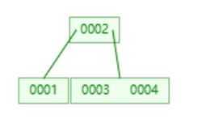
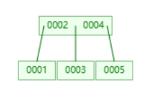
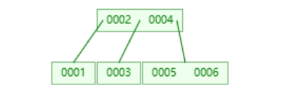
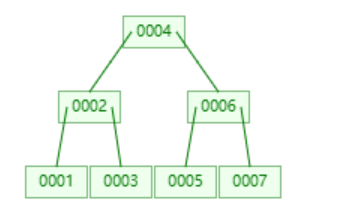
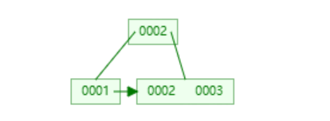

# 存储引擎

单机存储引擎从`读`和`写`两个方面看，可以分为`读多写少`和`写多读少`。比如之前分析的日志结构文件系统，就是针对`写多读少`场景的专门优化的文件系统，其通过加中间层以及`copy on write`的方式，将所有的写统一为按段的顺序写，从而加速写入效率。

具体的存储引擎分下述两类：

* `读多写少` B & B+树
* `写多读少` LSM-Tree，LSM-Array等

每种引擎又在数据落盘时机上分为`同步落盘`和`异步落盘`，后者通常通过`预写WAL`实现。

## 数据结构

### 基础结构

#### 数组和链表

从内存管理的角度来看，数组和链表就是分别代表了数据组织两个特性，也就是顺序组织和离散组织。

最终的所有高级结构都会归结为这两个基本结构来实现。

这两者的侧重点有所不同，

* 数组的`按下标访问和尾部追加`都是`O(1)`的
* 链表的`插入，删除的执行`是`O(1)`，但是访问过程是`O(n)`的。

### 哈希结构

#### 哈希表

> [散列表 - 维基百科，自由的百科全书 (wikipedia.org)](https://zh.wikipedia.org/wiki/%E5%93%88%E5%B8%8C%E8%A1%A8)

#### BitMap

**本质**

按照`bit`来存储海量无重复数据(`比如ID`)的小状态(通常是`二值状态(true/false)`)。

比如`10亿`个`int`判断某个数是否存在。则存储开销可以减小为`1/32`，使用`bit`位置下标代表具体数字，该位的值代表是否存在。

**实现**

通常的实现是通过`Array[Int]`来实现的。若现在要寻找某个数的状态，其实也就是寻找对应`Int的某个位是否为1`。

可以将其看做二维bit矩阵，则对应位置为`arr(x/32)(x % 32)`。

但是实际上对于第二维度的`Int`来说不能再直接索引了，只能通过`arr(x/32) & (1<<(x%32)))`来实现。

**API**

在Java/Scala中，都提供了`BitSet`类，其就是一个专用的针对`Int`类型的`BitMap`。可以看到其构造方法甚至都不是泛型方法，因为内部已经规定是`Int`。

它同时是一个`SortedSet`。

```java
object BitSetDemo {
  def main(args: Array[String]): Unit = {
    import scala.collection.BitSet
    val set = BitSet(1,2,3,4,5)
    val set2 = BitSet(1,4,5,7,9)
    println(set & set2)
    println(set | set2)
    println(set &~ set2)
    println(set ^ set2)
  }
}
```

结果如下:

```plaintext
BitSet(1, 4, 5)
BitSet(1, 2, 3, 4, 5, 7, 9)
BitSet(2, 3)
BitSet(2, 3, 7, 9)
```

#### BloomFilter

**本质**

长度为`n`的bit数组 + `k`个`Hash函数`

**使用**

> [布隆过滤器可视化 (selfboot.cn)](https://gallery.selfboot.cn/zh/algorithms/bloomfilter)

可以看到，初始的时候设置$n = 200,k = 6$.

然后每次添加一个字符串类型的`key`，都可以通过6个哈希函数计算出来的值，填充到6个位中。然后查找的时候只需要查看这些位是否为1即可大概率判断是否有该key。

其查询性能是`O(k)`的，与数据量无关，并且空间复杂度很低。

**假阳性**

很显然，bit数组不可能无限长。而总有可能不同`key`将同一个格子填满。那么在检验的时候本应该该位置为空的不为空了，则最终可能恰好认为该`key`在其中。

当然，如果一个数在有假阳性的条件下都被判断为不存在，则必然不存在，这也是数据库等应用使用它的根本原因，就是它可以提供这种`assert`。

### 树结构

#### BST

**性质**

1. 若任意节点的左子树不空，则左子树上所有节点的值均小于它的根节点的值；
2. 若任意节点的右子树不空，则右子树上所有节点的值均大于它的根节点的值；
3. 任意节点的左、右子树也分别为二叉查找树；

**性能**

搜索，插入，删除操作平均都为`O(log n)`。因为本质就是在`二分`。

最坏情况就是退化为一条边的斜二叉树(有序链表)，各种操作都劣化为`O(n)`。

如果要解决深度增加而引起的平均时间复杂度增加，则可以考虑使用`平衡树`进行深度限制，比如`AVL`树，就是带平衡限制的`BST`。但是还要权衡维护平衡所带来的额外开销。

#### SkipList实现

> [跳跃列表 - 维基百科，自由的百科全书 (wikipedia.org)](https://zh.wikipedia.org/wiki/%E8%B7%B3%E8%B7%83%E5%88%97%E8%A1%A8)

**背景**

> 跳跃列表是在很多应用中有可能替代平衡树而作为实现方法的一种数据结构。跳跃列表的算法有同平衡树一样的渐进的预期时间边界，并且更简单、更快速和使用更少的空间

跳表在很多场景下可以取代平衡树以及弱平衡树(红黑树)。

它是针对有序集合所做出的优化，比如需要对有序集合做大量的范围(投影)查找。和哈希表使用场景完全不同，后者往往是无序的并且注重`k-v`存储。

**性能**

搜索，插入，删除操作平均都是`O(logn)`，同样是在二分。

最差情况均是劣化到`O(n)`，这是它的缺点之一。

**原理**

它是一种概率性数据结构，是有普通的有序链表向上按层构建而成的，也就是不断向上添加索引通道，达到二分的目的。由于是二分，所以它的层也不会很高，也就是个位数的层高。

第`i`层的元素在`i+1层`的的出现概率为$p$，每个元素的出现层数平均为$1 / (1 - p)$。而每个元素可以处于多层，就说明其可以有多个指针。

**API**

Scala只能使用`java.util.concurrent.ConcurrentSkipListMap/Set`，它们都实现了`NavigableMap/Set`接口。也就是说，支持返回某个值区间的投影。

**手搓跳表**

[1206. 设计跳表 - 力扣（LeetCode）](https://leetcode.cn/problems/design-skiplist/description/)

用`Scala`的实现如下

```java
class Skiplist() {
  val maxLevel = 32
  val factor = 0.25
  //dummy头结点
  private var head = new SkiplistNode(-1,maxLevel)
  //当前的最大层高
  private var level = 0
  private var random = new util.Random()
  //无论是查找，插入，删除，都是从head的最高层开始
  def search(target: Int): Boolean = {
    var cur = this.head
    for(i <- level-1 to 0 by -1){
      while(cur.forward(i) != null && cur.forward(i).value < target){
        cur = cur.forward(i)
      }
    }
    //最终会停在目标node的前一个node的level 0
    cur = cur.forward(0)
    if(cur != null && cur.value == target){
      return true
    }
    return false
  }

  def add(num: Int): Unit = {
    //每层中比当前值小的最后一个node的引用集合
    //
    val update = Array.fill[SkiplistNode](maxLevel)(this.head)
    var cur = this.head
    //从当前最高层开始向下每层找
    for(i <- level - 1 to 0 by -1){
      while(cur.forward != null && cur.forward(i).value < num){
        cur = cur.forward(i)
      }
      update(i) = cur
    }
    //新插入的值的node的层数
    val lv = randomLevel()
    //如果随机出来的层数比之前的都高，则更新level
    level = level max lv
    val newNode = new SkiplistNode(num,lv)
    //从底向上更新
    for(i <- 0 until lv){
      //插入到本层cur的下一个节点
      newNode.forward(i) = update(i).forward(i)
      update(i).forward(i) = newNode
    }
  }

  def erase(num: Int): Boolean = {
    val update = Array.fill[SkiplistNode](maxLevel)(null)
    var cur = this.head
    for(i <- level-1 to 0 by -1){
      while(cur.forward(i) != null && cur.forward(i).value < num){
        cur = cur.forward(i)
      }
      update(i) = cur
    }
    cur = cur.forward(0) //当前要删除的块的最底层
    //如果没有要删除的块
    if(cur == null || cur.value != num){
      return false
    }
    //从底向上删除
    for(i <- 0 until level;if(update(i).forward(i) == cur)){
      update(i).forward(i) = cur.forward(i)
    }
    ////最高层为空则删除
    while(level > 1 && head.forward(level-1) == null){
      level -= 1
    }
    return true

  }
  //最底层每个节点出现在上层的最大层数
  private def randomLevel():Int = {
    var lv = 1
    while(random.nextDouble() < factor && lv < maxLevel){
      lv += 1
    }
    lv
  }

}
class SkiplistNode(_value:Int,_maxLevel:Int){
  var value = _value
  //这是跨层的多个引用，代表可能存在的每个层的下一个指向
  var forward:Array[SkiplistNode] = Array.fill[SkiplistNode](_maxLevel)(null)
}
```

#### BTree实现

> [B树 - 维基百科，自由的百科全书 (wikipedia.org)](https://zh.wikipedia.org/wiki/B%E6%A0%91)

**定义**

一种自平衡的树，能够保证数据有序，并在对数时间内进行操作，可以视作一个一般化的BST，所以它一般也称为`多路搜索树`。

通常使用在需要大数据块组织的场景，比如数据库，文件系统。

> 需要注意，它的内部节点是和叶子节点一样存储数据(键值对)的。

**性能**

搜索，插入，删除平均都是`O(logn)`，并且最差情况同样是`O(logn)`

**原理**

> [B树Java代码实现以及测试 - kosamino - 博客园 (cnblogs.com)](https://www.cnblogs.com/jing99/p/11736003.html)
>
> 这里进行该代码的解析

整体概览，一个`BTree`类有3个静态内部类：

* `Entry`：键值对kV在BTree中的基本抽象，代表着一条数据，当然Scala可以直接用Tuple。在BTreeNode中通过数组存储。
* `BTreeNode`：一个BTree的节点，可能是内部节点，或者叶子节点。
* `SearchResult`：在一个BTree节点中搜索数据的返回结果，是一个`V`的包装。

除此之外，还有其他的6个成员变量:

* `DEFAULT_T`: 树默认的分支因子，也就是最大出度
* `t` 树的分支因子，可由用户定义，默认是`DEFAULT_T`
* `minKeySize`：树的节点的最小的数据对(entry)数量，值为`t-1`
* `maxKeySize`：树的节点的最大的数据对(entry)数量，值为`2t-1`
* `root`：根节点
* `kComparetor`：键的比较逻辑，如果没有定义则会强转然后比较。

数据和节点的组织逻辑如下：

* 数据(一个个的KV)有序存储在每个节点上。
* 如果当前节点的有序数据为`x`个，则该节点可以间插`x+1`个子节点，从而定位到该节点的时候可以进行`BST`的搜索逻辑。

看完了成员变量，则接下来跟着单测看核心方法.所有核心方法都从`root`开始进入。

首先是`insert`方法


可以看到常规的调用栈如上图所示。

从`insert(k,v)`方法进入，如果root满了，则进行分裂变为非空。然后统一进行`insertNotFull`对节点进行插入。

后者是一个核心逻辑，所以我将代码贴出:

```java
    private boolean insertNotFull(BTreeNode<K, V> node, Entry<K, V> entry) {
        assert node.size() < maxKeySize;

        if (node.isLeaf()) // 如果是叶子节点，直接插入
            return node.insertEntry(entry);
        else {
            /* 找到entry在给定节点应该插入的位置，那么entry应该插入
             * 该位置对应的子树中
             */
            SearchResult<V> result = node.searchKey(entry.getKey());
            // 如果存在，则直接返回失败
            if (result.isExist())
                return false;
            BTreeNode<K, V> childNode = node.childAt(result.getIndex());
            if (childNode.size() == 2 * t - 1) // 如果子节点是满节点
            {
                // 则先分裂
                splitNode(node, childNode, result.getIndex());
                /* 如果给定entry的键大于分裂之后新生成项的键，则需要插入该新项的右边，
                 * 否则左边。
                 */
                if (compare(entry.getKey(), node.entryAt(result.getIndex()).getKey()) > 0)
                    childNode = node.childAt(result.getIndex() + 1);
            }
            return insertNotFull(childNode, entry);
        }
    }
```

可以看到，这是一个递归调用的逻辑。`base case`就是当前节点为叶子节点，则直接`insertEntry`。具体逻辑原作者在这里的比较复杂，如果是`Scala`则可以直接进行`ListBuffer.insert`，但是这里的随机插入是`O(n)`的，应该可以有更佳的实现。

常规逻辑就是根据`key`，找到当前键值对应该插入的子树。具体来说，是对当前节点存储的有序`List<Entry>`进行二分逻辑，则可以找到应该递归进入的子节点位置。

如果子节点满了，先分裂变为不满的，然后将其传入子树进行插入的递归逻辑直到`base case`。

走到这里，我们可以发现就算父节点的数据没满，数据也全部是插入到叶子节点才结束的。可能会有这样的疑问：不是所有节点都存数据吗，那上面的节点的数据是怎么来的？

答案就在被多次调用的节点分裂`splitNode`的逻辑上。

我们首先来看这个函数最常规的调用场景，也就是向子节点路由插入的时候发现它满了，由于可能是最终的叶子节点，也就是插入数据的节点，所以必须要做处理：

```java
            SearchResult<V> result = node.searchKey(entry.getKey());
            // 如果存在，则直接返回失败
            if (result.isExist())
                return false;
            BTreeNode<K, V> childNode = node.childAt(result.getIndex());
            if (childNode.size() == 2 * t - 1) // 如果子节点是满节点
            {
                // 则先分裂
                splitNode(node, childNode, result.getIndex());
                /* 如果给定entry的键大于分裂之后新生成项的键，则需要插入该新项的右边，
                 * 否则左边。
                 */
                if (compare(entry.getKey(), node.entryAt(result.getIndex()).getKey()) > 0)
                    childNode = node.childAt(result.getIndex() + 1);
            }
            return insertNotFull(childNode, entry);
        }
```

上述函数是`insertNotNull`中的一部分。可以看到这时候，是当前节点作为父节点，而叶子节点作为子节点传入，索引就是从父节点路由到子节点的索引值。

然后就是具体逻辑：

```java
private void splitNode(BTreeNode<K, V> parentNode, BTreeNode<K, V> childNode, int index) {
        assert childNode.size() == maxKeySize;

        BTreeNode<K, V> siblingNode = new BTreeNode<K, V>(kComparator);
        siblingNode.setLeaf(childNode.isLeaf());
        // 将满子节点中索引为[t, 2t - 2]的(t - 1)个项插入新的节点中
        for (int i = 0; i < minKeySize; ++i)
            siblingNode.addEntry(childNode.entryAt(t + i));
        // 提取满子节点中的中间项，其索引为(t - 1)
        Entry<K, V> entry = childNode.entryAt(t - 1);
        // 删除满子节点中索引为[t - 1, 2t - 2]的t个项
        for (int i = maxKeySize - 1; i >= t - 1; --i)
            childNode.removeEntry(i);
        if (!childNode.isLeaf()) // 如果满子节点不是叶节点，则还需要处理其子节点
        {
            // 将满子节点中索引为[t, 2t - 1]的t个子节点插入新的节点中
            for (int i = 0; i < minKeySize + 1; ++i)
                siblingNode.addChild(childNode.childAt(t + i));
            // 删除满子节点中索引为[t, 2t - 1]的t个子节点
            for (int i = maxKeySize; i >= t; --i)
                childNode.removeChild(i);
        }
        // 将entry插入父节点
        parentNode.insertEntry(entry, index);
        // 将新节点插入父节点
        parentNode.insertChild(siblingNode, index + 1);
    }
```

可以看到，其在满的子节点，也就是`child`的旁边创建一个兄弟节点`siblingNode`。

`child`节点一共范围是$[0,2t-2]$，则分为三部分：

* [0, t-2] ,保留到child节点的数据
* t-1，中位数的数据
* [t,2t-2]，分到`silbingNode`的数据，之后`childNode`就可以将这部分删除

然后的话，`child`节点一共只有`t-1`个数据了，并将中位数向上传递到`parent`，然后将`siblingNode`作为`child`的兄弟节点插入`parent`，

并且上去的中位数节点，就可以完美的在父节点中起到路由到`child/sibling`节点的功能了。

同时需要注意，这个路由上去的节点可能会改变本来下一个要插入的子树，因为新增加了一个兄弟节点，所以需要额外处理一下。

至于删除逻辑，是BTree真正复杂的地方，因为它设计到了维持平衡的左旋右旋等逻辑。暂时跳过。

**示例**



假设一个节点最多只能存储2个数据。则此时，`0002`就是`node`，而`0003,0004`就是`childNode`，并且`childNode`是满的。

按逻辑，如果要插入`0005`，则`childNode`就需要分裂了。则分为`child/sibling node`，并将中位数向上。同样，如果`root`满了，则同样需要分裂逻辑。



连续分裂的场景如下：



分裂之后：



## 设计思路

### 从开销看设计

#### B&B+ Tree

以HDD为例子。

首先是传统的二分设计：

假设当前的数据库存储了有`100万`数据的有序列表，每条数据`150`字节，并假设数据全在磁盘上。

我们都知道，数据在磁盘上并不是按照`扇区`的形式存储，而是按照`Block`，通常一个`block = 4KB、16KB`。而内存页通常是相等，或者与其有倍数关系(大小关系不一定)。则现在一个`block`存储了`100 record`，并且假设内存页大小是`4KB`。

假设磁盘的随机IO，寻找到一个`Block`的时间是`寻道时间 + 旋转时间 = 10毫秒`。

现在，我们可以对该有序列表进行二分查找，则操作次数是`log2 1000000` = 20次。因为假设所有数据都在磁盘中，所以理论上这20次都需要进行磁盘IO。

但是显然。因为读取的粒度都是页，所以我们当二分的范围缩小到100左右的时候，我们完全可以将数据局限在内存中读取到的`Block/page`，而不用再去进行IO。所以总共的磁盘IO时间是`14次左右`，我们将最后在100范围上进行的大约`6-7`次操作只用内存。

原始总开销: 20次二分，其中14次有磁盘IO，6次纯内存。

优化思路是什么呢？

我们可以将磁盘上存储数据的`block`的第一个`block`的第一笔`record`建立索引。而本身因为有序结构，一个`block`内的数据都是有序的。

所以我们可以通过`block`的粒度进行二分。

具体来说，有`100 万`的数据，而每个`block`有100笔记录，一共就需要10000个。所以我们维护这抽取出来的`10000`个`索引record`，在其上进行二分，这样的总二分次数就是`14`次，而不是之前的`20`次。

而总二分数是`14`次，内存页和`Block`都是`4KB`，则只需要`8`次IO，最后6次操作只需要内存。

到此的总开销：14次二分，其中8次有磁盘IO，6次纯内存。

而10000大小的辅助索引(稀疏索引)，我们可以在其上再次创建索引，再次减少二分次数。具体来说，这10000笔有索引功能的数据，可以存储到100个Block中，当然每个Block中的数据是有序的。而对这100个Block的每个的第一条数据，抽出来就可以做一个100大小的索引，并将他们缓存到内存中。

则此时要查找一条记录，就是对二级索引(size=100)做6次二分，但是纯内存不需要磁盘IO(初次需要IO)。然后需要对找到的大小为100的索引进行一次磁盘IO读取到内存中，进行6次二分，得到数据块的Block位置。最后到内存，进行6次纯内存操作即可。

到此的开销：18次二分 + 3 次磁盘IO，可以视作一次内存操作替换了一个磁盘操作，当然性能更加提升。

我们可以看到，B系列的树就是为减少磁盘IO而生的，B树就是完全实现了上面的设计，一级索引就是树的一层。

那B Tree 和 B+ Tree的区别是什么呢？



可以看到，b+树的形式如上图所示。根上的`0002`，实际上并没有存储真正的数据，只有`K`而没有值，也就是对应的`V`，完整的数据会在叶子节点存储一份。

难道这不是冗余存储了吗？

是，但是其带来的优势是很大的。

之前的B树，每个`block`只能存储`100条大小为150字节的record`，但是现在如果只存`K`，则可以存`4000条`。

那么再次计算：一共100万条数据，底层存储在10000Block，这个是不变的。但是此时抽取出来的10000个索引，不再是`record`，而是单纯的`K`。假设其实`Int`，则需要的存储空间是`4B * 10000 = 40KB`，需要3个Block存储。则此时这三个Block可以直接缓存在内存。

也就是说，只需要一级索引就足够了，并且这一级索引的存储量远不止于此。

一般3层的B+树就可以存储千万级别的数据，4层的B+树可以存储千亿级别的数据。也就是说，最大的磁盘IO次数也就3，4次就够了。

### 从请求处理看设计

#### LSM

> The Log-Structured Merge-Tree

对于一个单机KV存储引擎，我们可以将它暴露给用户的API归纳为三类

* set
* get
* delete

**存储介质**

首先声明，LSM针对的是海量数据的写入问题(比如日志数据)。所以，必然要选择磁盘作为存储介质。

在操作系统的部分，我们曾经分析过日志结构文件系统的设计，其实LSM就是其中的一种实现方式。

**写请求**

针对写请求，由于要将写优化到极致，而磁盘的顺序写和随机写的性能不是一个量级，所以必然要选择顺序写，并且是批量写。

最简单的方式，就是通过`append-only`方式来写。

我们可以通过一个日志文件，记录所有用户发起的请求(比如`add k-v`,`del k-v`)等。这个日志文件是`append-only`的。

**读请求**

写请求的方式已经通过WAL方式进行处理，那么读请求呢？可以在内存中维护一份全局数据的索引信息，查询的时候通过该索引进行查询即可。

> 其实这里也是索引和数据共存

**空间压缩**

通过多个数据操作，可能还有过期的数据保存在磁盘中，可以通过压缩`compact`的方式对数据存储进行压缩。

**压缩优化**

由于数据文件是临界资源，所以读写并发必然需要控制。为了减少阻塞问题，可以对文件进行分段，每次只在不相关的段上进行压缩即可。

压缩耗时问题优化：可以在存储的时候将数据有序存储，则进行压缩的时候可以进行多路归并排序(`合并k个有序链表`)。

**数据有序**

既然需要数据有序存储，右要求只追加，那么如何实现呢？具体方式就是按批写入的时候，将数据在内存中进行有序排序再写入。

**最终方案**

`write`流程如下:

1. 预写WAL日志
2. 写MemTable
   MemTable在达到阈值之后，转换为immutable,并重新开一个MemTable。Immutable内部数据有序(`因为本身就是有序数据结构，比如B+Tree或者跳表`)，并被一个写守护线程定时刷入磁盘，变为SSTable。

`Read`流程如下:

由于写入设计，所以数据的新旧关系: memtable > immutable > SSTable

所以就需要按照这个顺序进行读取，一但找到，则停止。并且可以通过`bloomFilter`的方式对数据进行过滤，加速寻找。

## 具体实现

### InnoDB

#### 行格式

关系型数据库都是行存结构。所以如何设计行的结构来保持高效的存储与查找是很重要的。

**Compact格式**

每行数据的存储，具体分为元数据信息 + 真实数据。

`元数据信息`：

* 变长字段的长度列表，这里和列的顺序是倒序存储
* NULL值列表，是一个`BitMap`。注意`Not Null`限定的列不会被计算
* 记录头信息,固定的5个字节，存储本行的各种信息。

`真实数据信息`，就是这一行数据每列的值，也就是表中看到的一行数据，但是，`InnoDB`会同时将添加3个隐藏列:

* `row_id`，行ID，没有指定主键的情况下它会成为主键。
* `trx_id`，事务ID
* `roll_pointer`，回滚指针

接下来，用一个具体例子来看


| varchar(16) | char | varchar(16) |
| ----------- | ---- | ----------- |
| aaa         | bb   | c           |
| dd          | Null | Null        |

则这个表的第一行数据的Compact格式如下：

元数据信息

* 变长字段长度列表：[01,03],
* Null值列表：一个bitmap，[110] -> 6,实际存储的时候就是用整数6存储
* 记录头信息

数据信息

从左到右依次是三个隐藏列，然后是c1，c2 ....

> 需要注意，由于可变列的存在，如果一行数据的某个列数据太大，超过了`Innodb`的一个页，也就是`16KB`，则会在该列的位置记录一部分数据，以及指向其他存储该列数据的页的指针。Text类型，varchar类型都可能成为溢出列。

**Dynamic行格式**

其是默认的行格式，其和Compact格式的区别就是其会将溢出列全部存储到另一页上，本行位置只保留一个指针即可。

#### 数据页

**userRcords**

首先，每次用户插入一条数据，都是向页申请空闲空间，然后存储到`user records`部分。

多行数据按照`Dynamic`格式按主键顺序紧密存储在同一个页中，一个页的头部和尾部分别是两个虚拟的数据，代表本页的最小和最大`record`.

之前我们说的记录头信息之中，有一个字段就是`next_record`，其将多行数据的真实数据部分(非元数据信息)串联起来，一行的next_record存储的就是下一行真实数据开头地址的指针。

**页目录**

就是在这一个`16KB`大小的页中，再划分为组，由于是按照顺序组织的，所以将每组的最值提取出来，就可以构建索引，从而进行多路搜索。

#### 索引

`InnoDB`中给索引进行了分类，具体有以下几种

**聚簇索引**

正常情况下,`InnnoDB`中所有的数据都是通过主键值有序存储在B+树的形式组织起来，这种最常规的方式其实也是一种索引，被称为`聚簇索引`。

索引即数据，数据即索引，说的就是它。

**二级索引**

由于主存储树是通过主键值的有序存储建立起来的索引，那么如果向通过别的列作为搜索条件的时候，就无法进行二分了。

如果我们的条件列是C,那么将`(C,ID)`作为数据有序组织起来构建一颗b+树即可。最后查找的是主键ID，再到主存储树进行一次回表查询即可。

这样既不用全量复制一份，也可以享受到索引的加速。

**联合索引**

就是现在不通过主键，而是通过`其他多个列`作为条件进行查询。则此时就是将`(k1-k2-k3,ID)`作为数据组织起来构建b+树，最后回表查询。

#### 表空间

`InnoDB`存储引擎，是通过`页`的方式来信息数据组织的，其中`B+`树的一个节点就用一个页来存储。

**页的种类**

* 最新空页
* 数据页
* 溢出页
* 表空间信息、事务信息
* `Change Buffer`相关

**页的通用部分**

就是`File Header和 File tailer`。其他的都是不同的。

**区**

是更粗粒度的空间结构。因为构建的聚簇索引或者二级索引，一个页存储不下的时候，就必须要跨页。而如果索引放到一个统管理的大片区域中，就会减少大量的随机IO。所以就有了区的概念。

在`InnoDB`中，每64个页就是一个区。

### LSM

#### 双组件结构

双组件结构的LSM存储引擎，包含一个内存中的树结构和一个磁盘中的树结构(B+树/跳表都可以)。数据首先在内存，随后被定时转到磁盘中去。

由于磁盘中，只维护了一个磁盘文件(树结构)，则其需要不断和内存数据进行合并，效率较低。

#### 多组件结构

内存组件仍然只有一个，但是磁盘组件有多个，并进行异步滚动合并。

#### 实际结构

至少一个内存组件 + 多个磁盘组件构成。

内存组件异步写入磁盘，成为一个磁盘组件，称为`Minor Compact`。磁盘组件和磁盘组件也会按需合并，维护磁盘组件的数量稳定，称为`Major Compact`。

**MemTable**

一个内存中的有序数据的集合，通过有序数据结构，比如`B+`Tree或者跳表实现(`LevelDB`是跳表，因为简单并且性能OK)。

同一时刻只有一个MemTable处理写操作，当其内存占用大小达到/定期，通过一个写线程将其异步刷盘。关闭并开启新的`MemTable`的过程是原子的(通过互斥锁保证)。

```java
  public void flushMemTable()
    {
        mutex.lock();
        try {
            // force compaction
            makeRoomForWrite(true);

            // todo bg_error code
            while (immutableMemTable != null) {
                backgroundCondition.awaitUninterruptibly();
            }

        }
        finally {
            mutex.unlock();
        }
    }
```

**SSTable**

来自于内存中的异步刷盘，或者通过SSTable之间的合并得到，每个SSTable内部数据始终有序。

## 事务专项

> 参考《数据库系统内幕》

### 核心概念

事务是指一个数据库中不可分割的逻辑单元，允许将多个操作(读取or写入)表示为一个步骤。

ACID

- 原子性，事务是不可分割的。也就是事务不可以被部分应用，每个事务要么成功提交(使内存写操作产生的所有更改变得可见)，要么中止(回滚所有尚不可见的事务副作用)。提交是事务的最后一个操作，中止后可以重试
- 一致性，事务只能将数据库从一个有效状态带到另一个有效状态，并保持所有的数据库不变量
- 隔离性，多个并发执行的事务应该能够互不干扰地运行，每个事务都像没有其他事务在同时执行一样。出于性能原因，许多数据库使用的隔离级别要弱于这里给出的隔离性定义
- 持久性，一旦事务被提交，所有数据库状态的修改都必须被持久化到磁盘上，即使之后发生断电、系统故障或崩溃也不受影响

其他组件

- 锁管理器，锁管理器可保护对资源的访问，并防止那些可能破坏数据完整性的并发访问。每当请求加锁时，锁管理器会检查这个锁是否已被其他事务以共享或排他模式持有，如果请求的访问级别没有冲突则允许本次访问。由于排他锁在任意时刻最多只能被一个事务持有，所以其他请求加锁的事务必须等待锁被释放，或者中止事务并稍后重试。一旦锁被释放或事务终止，锁管理器就会通知其中一个挂起的事务，让它获得锁并继续执行
- 页缓存(这里绕过内核页缓存，是用户态内存中的的等价实现)，充当了持久性存储（磁盘）和存储引擎其余部分之间的中介
- 日志管理器，记录了已应用在缓存页上的操作（日志条目），这些操作尚未与持久性存储同步，而日志可以确保这些操作不会在崩溃时丢失

### 页缓存

页缓存通常指两种，一种是OS概念中内核页缓存，一种是数据库中的页缓存(buffer pool)。

区别就是DB通常会使用O_DIRECT标志打开文件，它允许I/O系统调用绕过内核页缓存直接访问磁盘，直接是用户态内存和磁盘交互。

为什么要使用这样的方式呢，明明有现成的page cache？就是因为虽然可以通过fadvise这个系统调用从某种程度上控制内核如何将页换出页缓存，但这仅仅是让内核考虑我们的意见，并不保证它一定会发生。所以为了进一步进行细粒度控制，就会放弃掉kernel page cache，将其在用户态内存等价实现。它和内核页缓存一样，都是对磁盘访问的抽象，同时将逻辑写和物理写操作分离。

#### 页缓存的语义

它是内核页缓存的用户态等价实现

当存储引擎访问（或请求）页时，我们首先检查其内容是否已被缓存。如果该页在缓存中，则直接返回缓存的页。如果该页未被缓存，则页缓存会将其逻辑地址或页号转换为物理地址，并将它的内容加载到内存，然后返回已缓存的版本给存储引擎。一旦返回，这个存有缓存页内容的缓冲区就称为被引用的(referenced)，存储引擎必须在用完之后将其归还给页缓存或解除引用。若想让页缓存不要换出某些页，则可以将它们固定(pin)。如果某个页被修改了,则变为dirty,必须刷写到磁盘才能保证持久性。

#### 缓存回收

通常会单独开一个刷写后台进程/线程，循环检查可能被换出的脏页，更新其磁盘上的版本。

为了确保所有更改都被持久化，检查点进程会协调刷写进程。检查点进程控制预写日志(WAL)和页缓存，并确保两者协同工作。只有当缓存页完成刷写之后，相关操作的日志记录才能从WAL中丢弃。在上述过程完成后才能将脏页换出缓存。

#### 锁定页

以B树为例子，随着节点层次的降低，每层的节点数量呈指数级增加，并且较高层次的节点仅占整棵树的一小部分，因此这部分节点可以永久驻留在内存中，而其他部分则可以按需换入。

#### 页置换

FIFO,LRU,LFU

### 恢复

#### WAL

核心就是WAL，也就是Write-Ahead Log，预写日志。通常是append only。

功能：

- 在允许页缓存将页上的修改缓存起来的同时，保证数据库系统仍然具有持久性语义。在那些受操作影响的缓存页被同步到磁盘上之前，将所有操作持久化到磁盘上。每个修改数据库状态的操作必须先写日志到磁盘上，然后才能修改相关页的内容(WAL刷写，早于内存页操作)
- 当发生崩溃时，使系统可以从操作日志中重建内存中丢失的更改

组成：WAL由日志记录组成，每条记录都有一个唯一的、单调递增的日志序列号(LSN)。通常，LSN由一个内部的计数器或时间戳表示。各日志记录必须以LSN的顺序刷写到磁盘上。除了单独的操作记录外，WAL还会保存事务完成的记录。只有当事务提交记录完成刷盘之后，才能将该事务视为已提交。

#### 操作日志和数据日志

状态变换：一个state，通常有before-image和after-image两部分组成。对before-image进行redo，得到after-image。对after-image进行undo，得到before-image。

日志类型：逻辑日志(保存当前状态上执行的操作)，以及物理日志(保存对完整页状态或字节级的更改)。

通常数据库，都是使用逻辑日志进行undo(语义级别，更好逆向，提升并发)。使用物理日志进行redo(直接Byte级别修改对应页位置值，缩短恢复时间)。撤销操作会回滚那些已提交事务强制刷盘的页上的更新，而重做操作会将已提交事务执行的更改应用到磁盘上。

#### steal or force

steal/no steal，以及force/no force是页缓存部分的策略，但是会影响进行恢复的方法。

在事务提交之前允许刷写事务修改过的页，这被称为steal策略。而no-steal策略不允许将未提交的事务内容刷写到磁盘。之所以称为steal策略，是因为它将脏页偷窃(steal)出来，将其中的内容刷写到磁盘上，并从磁盘加载另一个页到该位置。

force策略要求在事务提交前将事务修改的所有页刷写到磁盘上。而在no-force策略中，即使事务修改的某些页尚未刷写到磁盘上，该事务也可以提交。这里force的含义是强制(force)脏页在事务提交前必须将其刷写到磁盘上。

- 使用no-steal策略，则只需要redo就可以实现恢复。因为旧副本包含在磁盘的页上，而修改被存储在WAL日志中(直接将WAL中状态修改通过Byte级别操作应用到磁盘数据页中)。
- 使用force策略，则崩溃恢复无须任何其他工作即可重建已提交事务的结果，因为这些事务修改的页都已被刷写到磁盘。则磁盘只要不被破坏，就可以保证直接恢复。

更一般地说，直到事务提交前，我们需要保存有足够的信息来撤销它的结果。如果事务中涉及的页都已经刷写到磁盘，那么我们需要在日志中保留撤销信息，以在事务提交之前确保它能被回滚；否则，我们必须保留重做日志。在这两种情况下，只有当撤销或重做记录被写入日志文件后，事务才能提交。

#### ARIES

是一种针对页缓存使用steal & no-force恢复算法。

恢复过程分为三个阶段

- 分析阶段，识别出页缓存中的脏页，以及崩溃时正在进行的事务
- redo阶段，物理重做，也就是在页级别，重放历史记录到崩溃点，将数据库恢复到原来状态。核心是处理未完成的事务，以及完成但是没有将脏页刷出的事务。
- undo阶段，逻辑撤销，也就是在记录级别，会回滚所有没有完成的事务，将数据库还原到最后的状态。同时将undo的日志也记录下来。
