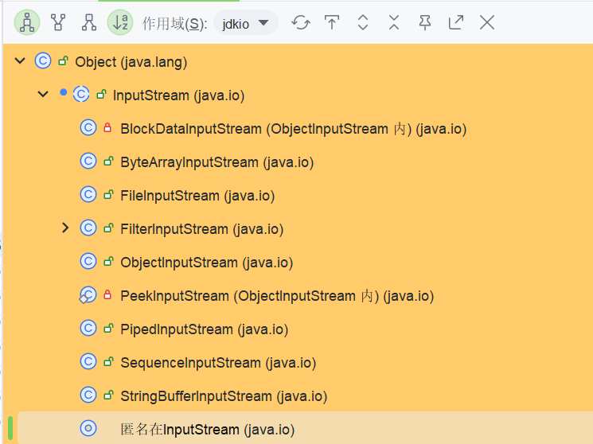
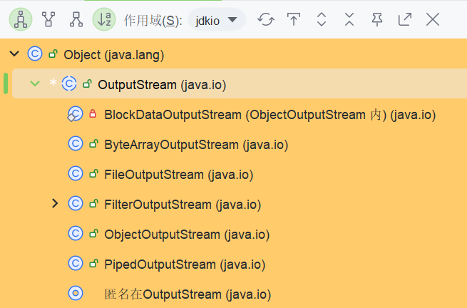
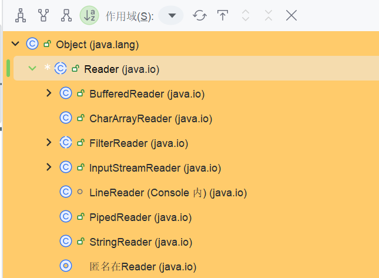
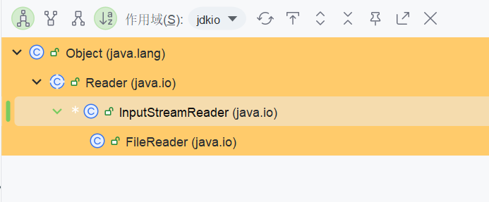

# Java/Scala I/O

## 基础

### 传输方式分类

从传输方式来看，分为字节流和字符流。

#### 字节流

命名格式：`xxxStream`

**InputStream**

> This abstract class is the superclass of all classes representing an input stream of bytes.
> Applications that need to define a subclass of InputStream must always provide a method that returns the next byte of input.



**OutputStream**

> This abstract class is the superclass of all classes representing an output stream of bytes. An output stream accepts output bytes and sends them to some sink.
> Applications that need to define a subclass of OutputStream must always provide at least a method that writes one byte of output.



#### 字符流

**Reader**

> Abstract class for reading character streams. The only methods that a subclass must implement are read(char[], int, int) and close(). Most subclasses, however, will override some of the methods defined here in order to provide higher efficiency, additional functionality, or both.



**Writer**

> Abstract class for writing to character streams. The only methods that a subclass must implement are write(char[], int, int), flush(), and close(). Most subclasses, however, will override some of the methods defined here in order to provide higher efficiency, additional functionality, or both.


#### 相互转换

这里的流都是字符流，但是都以字节流作为构造参数进行包装。

也就是一个从文件读数据，可以在读取的时候进行`decode`，在输出的时候进行`encode`

**InputStreamReader**

> An InputStreamReader is a bridge from byte streams to character streams: It reads bytes and decodes them into characters using a specified charset. The charset that it uses may be specified by name or may be given explicitly, or the platform's default charset may be accepted.
> Each invocation of one of an InputStreamReader's read() methods may cause one or more bytes to be read from the underlying byte-input stream. To enable the efficient conversion of bytes to characters, more bytes may be read ahead from the underlying stream than are necessary to satisfy the current read operation.
> For top efficiency, consider wrapping an InputStreamReader within a BufferedReader. For example:
> BufferedReader in
> = new BufferedReader(new InputStreamReader(System. in));



`InputStreamReader`用来对字节流进行包装，所以需要其作为构造参数传入。

可以看到JDK给用户额外封装好了一个`FileReader`，用于方便文件读取，其使用`FileInputStream`作为构造参数。

> Reads text from character files using a default buffer size. Decoding from bytes to characters uses either a specified charset or the platform's default charset.
> The FileReader is meant for reading streams of characters. For reading streams of raw bytes, consider using a FileInputStream.

**OutputStreamWriter**

> An OutputStreamWriter is a bridge from character streams to byte streams: Characters written to it are encoded into bytes using a specified charset. The charset that it uses may be specified by name or may be given explicitly, or the platform's default charset may be accepted.
> Each invocation of a write() method causes the encoding converter to be invoked on the given character(s). The resulting bytes are accumulated in a buffer before being written to the underlying output stream. Note that the characters passed to the write() methods are not buffered.
> For top efficiency, consider wrapping an OutputStreamWriter within a BufferedWriter so as to avoid frequent converter invocations. For example:
> Writer out
> = new BufferedWriter(new OutputStreamWriter(System. out));

同样封装了一个`FileWriter`

### 设计思路

#### 装饰者模式

> [装饰器模式 | 菜鸟教程 (runoob.com)](https://www.runoob.com/design-pattern/decorator-pattern.html)

> [详细讲解装饰者模式和继承之间的关系和优劣(讲道理这事儿，不怕过 就怕不够)\_装饰者模式和继承区别-CSDN博客](https://blog.csdn.net/qq_27093465/article/details/53323187)

`JDK IO`整体采用装饰者模型进行设计。

简单来讲，如果要设计一个`MyReader`，只用继承，可能会设计成如下：

* MyReader
  * MyFileReader
  * MyMusicReader
  * MyxxxReader

当想要把所有流增加`Buffer`功能的时候，就需要更深一级的继承。

要解决层级太深的问题，可以在用户线程与具体类的使用之间，加一层进行解耦。

具体而言，将修饰功能的类单独抽离出来，并继承/实现`MyReader`。

然后在该类中拿到被修饰者作为字段，这里使用多态可以将类型声明为父接口即可。

```java
class MyBufferedReader implements MyReader{
    private MyReader toenhance;
    MyBufferedReafer(MyReader r){
      this.toenhance = r
    }
    public xxx
}
```

以后用户线程直接调用的都是该增强类的方法,然后由该类统一增强，除了增强逻辑之外，其他部分都与被增强的类耦合。

#### BufferedReader

具体来看`BufferedReader`

**字段**

```java

    private Reader in;

    private char cb[];
    private int nChars, nextChar;
```

其他字段均为实现增强功能所需要的字段。

**构造方法**

```
    /**
     * Creates a buffering character-input stream that uses an input buffer of
     * the specified size.
     *
     * @param  in   A Reader
     * @param  sz   Input-buffer size
     *
     * @exception  IllegalArgumentException  If {@code sz <= 0}
     */
    public BufferedReader(Reader in, int sz) {
        super(in);
        if (sz <= 0)
            throw new IllegalArgumentException("Buffer size <= 0");
        this.in = in;
        cb = new char[sz];
        nextChar = nChars = 0;
    }
```

**read**

```java
    /**
     * Reads a single character.
     *
     * @return The character read, as an integer in the range
     *         0 to 65535 ({@code 0x00-0xffff}), or -1 if the
     *         end of the stream has been reached
     * @exception  IOException  If an I/O error occurs
     */
    public int read() throws IOException {
        synchronized (lock) {
            ensureOpen();
            for (;;) {
                if (nextChar >= nChars) {
                    fill();
                    if (nextChar >= nChars)
                        return -1;
                }
                if (skipLF) {
                    skipLF = false;
                    if (cb[nextChar] == '\n') {
                        nextChar++;
                        continue;
                    }
                }
                return cb[nextChar++];
            }
        }
    }
```

这里读取单个字符，里面调用的是`fill`方法来读取单个字符到缓冲区，其核心逻辑如下：

```java
        int n;
        do {
            n = in.read(cb, dst, cb.length - dst);
        } while (n == 0);
        if (n > 0) {
            nChars = dst + n;
            nextChar = dst;
        }
```

可以看到，最终其实还是调用的被修饰类的方法，但是实现了增强功能与基础功能解耦，由继承变为组合，灵活更强的好处。

### Files工具类

`从JDK7`开始，提供的文件/目录操作工具类，封装了很多常用的逻辑。

#### Path

> An object that may be used to locate a file in a file system. It will typically represent a system dependent file path.
> A Path represents a path that is hierarchical and composed of a sequence of directory and file name elements separated by a special separator or delimiter. A root component, that identifies a file system hierarchy, may also be present. The name element that is farthest from the root of the directory hierarchy is the name of a file or directory. The other name elements are directory names. A Path can represent a root, a root and a sequence of names, or simply one or more name elements. A Path is considered to be an empty path if it consists solely of one name element that is empty. Accessing a file using an empty path is equivalent to accessing the default directory of the file system. Path defines the getFileName, getParent, getRoot, and subpath methods to access the path components or a subsequence of its name elements.

说明了其就是用于在文件系统中定位文件的类。

文档中还给了一个简单的例子：

```java
//Paths may be used with the Files class to operate on files, directories, and other types of files. For example, suppose we want a java. io. BufferedReader to read text from a file "access. log". The file is located in a directory "logs" relative to the current working directory and is UTF-8 encoded.
      Path path = FileSystems. getDefault().getPath("logs", "access. log");
      BufferedReader reader = Files. newBufferedReader(path, StandardCharsets. UTF_8);
```

**创建path**

使用`Path.of`方法进行创建，参数可以是文件路径/URL。这里要注意`idea`运行时配置的默认工作路径。

```java
    public void demo1() {
        Path path = Path.of("src/main/java/org/lxbigdata/io/hello.txt");
        try(BufferedReader reader = Files.newBufferedReader(path)){
            String s = null;
            while((s  = reader.readLine()) != null){
                System.out.println(s);
            }
            reader.close();
        }catch (IOException e){
            e.printStackTrace();
        }
    }
```

#### Files

**创建文件/目录**

* create[Temp]File
* create[Temp]Directory

**增删改查**

* 增
  * createFile
  * ...
* 删
  * delete
  * deteleIfexists
* 改
  * newInput/OutputStream
  * newBufferedReader/Writer
  * move/copy
* 查
  * exists
  * ....

## I/O 模型

### Unix-like IO

#### 前置知识

**文件描述符 & 打开文件表 & inode表**

> 关于文件描述符，文件句柄，以及inode:
>
> [彻底搞懂文件描述符/文件句柄/文件指针的区别与联系-CSDN博客](https://blog.csdn.net/nazeniwaresakini/article/details/104220111)
>
> [理解Linux的文件描述符FD与Inode - 知乎 (zhihu.com)](https://zhuanlan.zhihu.com/p/143430585)
>
> [inode - 维基百科，自由的百科全书 (wikipedia.org)](https://zh.wikipedia.org/wiki/Inode)

都知道`OS`中一个进程维护一个`PCB`，其用于控制进程，并维护进程的上下文信息。其中就包括了一个`file descriptor table`。这是一个`Array[filedescriptor]`。而一个文件描述符`fd`，就是用来获取对应的`filedescriptor`的，也就是`filedescriptor curfd = arr(fd)`。其有一个字段指向了`file结构`，也就是`file curfile = curfd.file`

`OS`中维护了一个全局`open file table`，这是一个`Array[file]`,维护了所有被打开文件的信息，比如`offset,mode`等，以及最重要的`inode 指针`。这里的index，就称为文件描述/文件句柄。也就是`file curfile = arr(handle)`。

> window下通常将一组指针/引用对应的数据的下标称为`句柄`。

然后就是`inode table`。

`inode`是`unix`文件系统中的数据结构，用于描述文件系统对象，包括`文件，目录，socket等`，其中有文件创建者，模式等信息，并存储着`block`指针。一个文件如果要存储，则需要存储元数据信息，以及其本身数据信息两部分内容。而`unix`文件系统，一般初始化的时候就把存储区域分为两部分，分别用于存储这两部分信息。

文件系统对象才是一个文件系统中的标准描述，而文件/目录都只是别名。

* 元数据部分就是`inode`组成的表，一个`inode`一般占据`256/128`字节。
* 数据部分以`block`形式存储，一个`block`为4KB。

在操作系统内存中，对应着`inode cache`以及`page cache`。

**网卡到用户进程**

> [内功修炼-网络数据包的发送、传输、接受过程 - 沉迷于学习，无法自拔^\_^ (hlog.cc)](https://hlog.cc/archives/156/)

> ring buffer：环形缓冲区，这里的实现内部有两个环形数组，一个是内核驱动使用，一个是网卡硬件使用。两者可以通过`share`同一块内核内存来实现消费者-生产者模式，比如`skb_buffer`。
>
> DMA：数据传输技术，将数据不通过CPU，而是通过总线，来直接从外设缓冲区复制到内核内存，或者另一个外设缓冲区。

* 数据以高低电平形式来到网卡，被网卡硬件转换为数据并刷到`FIFO`缓冲区，然后网卡申请`skb_buffer`的引用，然后数据就可以通过`DMA`方式，从`fifo-buffer `到`skb_buffer`。
* 硬中断：由于是`DMA`写入，内核无法监控，所以需要发起中断，这里网卡会触发硬中断，然后处理程序来调用`Driver`来处理
* 软中断：`Driver`处理完毕，触发软中断，由内核中的专门进程处理，这里中断处理程序会调用`网卡Driver所对应的处理函数`。
* 驱动处理：由网卡驱动对数据进行格式处理。处理完毕传递给`协议栈`
* 协议栈到`socket`：协议栈经过处理，并且可以拿到数据的`端口，IP`信息，将数据发送到`scoket buffer`,然后给`socket`信号说明有数据来了。一个`socket`有两个`buffer`，分别用于发送数据和接收数据。
* 应用进程响应
  * 阻塞式，则`receivefrom`函数阻塞直到数据过来，然后将数据存储到用户进程内存。
  * 非阻塞式：使用`poll/select`监听`socket`,有数据过来，就读取数据

#### 阻塞式IO

就是线程调用函数`receivefrom`之后，如果`socket buffer`无数据，则阻塞，期间进程`OS`挂起然后加入队列进行调度。

直到`socket buffer`有数据，则**操作系统可以重新执行该进程**，该函数将数据从`socket buffer` 复制到 `用户进程的buf`。

`receivefrom`函数原型：

```c
ssize_t recvfrom(int sockfd, void *buf, size_t len, int flags,
                 struct sockaddr *src_addr, socklen_t *addrlen);

```

可以看到，其拿到`socket文件描述符`，以及`buf指针`，并将数据从`socket buffer`复制到`进程buf`。

#### 非阻塞式IO

用户执行`recvfrom`之后，如果`socket buffer`没有数据，进程不被阻塞，而是一直轮询，比如在一个`while`循环中间接性调用该函数。

如果`socket buffer`有数据，则立刻可以返回。

**与阻塞式IO区别**

> [聊聊计算机里面的“中断”和“轮询” - 知乎 (zhihu.com)](https://zhuanlan.zhihu.com/p/681876317)

区别就是信息的控制方不同。当然非阻塞式IO可以尽力细化粒度(比如`Thread.sleep`的间隔减小)的进行控制，但是由于其无法控制信息，则只能同时将压力给到用户进程。阻塞时候控制权重新交给了`OS`，则无法精确满足要求。

#### I/O复用

将感兴趣的多个`socket文件描述符`维护起来，然后调用`select`将程序阻塞并挂起。

如果有一个`socket`发生了变化，则`select`会立即返回。此时可以再使用`recvfrom`将数据从`socket buffer`复制到`进程内存区域`。

其使得单个进程有了处理多个`event`的能力，而不是一个线程一个`socket`连接。

#### 信号驱动I/O

应用进程发送`sigaction`调用，此时主线程不会被阻塞。如果有`socket buffer`无数据，则直接`return`。如果有数据，则返回信号，**通知用户进程可以开始读数据**。此时用户线程可以执行`recvfrom`。

相比于非阻塞式IO，CPU浪费较少。

#### 异步I/O

执行异步io，调用立即返回，内核完成所有事情，向进程发送信号，**通知用户进程IO任务已经完毕**

### Reactor模型

> [如何深刻理解Reactor和Proactor？ - 知乎 (zhihu.com)](https://www.zhihu.com/question/26943938/answer/1856426252)

Reactor模型是整个`NIO`的实现基础。也称为`Dispatcher`模型。对于`Spark`熟悉的人肯定知道,`Spark rpc`的核心就是`Dispatcher`。

这里的`NIO`采用`多reactor多线程`的模式。

`Client`发送请求之后，被主线程的`main Reactor 通过selector`收到并进行`Dispatch`，发送到主线程的`Acceptor`，获取连接(`accept`)。

获取连接之后，主线程将其分发到子线程的`sub Reactor`中。在子线程中，同样是连接被加入到`selelctor`中，再次等待被选中。

子线程中的`selelctor`返回之后，则可以通过`Handler`进行业务逻辑处理。

这里主线程和子线程分工明确：

* 主线程只用于创建连接
* 子线程只用于处理业务逻辑，并且可以将结果发送给客户端

`Netty`中亦有`BOSS GROUP`以及`Worker GROUP`

### NIO

从`JDK4`引入，高速并且面向块。

#### 基础概念

传统的`InputStream/OutputStream`是基于`单个Byte`的，但是这里的NIO基于的是`Block`，也就是`Byte[]`。

#### 核心组件

**Channel**

> A channel represents an open connection to an entity such as a hardware device, a file, a network socket, or a program component that is capable of performing one or more distinct I/ O operations, for example reading or writing.
> A channel is either open or closed. A channel is open upon creation, and once closed it remains closed. Once a channel is closed, any attempt to invoke an I/ O operation upon it will cause a ClosedChannelException to be thrown. Whether or not a channel is open may be tested by invoking its isOpen method.
> Channels are, in general, intended to be safe for multithreaded access as described in the specifications of the interfaces and classes that extend and implement this interface.

简单来说，就是面向`文件/socket/其它用于IO的组件`的一种连接。

其状态具有二值性：`open & close`，而不是和`SQL & 分布式系统`那种的三值语义。

```java
public interface Channel extends Closeable {

    /**
     * Tells whether or not this channel is open.
     *
     * @return {@code true} if, and only if, this channel is open
     */
    public boolean isOpen();

    /**
     * Closes this channel.
     *
     * <p> After a channel is closed, any further attempt to invoke I/O
     * operations upon it will cause a {@link ClosedChannelException} to be
     * thrown.
     *
     * <p> If this channel is already closed then invoking this method has no
     * effect.
     *
     * <p> This method may be invoked at any time.  If some other thread has
     * already invoked it, however, then another invocation will block until
     * the first invocation is complete, after which it will return without
     * effect. </p>
     *
     * @throws  IOException  If an I/O error occurs
     */
    public void close() throws IOException;

}
```

**Buffer**

> A container for data of a specific primitive type.

是一种线性的，面相特定数据类型(Int,Char等)的容器。

通过三个核心变量操作：

> A buffer's capacity is the number of elements it contains. The capacity of a buffer is never negative and never changes.
> A buffer's limit is the index of the first element that should not be read or written. A buffer's limit is never negative and is never greater than its capacity.
> A buffer's position is the index of the next element to be read or written. A buffer's position is never negative and is never greater than its limit.

`channel`过来的数据以及发送给其的数据必须到`buffer`中，也就是其常作为参数传入`read/write`方法中。

其中的`position`即是下一个要读取的位置，也是当前已经读取的字节数:

`x - 1  - 0 + 1 = x`

以`ByteBuffer`为例，常见方法如下：

* 初始化：`ByteBuffer.allocate(16)`
* `从channel读数据到buffer`：`int readbytes = channel.read(buf) / buf.put([i])`
* `从buffer写数据到channel`：`int writebytes = channel.write(buf) / buf.get()`
* mark & reset：在某个pos做标记，然后reset就可以回到这里

如下：

```java
    public void NIOSocketDemo() throws IOException {
        ByteBuffer buffer = StandardCharsets.UTF_8.encode("hello");
        var flag = true;
        while(buffer.hasRemaining()){
            var cur = (char)buffer.get();
            System.out.println(cur);
            if(cur == 'e'){
                buffer.mark();
                System.out.println("mark");
            }
            if(cur == 'o' && flag){
                buffer.reset();
                System.out.println("reset");
                flag = false;
            }
        }
        System.out.println("end");
    }
```

则这段程序的`llo`被重新又输出了一遍。

**Selector**

这里就是IO多路复用模型上的select。这里JDK已经将与`socket/file`的连接抽象为`Channel`，则`Selcetor`只需要监听多个`Channel`既可以达到多路复用。

如果是`SocketChannel`，可以配置为非阻塞。这时候`Selector`可以同时监听一批`Channel`，而不是在一个上面阻塞。

`Selector`可以同时监听`ServerSocketChannel以及SocketChannel`，而如果来的是`OP_ACCEPT`，则必然是`SSChannel`的请求，因为只有它用于处理连接。其`bind`方法解释如下:

> Binds the channel's socket to a local address and configures the socket to listen for connections.

而`accpet`方法就是建立连接。

#### 例子

> [Java NIO - 基础详解 | Java 全栈知识体系 (pdai.tech)](https://www.pdai.tech/md/java/io/java-io-nio.html#%E9%80%89%E6%8B%A9%E5%99%A8)

```java
public class NIOServerDemo {
    public static void main(String[] args) throws IOException {
        Selector selector = Selector.open();
        ServerSocketChannel ssChannel = ServerSocketChannel.open();
        ssChannel.configureBlocking(false);
        ssChannel.register(selector, SelectionKey.OP_ACCEPT);
        ssChannel.bind(new InetSocketAddress("127.0.0.1", 9999));

        while(true){
            selector.select(); // 阻塞方法，直到有Channel(或者Channels)被选中(发生event)
            Set<SelectionKey> keys = selector.selectedKeys(); //查看这些Channel本次事件的key，key => 某个channel发生了某种event
            Iterator<SelectionKey> iterator = keys.iterator();
            while(iterator.hasNext()){
                SelectionKey key = iterator.next();
                if(key.isAcceptable()){ //只有ssChannel可以建立连接
                    //处理新接入的请求消息
                    var channel1 = (ServerSocketChannel)key.channel();
                    SocketChannel sChannel = channel1.accept();
                    sChannel.configureBlocking(false);
                    //建立新连接，从客户端读取消息
                    sChannel.register(selector, SelectionKey.OP_READ); //表明select对这个channel,只做读操作
                }else if(key.isReadable()){
                    //sChannel可读，则从中读取数据到server端的buffer
                    var channel1 = (SocketChannel)key.channel();
                    var remoteAddress = (InetSocketAddress)channel1.getRemoteAddress();
                    int port = remoteAddress.getPort();
                    System.out.println("port:" + port);
                    System.out.println(readDataFromChannel(channel1));
                    channel1.close();
                }
                iterator.remove(); //必须删除，否则会重复处理引发空指针
            }
        }
    }

    private static String readDataFromChannel(SocketChannel sChannel) throws IOException {
        ByteBuffer buffer = ByteBuffer.allocate(1024);
        var data = new StringBuffer();

        while(true){
            buffer.clear(); //切换至写模式
            int n = sChannel.read(buffer);
            if(n == -1) break; //读取完毕
            buffer.flip(); //切换至读模式
            while(buffer.hasRemaining()){
                data.append((char)buffer.get());
            }
            buffer.clear(); //切换至写模式
        }
        return data.toString();
    }
}
```

则此时将数据从`client`写入`socket`即可在`server`得到响应。
